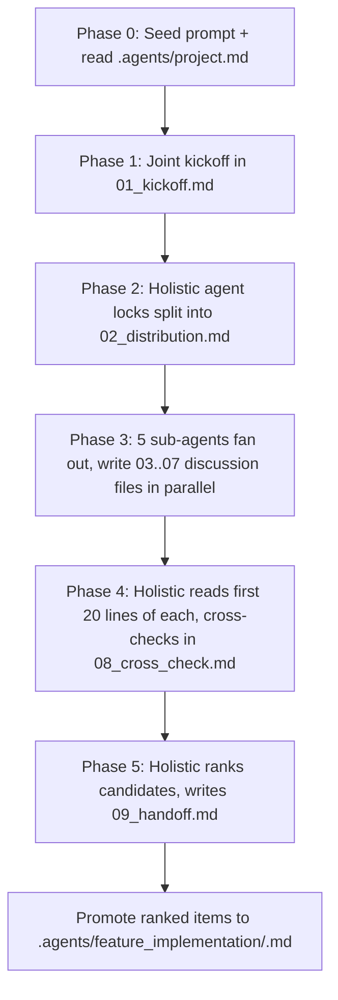

# Agentic Brainstorming

Repeatable multi-agent fan-out for early-stage thinking. One holistic agent orchestrates, five sub-agents deep-dive in parallel. Output translates near-mechanically into `feature_implementation/<feature>.md`.

## Purpose

Capture the back-and-forth of a multi-round brainstorm as durable artifacts, not just distilled summaries. Existing files in `../` (like `../vison_planning.md`) are syntheses. This folder preserves the discussion that produced them.

## Read when

- You are about to spawn a multi-agent brainstorm session and need the contract.
- You are an agent inside a session and need to know your file conventions and 20-line header rules.
- You are reviewing a finished session before promoting items into `../../feature_implementation/`.

## Skip when

- Doing solo creative work. Use `../../skills/brainstorming/SKILL.md` instead, that skill is single-author.
- Doing code review or audit. Use `../../holistic_planning/holistic_reviews/`.
- Adding a single seed idea. Drop it in `../SIMPLE_random_ideas.md` instead.

## Canonical for

- The 6-agent role split, the 5-phase workflow, the 20-line header convention, the discussion-format spec.
- The brainstorm-to-feature-spec mapping table.

---

## Folder layout

```
AGENTIC_BRAINSTORMING/
  README.md                                    this file
  agent_brainstorm_v1_2026-04-29-1430/         one folder per session, never overwritten
    00_overview.md                             holistic synthesis, text-only
    01_kickoff.md                              joint round-1 transcript
    02_distribution.md                         locked work split, agent to topic table
    03_topic_a.md ... 07_topic_e.md            sub-agent deep dives, renamed after kickoff
    08_cross_check.md                          peer review based on 20-line skims
    09_handoff.md                              ranked candidates ready to promote
```

Session folder name: `agent_brainstorm_v<N>_YYYY-MM-DD-HHMM/`. Each new session bumps `N` and stamps a fresh timestamp. Never overwrite a prior session.

---

## Roles

| Role | Count | Context budget | Job |
| --- | --- | --- | --- |
| Holistic overview | 1 | minimal, only reads peer 20-line summaries plus its own synthesis files | orchestration, work distribution, cross-check, ranking |
| Sub-agent | 5 | full read of own topic file, 20-line skim of peers | deep-dive own focus area, push back on peers using their summaries |

The holistic agent deliberately stays low-context. It does not do deep technical work. The 5 sub-agent topics are not pre-named, the agents agree on them in `01_kickoff.md` and rename `topic_a` through `topic_e` accordingly.

---

## Workflow (5 phases)



---

## File conventions (the 20-line header)

Every file in a session folder MUST front-load the first 20 lines with a fixed block. This is the cross-check mechanism, peers read only these 20 lines.

| Line | Content |
| --- | --- |
| 1 | `# <Title>` |
| 3 | `Author: <agent role>` |
| 4 | `Round: <N>` |
| 5 | `Started: YYYY-MM-DD` |
| 7 to ~16 | `Summary:` block, 5 to 10 lines, what is in the file, what was decided, what is open |
| ~17 to 20 | `Sibling files:` relative links to peer files in the same session folder |

If your summary spills past line 20, tighten it. The contract is that line 21 onward is body content peers may skip.

---

## Discussion format

Discussion files (`03_*` through `07_*`) use chat-style turn blocks, not Q&A interview format. Each agent can disagree, push back, and escalate to the holistic agent.

```
### Turn 1, sub-agent (focus: X) (2026-04-29 14:32)
<message>

### Turn 2, sub-agent (focus: Y) (2026-04-29 14:35)
<reply that pushes back>

### Turn 3, holistic (2026-04-29 14:40)
<arbitration or synthesis>
```

Timestamps are local-time `YYYY-MM-DD HH:MM`. Roles match `02_distribution.md`.

---

## Translating output to `feature_implementation/`

Every discussion file should produce these four primitives so a downstream agent can copy-paste into `../../feature_implementation/<feature>.md`.

| Brainstorm output | Maps to in `feature_implementation/<feature>.md` |
| --- | --- |
| One-line problem statement | `# <Feature Title>` plus `Status:` line |
| State-transition sketch | `## 1. Feature Detail` Mermaid `stateDiagram-v2` block |
| In-scope vs deferred bullets | `## 2. MVP Scope` (deferred items move to `## 6. Optional / Follow-ups`) |
| Ordered todo list | `## 3. Todos` (use the status legend below) |

These four are the contract. `09_handoff.md` ranks candidates and confirms each one carries all four primitives before promotion.

---

## Visual requirements

- At least one Mermaid diagram per discussion file (`03_*` through `07_*`). Priority order: state, flow, sequence, data-shape. Same priority as `../../feature_implementation/README.md:50` to `:54`.
- Comparison tables for any "option A vs option B" content. Tables and Mermaid over prose.
- ASCII flow diagrams in fenced blocks are allowed for folder or data-shape relationships, see `../vison_planning.md:23` to `:49` for the precedent.
- No Mermaid in `00_overview.md`. Keep its context budget tiny, text and tables only.

---

## Status legend

- `[ ]` pending
- `[A]` agent-confirmed-done (work finished from the agent's view, awaiting user verification)
- `[x]` user-verified-done

Capital `[X]` is forbidden. Match the legend used in `../../holistic_planning/holistic_tasks.md`.

---

## See also

- [`../vison_planning.md`](../vison_planning.md), existing north-star synthesis style, single-author predecessor to this multi-agent format
- [`../../feature_implementation/README.md`](../../feature_implementation/README.md), downstream target format where the four-primitive mapping lands
- [`../../skills/brainstorming/SKILL.md`](../../skills/brainstorming/SKILL.md), solo creative-work skill, distinct from this multi-agent fan-out, do not confuse the two
