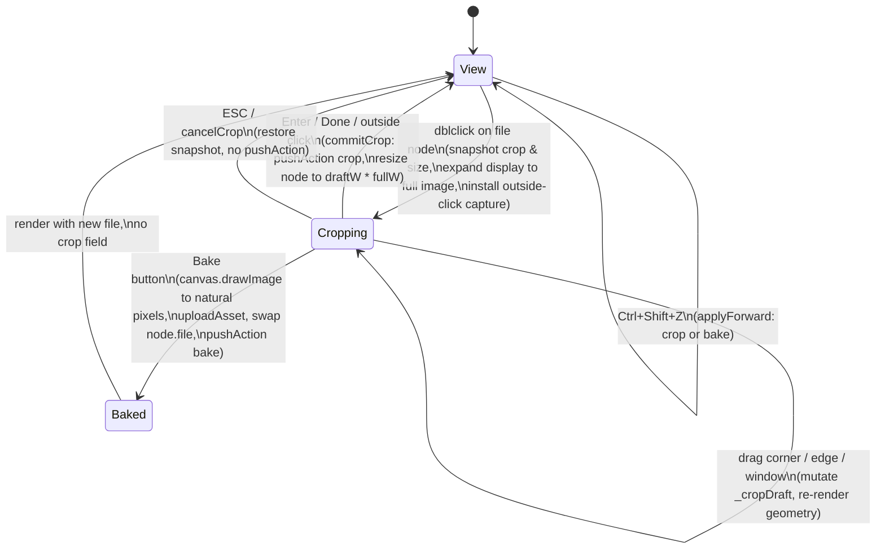
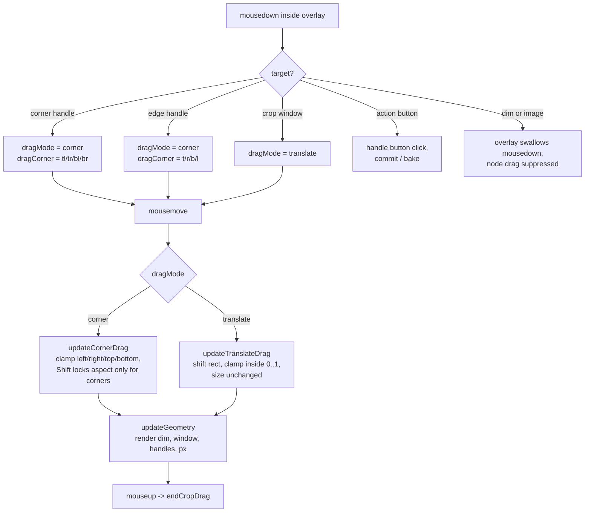
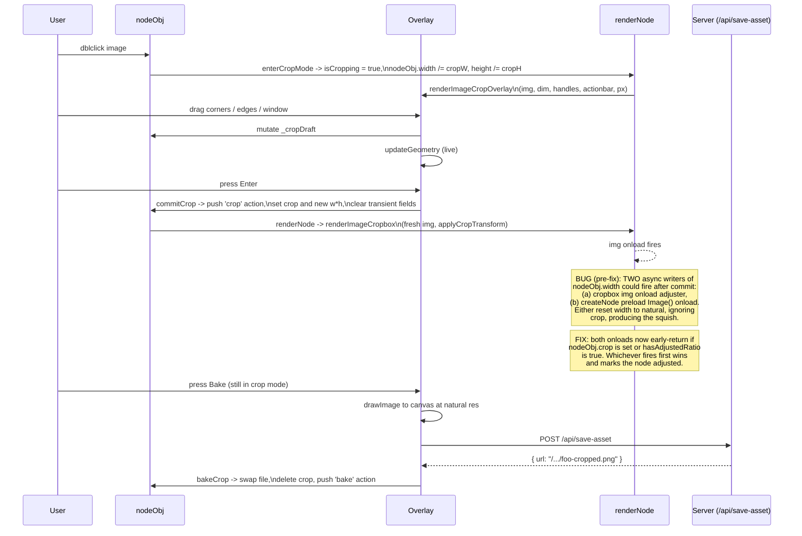

# Current state
items at the bottom "6" could be implemented. Ratio, orphan deletation etc. Maybe for orphans they could be kept for a set amount of time so the user could still ctrl+z

Currently works well


# Photo Cropping for Image Nodes

Status: MVP implemented and tested by agent. Squish bug discovered during user testing, fixed. Edge handles, window translate, and live pixel readout added in the same pass. Awaiting user verification in the browser.

Implementation lives in `JavaScript/braindump.js` (image-cropping helper block, file branch of `renderNode`, dblclick listener inside the `if (!el)` block, ESC/Enter branch in the global keydown handler, undo/redo cases for `crop` and `bake`) plus `CSS/braindump.css` (cropbox, overlay, handle, action bar, pixel readout). Persistence path is the existing `serializeState` -> `markBoardDirty` -> `/api/save-board` flow. Bake reuses `uploadAsset` and the existing `/api/save-asset` endpoint at `scripts/preview-server.mjs:515`.

Affected code area: `JavaScript/braindump.js`. Confirmed entry points and reuse:

- `applyCropTransform`, `renderImageCropbox`, `renderImageCropOverlay` — new helpers in the cropping block, defined just above `renderNode` so they live in module scope and `renderNode` can call them.
- `renderNode` file branch — switches between cropbox and overlay based on `nodeObj.isCropping`.
- `renderImageCropbox` onload guard at `braindump.js` (cropbox helper) — gates the auto-aspect adjuster on `!nodeObj.crop && !nodeObj.hasAdjustedRatio`. This is one half of the squish-bug fix.
- `createNode` image-preload onload guard at `braindump.js:3571` — second async writer of `nodeObj.width`/`height`. Same gate. This is the other half of the squish fix; without it, a fast crop+commit on a freshly dropped image races against this preload and the preload wins, resetting the displayed size to the source's natural dimensions and producing a squished cropped view.
- `enterCropMode`, `commitCrop`, `cancelCrop`, `bakeCrop` — overlay lifecycle.
- `serializeState` — strips `isCropping`, `_cropDraft`, `_cropEnterCrop`, `_cropEnterSize` so transient state never lands in autosave or the on-disk canvas.
- `applyReverse` and `applyForward` — extended with `crop` and `bake` cases.
- Global `keydown` handler at `braindump.js:2983` — crop-mode owns ESC (cancel) and Enter (commit) when `findCroppingNode()` returns a node.
- File-node `dblclick` listener inside the `if (!el)` block — entry point into crop mode. Skips when target is inside an existing overlay.
- `uploadAsset` at `braindump.js:5298` — reused by `bakeCrop`.

### Reality check vs. the original idea

The user's original sketch ("not sure what is the best way to store the cropping information") left the storage shape open. The chosen design uses one normalized rect on the node:

| Sketch assumption | Codebase reality | Decision |
| --- | --- | --- |
| Crop is destructive, bytes get rewritten | The `.canvas` format already stores `embedMode` and other custom fields. Adding a `crop` rect is a backward-compatible change. | Default keeps original lossless. `Bake` button is a separate explicit action. |
| Crop in pixel coordinates of the source image | Source images can change resolution (Bake creates a new file, drag-drop replaces nodes). Pixel coordinates would silently rot. | Normalized 0..1 rect: `{ left, top, right, bottom }`. Survives any source-image swap. |
| Resize handle should adjust the crop | Existing resize handle modifies `nodeObj.width`/`nodeObj.height`, which are always the displayed size of whatever the node currently shows (cropped or not). | Crop is independent. Resize scales the cropped view as a whole; the crop rect is not touched. |
| Need a separate "edit crop" button | Link nodes already use a node-local `isEditingUrl` flag to toggle into an edit overlay. | Mirror that pattern: `nodeObj.isCropping = true` while the overlay is open. Double-click is the entry gesture. |

---

## 1. Feature Detail

### Purpose

Make image nodes croppable on the board. Cropping is non-destructive by default so the user can re-edit later. A bake step is available for the privacy case where the original pixels must not stick around.

### Core behavior

Double-click an image to enter crop mode. The node's display expands so the full original image is visible. A dim frame shows what is hidden, a clear window shows what will remain, four corner handles and four edge handles let you reshape the rect, and the rect itself can be dragged to translate the crop. Enter or click outside commits. ESC cancels. Bake re-encodes and replaces the file on disk.

#### State diagram

Per-node crop lifecycle. The `isCropping` flag is the only persistent piece of state that distinguishes the modes; the others (`_cropDraft`, `_cropEnterCrop`, `_cropEnterSize`) are transient and stripped from autosave.



#### Flow diagram

Per-pointermove decision tree inside the overlay. The dragMode latch decides whether to resize the rect or translate it.



#### Sequence diagram

End-to-end happy path including the squish bug's prior failure mode (now fixed).



#### Data-shape diagram

How state composes during each phase. The transient fields are filtered out by `serializeState` via `TRANSIENT_NODE_FIELDS`.

```
View (uncropped):
  { id, type:"file", x, y, width:600, height:400, file:"/path.png",
    hasAdjustedRatio:true }
                                                    ← no crop field

View (cropped):
  { id, type:"file", x, y, width:428, height:286, file:"/path.png",
    hasAdjustedRatio:true,
    crop: { left:0.10, top:0.14, right:0.81, bottom:0.86 } }

Cropping (in-memory only, never persisted):
  { ...above,
    isCropping: true,
    _cropEnterCrop: <snapshot of crop on entry, or null>,
    _cropEnterSize: { w:428, h:286 },              ← restore target on cancel
    _cropDraft:    { left, top, right, bottom },   ← live mutated by drags
    width:600, height:400 }                        ← expanded to full image

Baked (after Bake button):
  { id, type:"file", x, y, width:428, height:286,
    file:"/path-cropped.png", hasAdjustedRatio:true }
                                                    ← crop removed, original
                                                      file no longer used
```

### Required state per node

- `crop` (persistent, optional): normalized rect `{ left, top, right, bottom }`. Absent when the image has never been cropped or when bake has flattened it.
- `isCropping` (transient): `true` while the overlay is open. Stripped by `serializeState`.
- `_cropDraft` (transient): the working rect the user is mutating with the mouse. Becomes `crop` on commit. Stripped by `serializeState`.
- `_cropEnterCrop` (transient): snapshot of `crop` on entry. Used by ESC to restore.
- `_cropEnterSize` (transient): snapshot of `width`/`height` on entry. Used by ESC to restore.
- `_cropEnterPos` (transient): snapshot of `x`/`y` on entry. Used by ESC to restore. Both `enterCropMode` and `commitCrop` shift `nodeObj.x`/`y` so the cropped slice stays visually anchored where the user selected it; the snapshot lets ESC put the node back where it started.

### Required state, module-level

- `_cropOutsideClickHandler` (let): the registered capture-phase document `mousedown` listener. There is at most one cropping node at a time; helpers `installCropOutsideClick` and `uninstallCropOutsideClick` flip it on and off.

### Edge cases handled

- **Multiple nodes, only one cropping**: `enterCropMode` calls `commitCrop` on any other node currently in crop mode before installing its own state.
- **Image not loaded when Bake is pressed**: `bakeCrop` checks `img.complete && img.naturalWidth`. Falls back to a toast.
- **Cross-origin canvas taint**: not a concern. All images served by the local preview server are same-origin; blob: URLs from local files are safe.
- **JPEG vs PNG bake**: the original extension is sniffed from the URL. JPEG re-encodes at quality 0.92; everything else encodes as PNG.
- **Filename collisions**: `/api/save-asset` already collision-renames, so a `foo-cropped.png` followed by another bake of a cropped image produces `foo-cropped-1.png` etc.
- **Undo of bake**: restores the prior `file` and `crop`. The new baked file stays on disk (orphaned). Undo never deletes files.
- **Undo of crop**: restores the prior `crop` and the prior displayed `width`/`height`.
- **Double-click after crash mid-crop**: `serializeState` strips transient flags, so a reload always boots into View mode.
- **Resize handle interaction**: hidden via CSS during cropping (`.bd-item.is-cropping .resize-handle { display:none !important }`) and the existing resize logic operates only on `width`/`height`, never on `crop`.
- **Outside-click vs button click**: the action bar buttons live inside `el`, so the capture-phase outside-click listener does not fire when they are clicked.

### Performance constraints

The overlay only mounts while `isCropping` is true and is torn down on commit/cancel/bake. Geometry updates are pure inline-style writes; no layout thrash beyond the four dim divs, four+four handles, one window, and the px label. The hot path during drag is `pointerToNorm` (one `getBoundingClientRect`) plus a fixed-size object copy plus a CSS write per element. No layout reads inside the move handler.

### Persistence and portability

The `crop` field is one extra optional key on the node object. The `.canvas` format is already proprietary (the codebase has no Obsidian/JSONCanvas spec dependency at this layer), so adding the field does not break any consumer. Older nodes without a `crop` key keep working unchanged.

The bake produces a real file under `content/boards/<slug>/`. Bundle export and other portability flows pick it up the same way they pick up any drag-dropped image.

---

## 2. MVP Scope

In scope:

1. **Storage**: optional `crop: { left, top, right, bottom }` on file nodes, normalized 0..1.
2. **Render**: `applyCropTransform` on a wrapper `<div class="bd-file-cropbox">` containing the ``. Uncropped images get `width/height: 100%`, cropped images get scaled and translated.
3. **Crop mode**: dblclick toggles `nodeObj.isCropping`. Overlay is full-image with dim frame, four corner handles, four edge handles, draggable window, action bar with `Bake`/`Done` and a live pixel readout.
4. **Drag**: corner handles resize, edge handles single-axis resize, window translate. Shift locks aspect on corner drags.
5. **Commit / cancel**: Enter, click outside the node, or `Done` button commits. ESC cancels.
6. **Bake**: re-encodes the cropped pixels at natural resolution, posts to `/api/save-asset`, swaps `node.file`, drops `node.crop`.
7. **Undo / redo**: `crop` and `bake` are first-class action types in `applyReverse` / `applyForward`.
8. **Persistence**: `serializeState` strips transient fields. `crop` is autosaved like any other field.
9. **Squish bug fix**: gate the cropbox-img onload aspect adjuster on `!nodeObj.crop && !nodeObj.hasAdjustedRatio`.

Deferred (see section 6):

- Aspect-ratio presets (1:1, 16:9, 4:3) as toggles in the action bar.
- Touch-friendly larger handle hit targets.
- A separate `Reset` button in the overlay.
- Showing the crop rect's current aspect ratio (in addition to pixel dimensions).
- Cleaning up orphaned baked files when the user undoes a bake.

---

## 3. Todos

Status legend: `[ ]` pending, `[A]` agent-confirmed-done, `[x]` user-verified-done.

- [A] Add CSS for cropbox, overlay, dim, window, corner handles, action bar, `is-cropping` modifier.
- [A] Add JS helpers (`applyCropTransform`, `renderImageCropbox`, `renderImageCropOverlay`, `findCroppingNode`, install/uninstall outside-click).
- [A] Add `enterCropMode`, `commitCrop`, `cancelCrop`, `bakeCrop`, `deriveBakeFilename`.
- [A] Rewrite the `nodeObj.type === "file"` branch in `renderNode` to switch between cropbox and overlay.
- [A] Add `dblclick` listener inside the `if (!el)` block.
- [A] Plug ESC and Enter into the global `keydown` cascade above the existing branches.
- [A] Add `crop` and `bake` cases to `applyReverse` and `applyForward`.
- [A] Strip transient crop fields in `serializeState`.
- [A] Browser-verify drop, dblclick, drag, commit, re-edit, ESC, resize, Ctrl+Z/Shift+Z, Bake, persistence.
- [A] Fix squish bug: gate the cropbox onload aspect adjuster on `!nodeObj.crop && !nodeObj.hasAdjustedRatio`. Set `hasAdjustedRatio = true` for cropped nodes so the adjuster never re-fires.
- [A] Fix squish bug, part 2: gate the `createNode` preload `Image().onload` (`braindump.js:3571`) on the same condition. Without this guard, a fast crop+commit on a freshly dropped image races against the still-pending preload, the preload wins, and `nodeObj.width`/`height` get reset to the source's natural dimensions while `crop` is set, producing the squished view the user reported.
- [A] Fix squish bug, part 3 (the perceived horizontal squish): the `createNode` preload was setting `nodeObj.width = img.width` at the source's full natural width, while the cropbox `onload` clamps to `min(natural, 400)`. Whichever fired first won the size race, and the two writers disagreed. A 1200-wide source dropped on the board would sometimes settle at 1200 wide; the user's full-width crop of that image landed at 1200×N, which they perceived as a horizontal stretch (because every other newly dropped image clamps to ~400). Fix: clamp the preload the same way the cropbox onload does, so both writers produce the same displayed size regardless of race order.
- [A] Fix squish bug, part 4 (the actual squish, finally): `CSS/site.css:41` has a site-wide `img { max-width: 100% }` rule. Cropping requires the inner `` to render LARGER than its wrapper (e.g. `width: 250%` so the wrapper's `overflow: hidden` shows only the crop slice). The global `max-width: 100%` silently clamped the inner img back to wrapper-width, while `object-fit: fill` then stretched the full source to fill that clamped box, producing the "full image squished into the cropped frame" the user reported. The same clamp also caused right-side crops to vanish: the inline `left: -150%` shifted the (now wrapper-width) image entirely off-screen. Fix: add `max-width: none; max-height: none` to `.bd-file-cropbox img` and `.bd-crop-overlay img` in `CSS/braindump.css`. Specificity beats the global `img` selector and there's no `!important` on the site rule, so the override is clean.
- [A] Preserve slice position across commit and re-edit. Previously the cropped node's top-left equaled the original's top-left, so the visible slice "jumped" to the original's position on commit. Fix: `enterCropMode` shifts `nodeObj.x -= oldCrop.left * fullW` (and y similarly) so the slice stays anchored as the display expands; `commitCrop` shifts `nodeObj.x += draft.left * fullW` so the cropped node lands where the slice was visually selected. `cancelCrop` restores the saved `_cropEnterPos`. The `crop` and `bake` undo actions now carry `fromPos`/`toPos` and `applyReverse`/`applyForward` restore/apply position alongside size.
- [A] Add four edge handles (`t`, `r`, `b`, `l`) reusing the existing corner-drag wiring. Skip Shift aspect-lock for edge drags.
- [A] Add window translate gesture: mousedown on `.bd-crop-window` shifts the rect inside `[0,1]`. Cursor is `move`.
- [A] Add live pixel-dimensions readout `WxH` next to the action bar, computed from the loaded image's natural size.
- [A] Add CSS for edge-handle bar shape, edge cursors, and the px label pill.
- [A] Browser-verify squish fix, edge handles, window translate, and px readout.
- [A] User verifies the feature works on real screenshots in cosmoboard / braindump.

---

## 4. Tests

The feature is exercised today by ad-hoc browser-driven probes via the chrome-devtools MCP. No `tests/board/` test file has been added yet. When one lands it should cover:

- `tests/board/board-image-crop-storage.test.mjs` (unit / runtime): given a node with `crop`, `applyCropTransform` produces the expected `width`/`left`/`top`/`height` percentages for representative rects.
- `tests/board/board-image-crop-commit.test.mjs` (runtime): simulating a corner drag plus Enter mutates `crop` and resizes the node to `fullW * draftW`, `fullH * draftH`, and pushes one `crop` undo entry.
- `tests/board/board-image-crop-bake.test.mjs` (e2e, preview server up): clicking Bake creates a new file under `content/boards/<slug>/`, swaps `node.file`, drops `node.crop`, and pushes one `bake` undo entry whose reverse restores the prior file and crop.
- `tests/board/board-image-crop-persistence.test.mjs` (build): saving and reloading a board with cropped nodes preserves the `crop` field and never persists transient fields like `isCropping` or `_cropDraft`.

Until those land, acceptance comes from the manual checklist in section 2 of the original plan file (`C:\Users\evren\.claude\plans\photo-cropping-if-polished-milner.md`) plus the new gestures (edge handle drag in both axes, window translate stays inside `[0,1]`, px readout matches `cropW * naturalW` rounded).

---

## 5. Test Reports

No test-results report has been written yet. When the tests above land, link the latest run here. Most recent ad-hoc run:

- 2026-04-29 ad-hoc browser probe via chrome-devtools MCP. Confirmed: dblclick opens overlay; corner drag updates geometry; Shift locks visual aspect; Enter commits; ESC cancels; re-edit reopens with prior rect; resize handle scales the cropped view as a whole and preserves crop; Bake writes a new `*-cropped.png` to disk and swaps `node.file`; `Ctrl+Z` reverts crop; `Ctrl+Z` after bake restores prior file and crop; `crop` field round-trips through `serializeState` to the on-disk canvas.

---

## 6. Optional / Follow-ups

- **Aspect-ratio presets**: pill buttons in the action bar (`1:1`, `16:9`, `4:3`, `Free`). Selecting a preset constrains the rect's aspect during drag and resnaps the current rect to match. Bigger UI scope, deferred to a follow-up feature spec.
- **Reset button**: a `Reset` button in the action bar that snaps `_cropDraft` back to `{0, 0, 1, 1}` without leaving crop mode. Useful for long sessions where the user wants to start over.
- **Touch hit targets**: bump corner/edge handle hit boxes to ~44px on touch devices (use a media query). The current 24px box is fine for mouse but small for finger.
- **Display current aspect ratio in px label**: append `· 1.50:1` or similar so the user can spot common ratios without doing the math.
- **Orphan cleanup for baked files**: when an undo of a bake leaves a `*-cropped.png` on disk that no node references, offer a one-shot cleanup pass (or run it on board save). Today the file lingers, which is the safest default but consumes disk over time.
- **Crop in the bundle export**: round-trip the `crop` field through bundle export so a portable bundle re-renders the same cropped view. Likely already works because the field is a plain JSON property on the node, but no test confirms it yet.
- **Inline crop on markdown image embeds**: when an image lives inside a markdown node rather than as a standalone file node, dblclick currently does not enter crop mode. A markdown-image crop flow is a separate feature.
