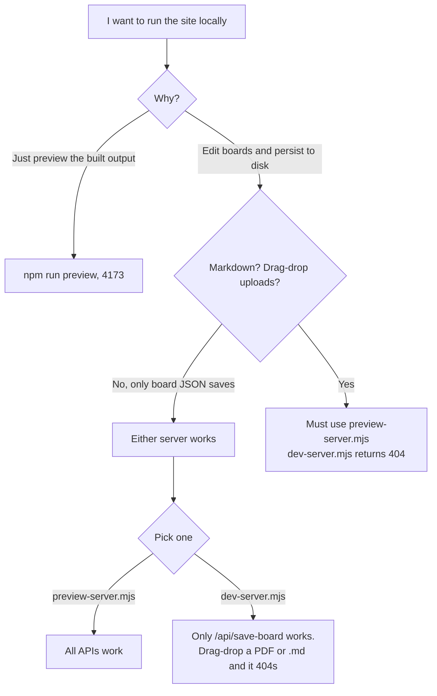

# Remove `scripts/dev-server.mjs`

Status: not started. Spec only. Execute later.

## 1. Feature Detail

### Why remove it

`scripts/dev-server.mjs` is a 73-line Node HTTP server that listens on port 3000 and exposes `POST /api/save-board` (and the alias `/api/save-braindump`). It was the original local save backend for Braindump. Since then, `scripts/preview-server.mjs` (port 4173, ~580 lines) has grown into the canonical local server and now owns every write API the UI calls:

| Endpoint | `dev-server.mjs` | `preview-server.mjs` |
| --- | --- | --- |
| `POST /api/save-board` | yes | yes |
| `POST /api/save-braindump` | yes (alias) | no (deprecated alias, see follow-up) |
| `POST /api/save-markdown` | no | yes |
| `POST /api/save-asset` | no | yes |
| `GET /api/list-markdown` | no | yes |
| `GET /api/get-video-meta` | no | yes |
| Static file serving | yes (basic) | yes (full MIME table, `404.html`) |

Concretely, this means:

1. **Functional foot-gun.** Anyone who runs `node scripts/dev-server.mjs` and then drags a PDF, image, or `.md` onto a board gets HTTP 404. The 404 originates at `scripts/dev-server.mjs:60-62` because the URL falls through to the static-file branch with no matching file on disk. This is the same failure mode that prompted this cleanup.
2. **Documentation drift.** `npm run preview` is the only npm-aliased server. `dev-server.mjs` is described in `scripts/README.md`, `scripts/AGENTS.md`, the testing skill, and several historical planning docs as if it were a first-class option. New agents read those docs and pick the wrong server.
3. **Security audit finding.** `.agents/reviews_and_feedback/security_audit_20260429_041336.md:58-61` flags that `dev-server.mjs` calls `server.listen(PORT)` with no host argument, which binds to `0.0.0.0`. `preview-server.mjs` already binds the same way, so the audit's host-binding concern needs a separate fix, but removing `dev-server.mjs` shrinks the attack surface to one server instead of two.
4. **Cognitive overhead.** Two near-duplicate servers force every reader to figure out which one is current. The structural review at `.agents/holistic_planning/holistic_reviews/structural_codebase_review_2026-04-28-1306.md:110` already flagged it as probable dead code overlapping with `preview-server.mjs`.

### What it is being replaced by

`scripts/preview-server.mjs`, started via `npm run preview`. It already serves on port 4173, handles every write API the UI uses, and serves the same static tree.

### Where references live (inventory taken 2026-04-29)

**Code references that change runtime behavior or user-visible text.** These must be updated.

- `JavaScript/braindump.js:7469` and `JavaScript/braindump.js:7476`: toast string `"Saved locally. Start dev-server to persist to the repository."`. Rename to refer to the preview server.
- `cosmoboard-landing.html:451`: user-visible copy `"If you are also running the local dev-server..."`. Rename.
- `cosmoboard-landing.html:475`: SVG label `"if local dev-server runs"`. Rename.

**Operational docs.** These describe how to run the project and must stay accurate.

- `scripts/README.md:10`: row in the scripts table. Delete row.
- `scripts/AGENTS.md:17`: bullet describing `dev-server.mjs`. Delete bullet.
- `.agents/agents.md` "Local Server Rule" (added 2026-04-29 in the upload-404 fix): contains a bullet calling `dev-server.mjs` deprecated. Replace with a bullet that simply says `npm run preview` is the only supported local server.
- `.agents/general_issues_and_tasks.md:20`: quotes the toast string. Update to match the new toast wording (or leave as a quoted historical excerpt with a note).
- `.agents/skills/whiteboard-automated-testing-skill/skill.md:29` and `.agents/skills/whiteboard-automated-testing-skill/desktop-testing.md:22`: tell the testing skill to use `dev-server.mjs` for save-flow tests. Replace with `npm run preview`.
- `.agents/whiteboard/whiteboard_automated_testing_skill.md:24`: same as above.

**Historical planning docs.** These describe past state. Do not rewrite history. Add a one-line note at the top of each file pointing to this spec, or leave them alone if they are already archived in spirit.

- `.agents/whiteboard/whiteboard_plan.md:40`
- `.agents/whiteboard/online_save_backend_plan.md:30, 411`
- `.agents/whiteboard/cosmoboard_implementation_plan.md:8, 70, 85`
- `.agents/whiteboard/cosmoboard_portability.md:80`
- `.agents/brainstorming_planning/landing_page_data_handling.md:81, 150, 158, 164, 211`
- `.agents/holistic_planning/holistic_reviews/structural_codebase_review_2026-04-28-1306.md:106, 110, 155`
- `.agents/reviews_and_feedback/security_audit_20260429_041336.md:58-61`
- `test-results/security_audit_2026-04-26T22-49-37Z.md` (historical run, do not touch)

**Archive, do not touch.**

- `.archive/JavaScript/braindump_broken.js:5597, 5604`

### Decision flow this change collapses

Today, an agent or user picking a local server has to navigate this:

After this change, the decision tree collapses to a single answer: `npm run preview`.

### Acceptance criteria

1. `scripts/dev-server.mjs` is deleted.
2. `npm run preview` is the only documented way to run a local server.
3. No live, non-archived doc references `dev-server.mjs` as a usable option. Historical planning docs may still mention it as part of describing past state.
4. The two toast strings in `JavaScript/braindump.js` and the two strings in `cosmoboard-landing.html` no longer use the term "dev-server". Replacements use "preview server" or "local preview server".
5. The whiteboard testing skill points at `npm run preview` for save-flow verification.
6. A smoke test against the preview server confirms that drag-drop of `.md`, image, and `.pdf` all return 200.

### Risks and constraints

- **Possible muscle memory.** Anyone who has bookmarked `http://127.0.0.1:3000/braindump.html` or scripted `node scripts/dev-server.mjs` will see "no such file" after deletion. Mitigation: the deletion commit message should call out the replacement command and port.
- **Skill files referenced by tests.** `.agents/skills/whiteboard-automated-testing-skill/` is loaded on demand. Tests written to that skill that hardcode port 3000 will break. Search the `tests/` tree for `:3000`, `dev-server`, and `localhost:3000` before deletion.
- **Security audit.** The audit's host-binding concern applies to `preview-server.mjs` too. Do not let this cleanup imply the audit is resolved. Leave the audit alone, link to this spec from a one-line note instead.
- **No package.json changes.** `dev-server.mjs` has no npm alias today, so removing it does not change `package.json`. Confirm before deletion.

## 2. MVP Scope

In scope:

- Delete `scripts/dev-server.mjs`.
- Update the four code references that produce user-visible text (two in `JavaScript/braindump.js`, two in `cosmoboard-landing.html`).
- Update the live operational docs (`scripts/README.md`, `scripts/AGENTS.md`, `.agents/agents.md`, the three whiteboard testing skill files).
- Replace the deprecation bullet in `.agents/agents.md` with a single canonical bullet about `npm run preview`.
- Run a one-pass smoke test verifying drag-drop still works against `npm run preview`.

Out of scope (deferred):

- Renaming `dev-server` terminology inside historical planning docs in `.agents/whiteboard/`, `.agents/brainstorming_planning/`, and `.agents/holistic_planning/holistic_reviews/`. These describe past state.
- Anything in `.archive/`.
- The `/api/save-braindump` alias inside `preview-server.mjs`. If it exists, leave it for a separate cleanup.
- The host-binding finding from the security audit.

## 3. Todos

Status legend: `[ ]` pending, `[A]` agent-confirmed-done, `[x]` user-verified-done.

- [ ] Confirm `package.json` does not reference `dev-server.mjs`. If it does, decide whether to delete the alias or keep it pointing at preview-server.
- [ ] Search `tests/` for `:3000`, `dev-server`, and `localhost:3000`. List any hits in this section before changing them.
- [ ] Replace the two toast strings in `JavaScript/braindump.js:7469` and `JavaScript/braindump.js:7476`. New text: `"Saved locally. Start the local preview server (npm run preview) to persist to the repository."`
- [ ] Update the two strings in `cosmoboard-landing.html:451` and `cosmoboard-landing.html:475` to use "preview server" wording.
- [ ] Delete the `dev-server.mjs` row from the table in `scripts/README.md:10`.
- [ ] Delete the `dev-server.mjs` bullet from `scripts/AGENTS.md:17`.
- [ ] Update `.agents/agents.md` "Local Server Rule" so that the dev-server deprecation bullet is replaced by a single canonical bullet: `npm run preview` is the only supported local server.
- [ ] Update `.agents/skills/whiteboard-automated-testing-skill/skill.md:29`, `.agents/skills/whiteboard-automated-testing-skill/desktop-testing.md:22`, and `.agents/whiteboard/whiteboard_automated_testing_skill.md:24` to point at `npm run preview` instead of `node scripts/dev-server.mjs`. Update the URL from `http://127.0.0.1:3000/braindump.html` to `http://127.0.0.1:4173/braindump.html`.
- [ ] Update the toast quote in `.agents/general_issues_and_tasks.md:20` to match the new string. Keep the surrounding context about HTTP 405 fallback intact.
- [ ] Delete `scripts/dev-server.mjs`. Single commit, single file.
- [ ] Add a one-line note at the top of `.agents/holistic_planning/holistic_reviews/structural_codebase_review_2026-04-28-1306.md` indicating that the dev-server removal flagged on lines 110 and 155 was completed in this work, with the commit hash. Do not edit the body of the review.
- [ ] Run the smoke test from section 4.
- [ ] Move this spec to `.agents/feature_implementation/archived/` once the user confirms.

## 4. Tests

Acceptance is mechanical: the preview server still serves all three drop types successfully, and no live doc points at the deleted file.

### 4.1 Drag-drop smoke test (manual via curl, no Playwright needed)

Path: ad hoc, recorded in the test report. Pure HTTP, no browser.

Steps:

1. Start the preview server: `npm run preview`.
2. Wait for the server to log all three endpoints (`Board save`, `Markdown save`, `Asset save`).
3. POST a small payload to each:
   - `curl -i -X POST "http://127.0.0.1:4173/api/save-board?slug=braindump" -H "Content-Type: application/json" -d '{"smoke":true}'`
   - `curl -i -X POST "http://127.0.0.1:4173/api/save-markdown?slug=braindump" -H "Content-Type: application/json" -d '{"filename":"smoke.md","path":"","content":"# smoke"}'`
   - `printf "PNGTEST" > /tmp/smoke.png && curl -i -X POST "http://127.0.0.1:4173/api/save-asset?slug=braindump&filename=smoke.png" --data-binary @/tmp/smoke.png -H "Content-Type: image/png"`
4. Each must return HTTP 200 with a JSON body containing `success: true`.
5. Delete the three smoke files (`content/boards/braindump/smoke.md`, `content/boards/braindump/smoke.png`, and the `current.canvas` if it was overwritten by step 3.1, in which case restore from git).

Asserts: the preview server still owns every write API. If any 404, this spec is not ready to merge.

### 4.2 Reference grep

Path: ad hoc, recorded in the test report.

Steps:

1. Run a recursive search for `dev-server` across the live tree, excluding `.archive/`, `.git/`, `node_modules/`, and `.agents/holistic_planning/holistic_reviews/`, `.agents/whiteboard/`, `.agents/brainstorming_planning/`, `.agents/reviews_and_feedback/`, `test-results/` (historical archives).
2. The result must be empty, or only contain matches in the historical paths listed above.

Asserts: no live, non-archived doc still tells a reader to use `dev-server.mjs`.

### 4.3 Existing test suite

Path: `node --test tests/**/*.test.mjs`.

This is a regression check, not a feature test. The preview-server-based tests should already pass before this change. Re-run after the deletion to confirm nothing was depending on `dev-server.mjs` indirectly. Failures unrelated to this change (see `current_scratch_pad.md` end-of-session notes for known-bad tests) do not block.

## 5. Test Reports

TBD.

When this spec is executed, write a report to `test-results/remove-dev-server_<YYYY-MM-DDTHH-MM-SSZ>.md` with:

- Date and commit hash.
- Output of section 4.1 (curl results, exit codes).
- Output of section 4.2 (grep result).
- Output of section 4.3 (`node --test` summary).
- Whether acceptance criteria 1-6 in section 1 are met.

Latest report: TBD.

## 6. Optional / Follow-ups

- **`/api/save-braindump` alias.** The legacy alias was specific to `dev-server.mjs`. If `preview-server.mjs` still has it, decide separately whether to drop it. Out of scope here.
- **Host binding hardening.** `preview-server.mjs` binds to `0.0.0.0`. The security audit at `.agents/reviews_and_feedback/security_audit_20260429_041336.md` flagged this for both servers. Track separately as part of the audit follow-up, not this spec.
- **Historical doc rewrites.** If the historical planning docs in `.agents/whiteboard/` ever get refreshed for a new initiative, update the `dev-server` references then. Not now.
- **`patch-js-proxy.py`.** The same structural review flagged this Python file as probable dead. Separate cleanup.

## See also

- [`../agents.md`](../agents.md), Local Server Rule and current canonical server guidance
- [`../holistic_planning/holistic_reviews/structural_codebase_review_2026-04-28-1306.md`](../holistic_planning/holistic_reviews/structural_codebase_review_2026-04-28-1306.md), original "probable dead" flag
- [`../reviews_and_feedback/security_audit_20260429_041336.md`](../reviews_and_feedback/security_audit_20260429_041336.md), host-binding finding (separate work)
- [`../../scripts/preview-server.mjs`](../../scripts/preview-server.mjs), the canonical local server
