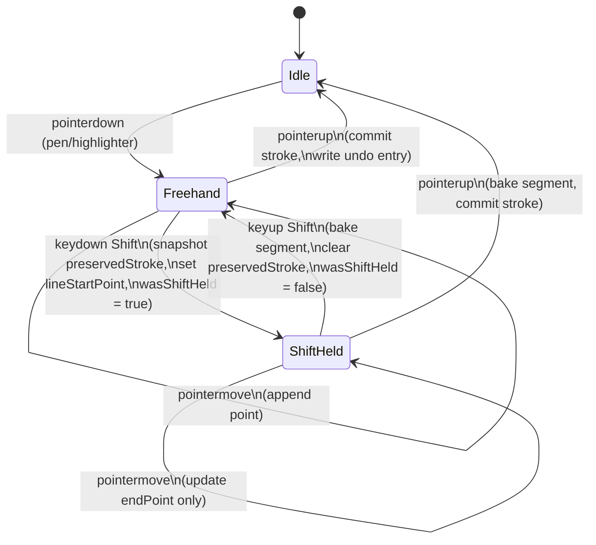

# Straight-Line Drawing with Shift Snap

Status: MVP implemented and tested by agent. Awaiting user verification in the browser.

Implementation landed in `JavaScript/braindump.js` (drawing logic block around `startDrawing` / `draw` / `stopDrawing`, plus the window pointermove/keyup wiring and the touch path). The Shift-snap branch is gated on `activeTool === "draw"`, snapshots `preservedPathData = currentPathData` once per Shift press, rebuilds `currentPathData` as `preservedPathData + " L endX endY"` on each move, and bakes on Shift keyup or pointer release. No `pushAction` calls run during preview — the existing single per-stroke history entry written by `createNode` in `stopDrawing` is unchanged. Snap math is exposed to tests via the `@export-for-test:snapStraightLine` marker.

Affected code area: `JavaScript/braindump.js`. Confirmed entry points:

- `startDrawing(x, y)` at `braindump.js:3373` — creates `currentPath` (SVG `<path>`) and seeds `currentPathData = "M x y"`.
- `draw(x, y)` at `braindump.js:3391` — appends ` L x y` to `currentPathData` on every pointermove. **This is the freehand hot path; do not slow it down.**
- `stopDrawing()` at `braindump.js:3406` — bakes the path into a `text` node via `createNode()`.
- `createNode()` at `braindump.js:3504` — writes undo entry via `pushAction()`. Already gated on `isLoadingState` (line 1455), which is the existing pattern for suppressing history writes.
- Live render surface: `svgLayer` (SVG element, `braindump.js:282`). Active stroke is one `<path>` element whose `d` attribute is mutated in place — no canvas redraw needed.

### Reality check vs. the original spec

The spec was written assuming a points-array model (`currentStroke = [{x, y, pressure}, ...]`). The codebase uses an SVG path string. This is actually simpler for Shift-snap:

| Spec assumption | Codebase reality | Adaptation |
| --- | --- | --- |
| `currentStroke` is a points array | `currentPathData` is an SVG path string (`"M x0 y0 L x1 y1 ..."`) | `preservedPathData = currentPathData` (string copy, O(n) once on Shift-down). During Shift-held: `currentPathData = preservedPathData + " L " + endX + " " + endY`. One allocation per move, same as a freehand append. |
| `preservedStroke = [...currentStroke]` | Snapshot the string instead | Strings are immutable in JS, so `let preservedPathData = currentPathData` is the snapshot — no spread needed. |
| Affected tools: pen, highlighter | Only one `"draw"` tool exists today | Gate on `activeTool === "draw"`. No subtype distinction needed for MVP. If pen/highlighter split lands later, the gate widens trivially. |
| Preserve pressure when available | No pressure handling exists today | Use synthetic `0.5` for now. True pressure preservation moves to follow-ups (already deferred in section 6). |
| `lineStartPoint` is the last point in `currentStroke` | The last point is recoverable from `lastDrawPoint` (already maintained at `braindump.js:3373, 3396`) | Use `lastDrawPoint` directly. No new state needed for this. |
| Suppress undo writes during preview | `isLoadingState` flag at `braindump.js:1455` already gates `pushAction` | Reuse `isLoadingState` pattern, or set a narrower `isShiftPreviewing` flag and OR-gate `pushAction`. The narrower flag is cleaner — `isLoadingState` has unrelated semantics. |

**No keyboard handling exists in the draw pipeline today** (Shift is only inspected for pan and selection elsewhere). This means the new Shift listener can live entirely inside the draw branch with no risk of conflict.

---

## 1. Feature Detail

### Purpose

While drawing with a pen or highlighter, holding **Shift** converts the active part of the stroke into a straight line. The line can either stay at the raw cursor angle or snap to common angles such as horizontal, vertical, or diagonal.

The feature must not slow down normal drawing, break existing freehand behavior, or affect non-drawing tools.

### Core Behavior

When the user draws normally, the stroke is recorded as freehand points.

#### State diagram

Stroke-level state machine. The `wasShiftHeld` flag distinguishes the first Shift-down frame from subsequent move frames so we only snapshot once per press.



#### Flow diagram

Per-pointermove decision tree. The early-return on the non-Shift path is load-bearing for the performance requirement.

```mermaid
flowchart TD
    A[pointermove event] --> B{stroke active\n& tool ∈ pen/highlighter\n& primary pointer?}
    B -- no --> Z[ignore]
    B -- yes --> C{Shift held?}
    C -- no --> D[freehand path<br/>append cursor to currentStroke<br/>existing logic, untouched]
    C -- yes --> E{wasShiftHeld?}
    E -- no --> F[Shift-down frame<br/>preservedStroke = [...currentStroke]<br/>lineStartPoint = last point<br/>wasShiftHeld = true]
    E -- yes --> G[continue]
    F --> G
    G --> H[compute dx, dy, angle, distance]
    H --> I{distance < 0.001?}
    I -- yes --> J[endPoint = lineStartPoint]
    I -- no --> K{angle within ±3°<br/>of a snap target?}
    K -- yes --> L[endPoint at snapped angle,<br/>preserve distance]
    K -- no --> M[endPoint = cursor position]
    J --> N[currentStroke =<br/>preservedStroke + lineStartPoint + endPoint]
    L --> N
    M --> N
    N --> O[render active layer only<br/>NO undo / history / CRDT write]
```

When the user presses **Shift** during the stroke:

1. Preserve the existing freehand part of the stroke.
2. Use the latest stroke point as the anchor for the straight segment.
3. Replace only the active tail of the stroke with a straight line from that anchor to the current cursor position.
4. Snap the line endpoint if the angle is close to a snap target.

When the user releases **Shift**:

1. Keep the last rendered straight segment as part of the stroke.
2. Resume normal freehand drawing from the segment endpoint.
3. Allow Shift to be pressed again later in the same stroke to create another straight segment.

### Required State

- `currentStroke` — points currently being drawn.
- `preservedStroke` — snapshot of the freehand stroke before Shift was pressed.
- `lineStartPoint` — anchor point for the straight segment.
- `wasShiftHeld` — tracks whether Shift was already held, so the system can detect the first Shift-down frame.
- `startPoint` — fallback anchor from pointer-down if no current stroke point exists.

#### Data-shape diagram

How `currentPathData` (SVG path string) is composed during each phase. Strings are immutable in JS, so the "snapshot" is just a variable assignment; only the trailing segment mutates while Shift is held.

```
Freehand phase (no Shift):
  currentPathData: "M x0 y0 L x1 y1 L x2 y2 L x3 y3 L x4 y4"
                                                          ↑ cursor (lastDrawPoint)
  Each pointermove: currentPathData += " L " + x + " " + y

Shift-down (latch once, on first frame Shift is held):
  preservedPathData = currentPathData   ← snapshot (string assignment, O(1))
  lineStartPoint    = lastDrawPoint     ← anchor = last freehand point
  wasShiftHeld      = true

Shift-held (every pointermove, recompose without re-walking the prefix):
  currentPathData = preservedPathData + " L " + endX + " " + endY
                    └─── stable, untouched ───┘   └─ only this moves ─┘
  currentPath.setAttribute("d", currentPathData)
  // NO pushAction, NO history write, NO node creation

Shift-release (bake the segment, resume freehand from endPoint):
  // currentPathData already ends in " L endX endY" — already baked.
  lastDrawPoint     = { x: endX, y: endY }   ← so next freehand L starts here
  preservedPathData = null
  lineStartPoint    = null
  wasShiftHeld      = false
  // next pointermove appends " L x y" normally
```

Why the prefix is "free" to preserve here: it's a string, and `preservedPathData = currentPathData` does not copy characters in V8 — it copies a reference. The only allocation per Shift-move is the new concatenated string for the live `d` attribute, which is the same allocation cost as one freehand append.

### Shift-Down Logic

On the first frame where Shift is held:

1. Set `lineStartPoint` to the last point in `currentStroke`.
2. If `currentStroke` is empty, use the current cursor position or `startPoint`.
3. Copy the current stroke into `preservedStroke`.
4. Set `wasShiftHeld = true`.

This copy should happen only once per Shift press, not on every pointer move.

### Move Logic While Shift Is Held

For every pointer move while Shift is held:

1. Compute the vector from `lineStartPoint` to the cursor.

       dx = canvasX - lineStartPoint.x
       dy = canvasY - lineStartPoint.y

2. Compute the angle and distance.

       angle = Math.atan2(dy, dx) * 180 / Math.PI
       distance = Math.sqrt(dx * dx + dy * dy)

3. Compare the angle against snap targets using a tolerance.

       snapAngles = [0, 45, 90, 135, 180, -45, -90, -135, -180]
       snapTolerance = 3

4. If the angle is within tolerance of a snap angle, recompute the endpoint at that exact angle while preserving distance.

       radians = snappedAngle * Math.PI / 180
       endX = lineStartPoint.x + distance * Math.cos(radians)
       endY = lineStartPoint.y + distance * Math.sin(radians)

5. If no snap target matches, use the raw cursor position as the endpoint.
6. Represent the active stroke as:

       currentStroke = [
         ...preservedStroke,
         lineStartPoint,
         endPoint
       ]

The straight segment should use synthetic pressure if no real pressure value is available. Recommended default: `pressure = 0.5`.

### Shift-Release Logic

When Shift is released:

1. Clear `preservedStroke`.
2. Clear `lineStartPoint`.
3. Set `wasShiftHeld = false`.
4. Keep the latest rendered straight segment baked into the stroke.
5. Continue appending new freehand points from the segment endpoint.

### Snap Angles

| Snap angle | Direction |
| --- | --- |
| `0°` | Horizontal right |
| `180°` / `-180°` | Horizontal left |
| `90°` | Vertical down |
| `-90°` | Vertical up |
| `45°` | Diagonal down-right |
| `-45°` | Diagonal up-right |
| `135°` | Diagonal down-left |
| `-135°` | Diagonal up-left |

Default snap tolerance: `±3°`. This creates a 6° total snap window per direction.

### Performance Requirements

Normal drawing must stay as fast as it was before this feature.

**Do not slow the freehand path.** When Shift is not held, the existing drawing logic should run unchanged.

    if (!shiftHeld) {
      // existing freehand drawing path
      return
    }

The Shift-snap logic should only run while:

- a stroke is active
- the active tool is pen or highlighter
- the primary pointer is drawing
- Shift is currently held

**Avoid repeated full-stroke cloning.** Allowed only on Shift-down:

    preservedStroke = [...currentStroke]

Do not do this on every pointer move.

**Minimize allocations during pointer movement.** Update only the active straight segment endpoint where possible.

    activeStraightSegment = [lineStartPoint, endPoint]
    renderedStroke = preservedStroke + activeStraightSegment

**Keep history writes out of the hot path.** Do not create undo entries, checkpoints, CRDT updates, or persistent history records for every preview movement while Shift is held. Commit the stroke normally when the stroke ends.

**Keep calculations cheap.** Per-move math should remain `O(1)`: only `dx`, `dy`, `atan2`, `sqrt`, snap-angle comparison, endpoint update.

**Avoid render thrashing.** Render the active stroke on the existing live drawing layer. Do not recalculate unrelated canvas objects. Avoid layout reads or DOM measurements during pointer movement.

### Safety Requirements

**Affected tools:** pen, highlighter.

**Unaffected tools:** eraser, selector, pan, zoom, text, shapes, image placement, lasso, resize handles.

**Do not break normal freehand drawing.** If Shift is never pressed, the output stroke should be identical to the previous freehand behavior.

**Do not mutate the preserved prefix.** `preservedStroke` must remain stable while Shift is held. Only the live straight segment endpoint should change.

**Handle zero-length lines.** If the cursor is at the same position as `lineStartPoint`:

    if (distance < 0.001) {
      endPoint = lineStartPoint
    }

**Handle angle wraparound.** `180°` and `-180°` both represent horizontal-left. The implementation should handle this boundary cleanly so horizontal-left snapping does not flicker.

**Preserve pointer ownership.** Only the active primary pointer should update the stroke. Ignore unrelated pointer events while a stroke is active.

**Preserve pressure when available.** If pressure-sensitive input is available, use real pressure values. Fallback:

    pressure = pointerPressure ?? lastKnownPressure ?? 0.5

Do not require pressure support for the feature to work.

### Acceptance Criteria

**Basic drawing**

- Drawing without Shift behaves exactly like normal freehand drawing.
- Shift does nothing when no stroke is active.
- Shift does nothing for non-stroke tools.

**Straight-line behavior**

- Pressing Shift mid-stroke preserves the existing freehand prefix.
- The line anchor is the latest stroke point when Shift was first pressed.
- Moving the cursor while Shift is held updates a single straight segment.
- Releasing Shift keeps the straight segment and resumes freehand drawing.
- Pressing Shift again later creates another straight segment.

**Snapping behavior**

- Lines snap to horizontal, vertical, and diagonal angles inside the tolerance window.
- Lines outside the tolerance window remain straight but unsnapped.
- Horizontal-left snapping works correctly near `180°` and `-180°`.

**Performance behavior**

- No full-stroke clone happens on every pointer move.
- No undo/history/checkpoint entry is created for every Shift preview movement.
- No unrelated canvas objects are recalculated during Shift preview.
- Freehand drawing performance is unchanged when Shift is not held.

**Data behavior**

- The final stroke contains the preserved freehand prefix and the final straight segment.
- Intermediate Shift preview positions are not stored as permanent stroke points.
- Pressure data is preserved where available and falls back safely where unavailable.

---

## 2. MVP Scope

The MVP must validate the core Shift-snap loop without depending on optional polish.

**In scope for MVP**

- Shift-down captures `lineStartPoint` and `preservedStroke` exactly once per press.
- Shift-hold replaces the active tail with a straight segment to the cursor.
- Snap targets: 0, 45, 90, 135, 180, -45, -90, -135, -180 degrees.
- Snap tolerance: `±3°`.
- Shift-release bakes the segment and resumes freehand drawing.
- Zero-length protection (`distance < 0.001`).
- Angle wraparound at `±180°` is handled.
- Active only for `pen` and `highlighter` tools.
- No undo/history entries during preview.
- Synthetic pressure fallback at `0.5`.

**Deferred (see section 6)**

- Wider or configurable snap tolerance.
- Nearest-angle fallback (snap always when Shift is held).
- True per-point pressure preservation across the segment.
- Visual snap feedback (guide line, angle label).

---

## 3. Todos

- [A] Locate the freehand drawing path in `JavaScript/braindump.js`. Confirmed: `startDrawing` (3373), `draw` (3391), `stopDrawing` (3406), `createNode` + `pushAction` (3504), live layer `svgLayer` (282). Data shape is an SVG path string `currentPathData`, not a points array. No existing pressure handling, single `"draw"` tool. See "Reality check" above.
- [A] Add a pure snap-math helper. Landed inline in `braindump.js` as `snapStraightLine(start, cursor)`, exposed to tests via the `/* @export-for-test:snapStraightLine */` marker (see `tests/board/board-shift-snap-math.test.mjs` for the extraction pattern). Interface differs from the spec proposal: takes `(start, cursor)` and returns `{ x, y }` rather than `(dx, dy, tolerance) → { endX, endY, snapped }`. Same behavior; the simpler signature avoids redundant parameter plumbing.
- [A] Add module-scoped state inside `braindump.js`: `preservedPathData = ""`, `lineStartPoint = null`, `lineEndPoint = null`, `wasShiftHeld = false`. Anchor source is `lastDrawPoint` as planned.
- [A] Modify `draw(x, y, shiftKey)` so that the leading branch on `shiftKey && activeTool === "draw"` runs the snap path and returns early. Freehand throttle and `L x y` append below are unchanged in shape.
- [A] Track `shiftKey` state. Read `e.shiftKey` directly from `pointermove` and `touchmove` (the simpler option). A `keyup` listener handles the bake when Shift is released without further pointer movement so the next Shift press re-anchors at the previous segment's endpoint.
- [A] Implement Shift-down branch on the first frame: `preservedPathData = currentPathData`, `lineStartPoint = { x: lastDrawPoint.x, y: lastDrawPoint.y }`, `wasShiftHeld = true`.
- [A] Implement Shift-held move: call `snapStraightLine(lineStartPoint, pos)`, set `currentPathData = preservedPathData + " L endX endY"`, update the SVG `d` attribute, expand the bbox against the snapped endpoint.
- [A] Implement zero-length protection (`distance < 0.001` → `endPoint = lineStartPoint`) and `±180°` wraparound. Verified by `tests/board/board-shift-snap-math.test.mjs` cases 6, 7, 8.
- [A] Implement Shift-release via `bakeShiftSegment()`: sets `lastDrawPoint = lineEndPoint`, clears `preservedPathData` / `lineStartPoint` / `lineEndPoint`, resets `wasShiftHeld`. Called from the `keyup` listener and from `stopDrawing()`. A defensive call also runs if a non-Shift `pointermove` arrives before `keyup` fired.
- [A] Verify no `pushAction` / undo writes fire during Shift preview. Verified by `tests/board/board-shift-snap-runtime.test.mjs` case 10 (static check).
- [A] Update bounding box during Shift-held moves so the eventual SVG node fits the snapped endpoint. Implemented in the snap branch of `draw()`.
- [A] Add unit test `tests/board/board-shift-snap-math.test.mjs` for the pure snap helper. Covers cardinal axes, diagonals, the `±3°` boundary on both sides, the `±180°` wraparound, and the zero-distance case.
- [A] Add E2E test `tests/board/board-shift-snap-stroke-e2e.test.mjs` (Playwright). Drives `pointerdown → freehand moves → keydown Shift → moves at 0°, 90°, 45°, an out-of-tolerance angle → keyup Shift → freehand moves → pointerup`, plus a two-Shift-presses case, and asserts the live `<path>` `d` attribute on the active SVG layer.
- [ ] Add regression test `tests/board/board-shift-snap-regression.test.mjs` that runs a no-Shift sequence and asserts `currentPathData` matches a fixture from before the change. **Deferred.** Static structural coverage in `tests/board/board-shift-snap-runtime.test.mjs` (cases 4 and 11) keeps the freehand path locked in shape, but a dynamic byte-for-byte fixture comparison is still worth doing once a stable baseline is captured.
- [A] Add no-history-spam coverage. Static check landed in `tests/board/board-shift-snap-runtime.test.mjs` case 10 (asserts the snap branch never references `pushAction` / `undoStack` / `markBoardDirty` / `saveBoard`). Dynamic Playwright check landed at `tests/board/board-shift-snap-no-history-spam.test.mjs` — drives a 40-move Shift-held preview sequence and asserts a single `Ctrl+Z` rolls the entire stroke back to baseline.
- [A] Run the relevant tests, write the report under `test-results/straight-line-shift-snap_2026-04-29T02-11-06Z.md`, link it in section 5.

Status legend: `[ ]` pending, `[A]` agent-confirmed-done, `[x]` user-verified-done.

---

## 4. Tests

All tests must pass without manual user interaction. New test files go under `tests/board/` since this is a board drawing behavior. Follow the naming convention in `tests/README.md`.

Landed tests:

- **[`tests/board/board-shift-snap-math.test.mjs`](../../tests/board/board-shift-snap-math.test.mjs)** — pure unit test. Extracts `snapStraightLine` from `braindump.js` via the `@export-for-test:snapStraightLine` marker and evaluates it as a pure function. 9 cases cover:
  - Cardinal axes (`0°`, `90°`, `180°`, `-90°`) snap exactly.
  - 45° diagonal snaps exactly.
  - Angles within `±3°` of a target snap to the exact angle.
  - Angles outside the tolerance window pass through unsnapped.
  - `±180°` wraparound returns horizontal-left consistently.
  - `distance < 0.001` returns `endPoint === lineStartPoint`.
  - Snapping preserves cursor distance.
  - No suffix in the filename: pure unit test, no server, no Playwright.

- **[`tests/board/board-shift-snap-runtime.test.mjs`](../../tests/board/board-shift-snap-runtime.test.mjs)** — static source assertions over `JavaScript/braindump.js`. 12 cases catch accidental regressions in the freehand path, the snap branch's early return, the snapshot/bake/keyup invariants, the no-history-during-preview rule, and the mousedown branch order that prevents the Shift+drag pan shortcut from hijacking a Shift-started stroke. Pure-Node, runs in milliseconds. (This file did not appear in the original spec but was added because the unit test could not assert the wiring shape inside `draw()` without it.)

- **[`tests/board/board-shift-snap-stroke-e2e.test.mjs`](../../tests/board/board-shift-snap-stroke-e2e.test.mjs)** — Playwright. Spawns the preview server on port 4201, selects the draw tool, and drives 5 cases via `page.mouse` and `page.keyboard`:
  - Freehand → Shift held with near-horizontal motion → release → freehand resumes.
  - 90° (vertical down) snap.
  - 45° diagonal snap.
  - Out-of-tolerance angle stays unsnapped (no flicker).
  - Two Shift presses in one stroke produce two straight segments.

  Each case reads the live `<path>` `d` attribute from `[data-board-role="svg-layer"]` to verify the resulting path shape.

- **[`tests/board/board-shift-snap-no-history-spam.test.mjs`](../../tests/board/board-shift-snap-no-history-spam.test.mjs)** — Playwright. Spawns the preview server on port 4202 and drives a stroke containing a 5-point freehand prefix, 40 Shift-held pointer moves, and a 5-point freehand resumption. Asserts:
  - The stroke creates exactly +1 `.bd-item` on the board.
  - One `Ctrl+Z` rolls the count back to baseline (entire stroke is one undo unit, regardless of how many preview moves fired).

  Complements the static check in the runtime test by proving no transitively-called code path during preview accumulates history entries.

Still deferred (see todo list):

- **`tests/board/board-shift-snap-regression.test.mjs`** — fixed no-Shift pointer sequence vs baseline freehand fixture. Static structural coverage in the runtime test partially substitutes; a dynamic byte-for-byte comparison is worth doing once a freehand-related change actually threatens the baseline. Until then, a baseline-fixture test that nothing compares against is just maintenance overhead.

---

## 5. Test Reports

Most recent at the top.

- [`test-results/straight-line-shift-snap_2026-04-29T02-11-06Z.md`](../../test-results/straight-line-shift-snap_2026-04-29T02-11-06Z.md) — math 9/9, runtime 12/12, stroke-e2e 5/5, no-history-spam 1/1. Combined re-run: 27/27 across the four shift-snap files. All MVP acceptance criteria from section 2 verified mechanically. The runtime suite now also locks the mousedown branch order so the Shift+drag pan shortcut cannot hijack a Shift-started stroke. Sibling-test sweep (`tests/board/*.test.mjs`) shows three failures, all pre-existing (`board-save-export-runtime.test.mjs`, `cosmoboard-initial-layout.test.mjs`, `board-url-paste-preview-e2e.test.mjs`); none introduced by this change. Tracked in `.agents/general_issues_and_tasks.md`.

---

## 6. Optional / Follow-ups

- **Wider snap tolerance.** Increase tolerance from `3°` to `5°` or `7.5°` for easier snapping. Make it configurable if the user asks.
- **Nearest-angle fallback.** Instead of only snapping inside the tolerance window, always snap to the nearest angle while Shift is held.
- **True pressure preservation.** Use last known stylus pressure for the start point and current pointer pressure for the endpoint, falling back to `0.5` only when pressure data is unavailable.
- **Visual snap feedback.** Subtle guide indicator or angle label when the line is snapped. Optional, must not be required for the core feature.
