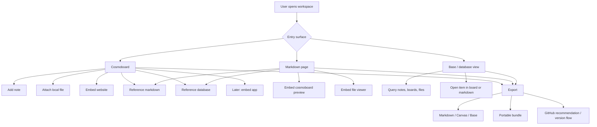
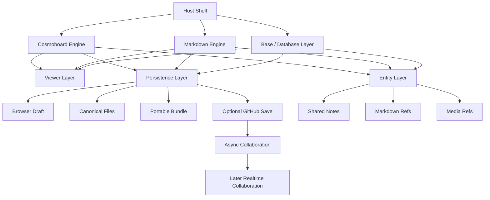
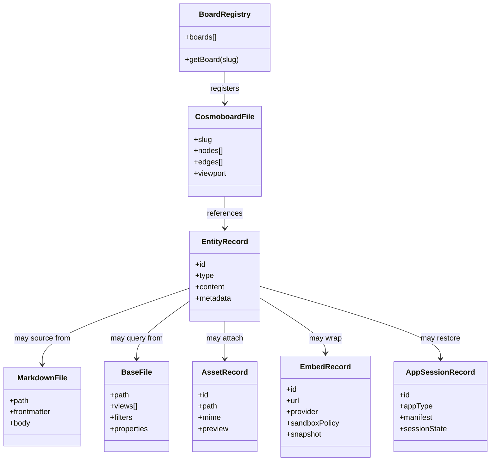
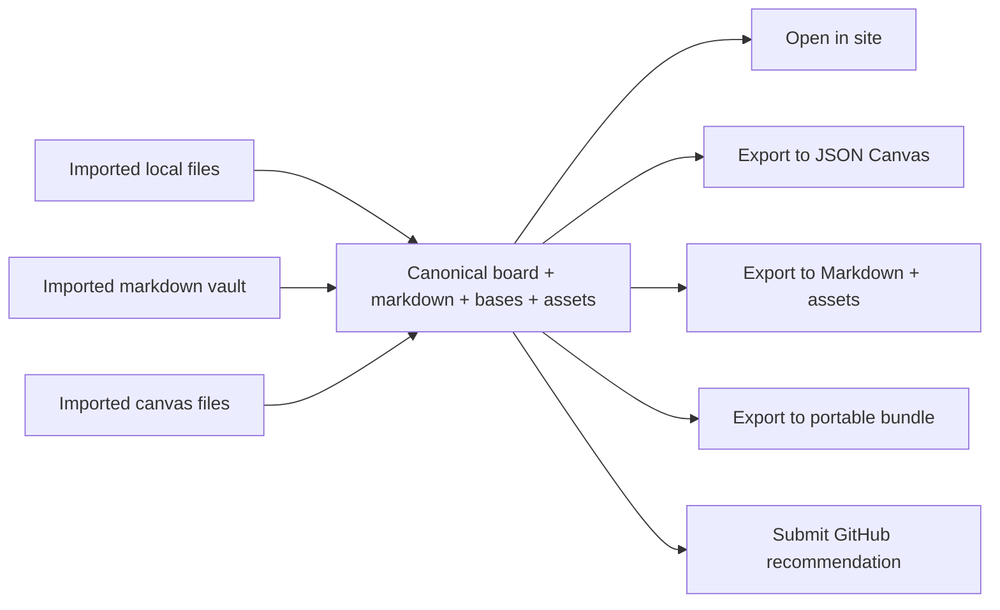

# Holistic Planning Archive

This file contains resolved planning history and legacy diagrams from the original `holistic_planning.md`.

---

## Product Flow Diagram (Resolved)

## Architecture Layer Diagram (Resolved)

## File Organization Class Diagram (Resolved)

## Interchange Flow Diagram (Resolved)

## Roadmap Flow Diagram (Resolved)

```mermaid
flowchart LR
    A[Phase 0 Demo Platform Framing] --> B[Phase 1 Cosmoboard Engine]
    B --> C[Phase 2 Markdown Integration]
    C --> D[Phase 3 Base / Database Layer]
    D --> E[Phase 4 File + Web Embed Layer]
    E --> F[Phase 5 GitHub Versioning]
    F --> G[Phase 6 Realtime Collaboration]
    G --> H[Phase 7 App Embeds]
    H --> I[Phase 8 Deep Portability]
```

