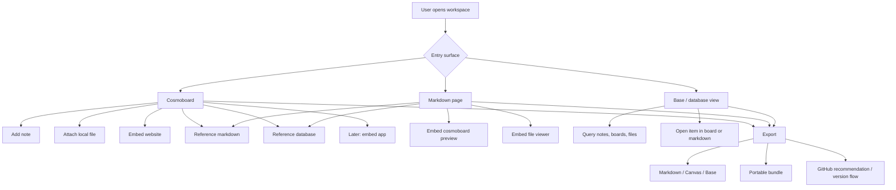
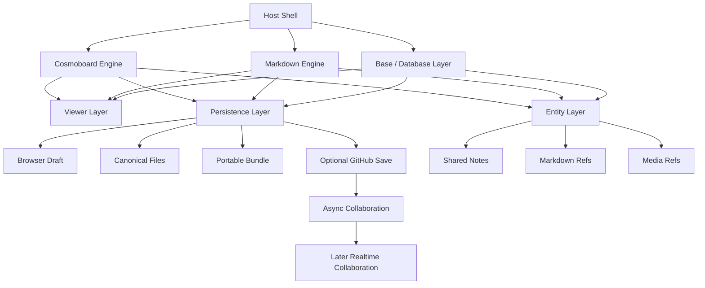
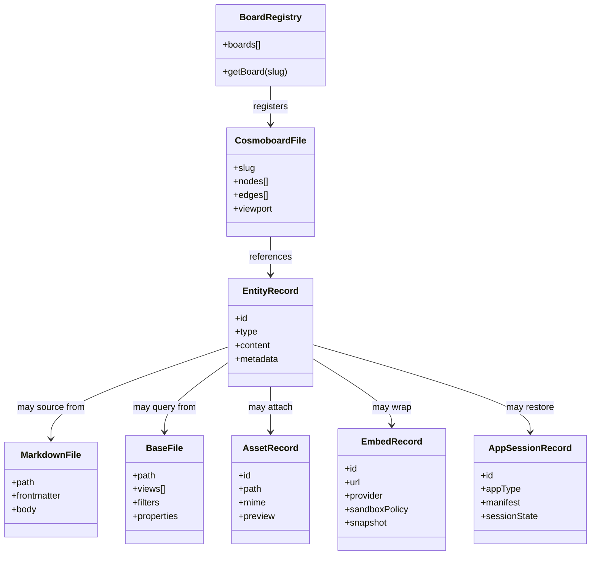
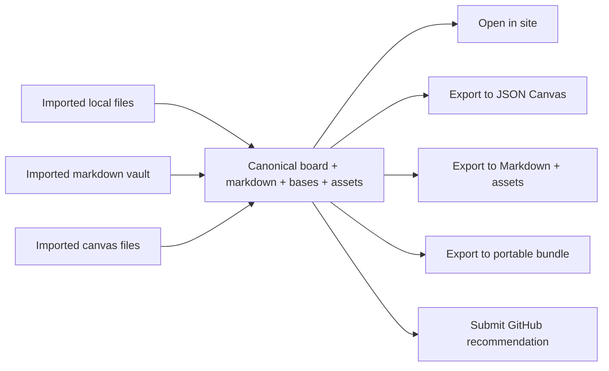

# Holistic Planning

## Purpose

This file is the umbrella product plan above the existing Braindump, Cosmoboard, online save, and page database plans.

| Topic | Role in the planning stack |
| --- | --- |
| This file | Defines the whole product shape: boards, markdown, files, databases, embeds, apps, portability, and collaboration |
| [whiteboard_plan.md](../whiteboard/whiteboard_plan.md) | Original Braindump whiteboard MVP direction |
| [cosmoboard_portability.md](../whiteboard/cosmoboard_portability.md) | Portability, embed, markdown, file, and compatibility strategy |
| [cosmoboard_implementation_plan.md](../whiteboard/cosmoboard_implementation_plan.md) | Refactor and implementation roadmap for turning Braindump into a reusable engine |
| [online_save_plan.md](../whiteboard/online_save_plan.md) | Static-site-friendly recommendation and export flow |
| [online_save_backend_plan.md](../whiteboard/online_save_backend_plan.md) | Later GitHub OAuth and PR-based collaboration path |
| [page_database_plan.md](../page_database/page_database_plan.md) | Collection, page, and database-like content model for the rest of the site |

## Product North Star

| Item | Direction |
| --- | --- |
| Product intent | One interface where canvases, markdown, databases, files, websites, and later apps can coexist and reference each other |
| Core metaphor | `Cosmoboard` is the spatial layer, markdown is the durable writing layer, bases/databases are the structured query layer |
| Primary quality bar | High performance on desktop, tablet, and mobile |
| Core deployment model | Local-first and static-site-compatible first |
| Portability goal | Every important artifact should be importable, exportable, downloadable, and recoverable |
| Interoperability goal | Stay close to open formats where possible, especially markdown and JSON Canvas |
| Collaboration goal | Start async and Git-friendly, then add realtime collaboration later |
| Anti-goal | Do not become a cloud-only locked workspace that requires backend sync for basic use |

## Product Pillars

| Pillar | What it means in practice |
| --- | --- |
| Local-first | Local drafts, local files, offline-friendly editing, browser-first persistence |
| Portable | Markdown, `.canvas`, exported bundles, downloadable assets, import/export everywhere |
| Embeddable | Markdown in boards, boards in markdown, websites in boards, documents in focused viewers, apps in bounded containers |
| Structured | Databases and bases can query, filter, and cross-reference notes, boards, and files |
| Performant | Pan, zoom, drawing, file previews, and embeds do not block interaction |
| Gradual collaboration | Single-user first, GitHub workflow second, realtime CRDT collaboration later |
| Safe by default | Sandboxed embeds, explicit local file permissions, no silent filesystem crawling |

## Capability Matrix

| Artifact type | Native object? | Embeddable in board? | Embeddable in markdown? | Import/export target | Suggested source of truth |
| --- | --- | --- | --- | --- | --- |
| Cosmoboard | Yes | Yes | Yes | `.canvas`, portable bundle | Board file |
| Markdown note | Yes | Yes | Yes | `.md`, bundle | Markdown file |
| Base / database view | Yes | Yes | Yes | `.base`, JSON, bundle | Base definition plus file metadata |
| Local file | Yes | Yes | Yes via embed/view block | Original file, bundle | File itself plus metadata |
| Local folder | Yes | Yes | Partial, via folder block or linked view | Folder import, bundle manifest | Folder handle plus indexed metadata |
| Website embed | Yes | Yes | Yes | URL plus metadata snapshot | URL plus embed metadata |
| App embed | Yes, later | Yes | Yes, later | App manifest plus session state | App session record |
| Shared entity | Yes, later | Yes | Yes | JSON, bundle | Entity store |
| Image / video / pdf | Yes | Yes | Yes | Original asset, bundle | Asset file plus metadata |



## Experience Model

| Surface | Primary use | Default mode | Expansion path |
| --- | --- | --- | --- |
| Full cosmoboard | Spatial thinking, curation, research, project mapping | Full interactive editor | Stays full editor |
| Embedded cosmoboard | Preview of a project/topic board | Read-only or lightweight interactive | Open dedicated full board route |
| Markdown page | Writing, specification, narrative, project logs | Document editor / viewer | Open linked board, files, database views |
| Base / database view | Structured browsing, sorting, filtering, cross-reference | Query and inspect | Open markdown pages, board nodes, file viewers |
| Focused file viewer | PDF, image, text, JSON, archive, CAD | Viewer-first | Optional editing for safe file types later |
| App container | Tool inside the workspace | Sandboxed preview | Open isolated app session |

## Architecture Overview

| Layer | Responsibility | Notes |
| --- | --- | --- |
| Host shell | Routing, layout, nav, mobile/desktop adaptation | Current website grows into product shell |
| Cosmoboard engine | Pan, zoom, selection, drawing, node layout, board import/export | Existing Braindump evolves into shared engine |
| Markdown engine | Durable writing, embeds, references, metadata | Must stay portable and file-backed |
| Base / database layer | Query, sort, filter, cards, relations, derived views | Bridge between notes, boards, and files |
| Viewer layer | PDF, text, image, video, archive, CAD viewers | On demand, not hot path |
| Entity layer | Shared reusable content across boards and markdown | Later phase |
| Persistence layer | Local draft, canonical files, bundle export, optional hosted save | Static-site-compatible first |
| Collaboration layer | GitHub recommendation, PRs, later CRDT sync and presence | Layered, not required for core editing |



## Canonical File Organization

### Recommended V1 file tree

```text
content/
  boards/
    index.json
    braindump/
      current.canvas
    projects/
      <project-slug>/
        current.canvas
    topics/
      <topic-slug>/
        current.canvas
  markdown/
    projects/
      <project-slug>.md
    notes/
      <note-slug>.md
  bases/
    projects.base
    notes.base
    media.base
  assets/
    images/
    video/
    pdf/
    files/
  embeds/
    websites/
      <embed-id>.json
    apps/
      <app-id>.json
```

### Recommended V2 linked-content tree

```text
content/
  boards/
    index.json
    braindump/current.canvas
    projects/<project-slug>/current.canvas
  markdown/
    projects/<project-slug>.md
    notes/<note-slug>.md
  bases/
    projects.base
    notes.base
    media.base
  entities/
    note-001.json
    markdown-002.json
    media-003.json
    embed-004.json
    app-005.json
  assets/
    ...
  bundles/
    exported/
      <slug>-YYYY-MM-DD-HH-mm-ss.cosmoboard.json
```



## Interchange And Portability

| Format / package | Import priority | Export priority | Why it matters |
| --- | --- | --- | --- |
| Markdown `.md` | High | High | Core durable writing format |
| JSON Canvas `.canvas` | High | High | Board portability and Obsidian-friendly interoperability |
| Base definition `.base` | Medium-high | High | Structured views over local files and metadata |
| Plain JSON | High | High | Entity records, manifests, session state |
| PDF / images / video | High | High | Common research and project assets |
| Portable bundle `.zip` | Medium | High | Full project handoff, archiving, includes all raw assets |
| Git-friendly patch `.canvas.json` | Medium | High | GitHub PR / issue payload, embeds new unsaved images as Base64 for clean diffs |



## App And Embed Strategy

| Object | V1 shape | Later shape | Important constraint |
| --- | --- | --- | --- |
| Website embed | Sandboxed iframe or metadata card | Richer live embed with provider adapters | Many sites will block or limit iframe embedding |
| PDF / document | Focused viewer | Inline snippets plus annotations | Keep heavy rendering off the camera hot path |
| Markdown embed | Read-only reference or excerpt | Editable linked entity | Clear source-of-truth rules needed |
| Cosmoboard embed | Read-only preview | Shared filtered view | Prefer dedicated full editor route |
| Database embed | Cards or table preview | Fully interactive embedded base | Avoid loading too much data by default |
| App embed | App card plus session manifest | Streamed or local app container | Strong sandboxing and saved state boundaries |
| Browser-like surface | URL card plus open action | Embedded browser pane or clipped snapshot flow | Cross-origin restrictions are real |

## Existing App References

| App / project | Relevant pattern to learn from | What to borrow | What not to copy blindly | Official reference |
| --- | --- | --- | --- | --- |
| Notion | Blocks plus databases in one workspace | Page as object, rich embeds, database views, relations | Cloud-only assumptions and weak file portability | https://www.notion.com/product/notion |
| Notion Databases | Structured pages with properties, relations, rollups | Database-style views over content | Over-centralizing everything into one opaque backend model | https://www.notion.com/help/what-is-a-database |
| Miro | Infinite multiplayer canvas and embed surface | Board ergonomics, canvas as collaboration surface, external embeds | Heavy always-live multiplayer cost for every board | https://miro.com/what-is-miro/ |
| Obsidian Canvas | Open canvas file format with markdown adjacency | `.canvas` compatibility and markdown-first ownership | Assuming every advanced node maps cleanly to Obsidian | https://help.obsidian.md/Plugins/Canvas |
| Obsidian Bases | File-backed database views over notes | Local database views that remain file-native | Treating every query view as a custom backend feature | https://help.obsidian.md/bases |
| AFFiNE | Doc plus edgeless in one product | Dual page/board model, attachments, iframe blocks, edgeless mode | Prematurely coupling all content to one app-specific model | https://docs.affine.pro/ |
| Anytype | Local-first, peer-to-peer, object graph | Offline-first mindset, local API, data ownership | Deeply custom encrypted object model before simpler file-first path is working | https://doc.anytype.io/ |
| tldraw | Infinite canvas SDK with customizable tools | Tool architecture, editor component patterns, custom UI approach | Replacing the current engine too early without a migration plan | https://tldraw.dev/faq |
| Excalidraw | Embeddable sketch-style canvas with open JSON format | Simple diagramming and embeddable whiteboard patterns | Sketch-only interaction model if you want a broader workspace | https://docs.excalidraw.com/ |

## Technology And Project Candidates

| Capability | Candidate | Stage | Why it is relevant |
| --- | --- | --- | --- |
| Board interchange | JSON Canvas | Immediate | Open board format already aligned with existing Braindump direction |
| Canvas runtime | Existing custom Braindump runtime | Immediate | Lowest migration risk and already matched to repo architecture |
| Canvas runtime alternative | tldraw SDK | Evaluate | Strong editor model if custom engine becomes too expensive to maintain |
| Sketch / diagram subset | Excalidraw | Evaluate | Useful reference or optional mode for looser diagramming |
| Markdown / block editing | BlockNote | Evaluate | Block-based editor with collaboration support and ready-made UI |
| Markdown / rich text primitives | ProseMirror or Tiptap stack | Evaluate | Flexible transaction-based editor foundation |
| Realtime sync | Yjs | Later | High-performance CRDT building blocks for collaborative apps |
| Realtime sync alternative | Automerge | Later | Strong local-first model with offline merge semantics |
| Presence / comments / inbox | Liveblocks | Later | Fast path for presence, comments, and collaboration primitives |
| Local file and folder access | File System Access API | Immediate where available | Explicit permission-based access to local files and folders in browser |
| Browser-local structured data | SQLite WASM | Evaluate | Local relational/query layer for bases, indexing, and search |
| PDF viewing | PDF.js | Evaluate | Mature browser PDF viewer path |
| Portable diagrams in docs | Mermaid | Immediate | Lightweight diagrams inside markdown and planning docs |
| Versioning / async collaboration | GitHub Issues and PRs | Phase 1-2 collaboration | Fits existing static-site and recommendation flow plans |
| In-browser app execution | WebContainers | Later, selective | Candidate for specific app or dev-tool embeds inside the workspace |

## Suggested Source-Of-Truth Rules

| Content type | Recommended source of truth |
| --- | --- |
| Quick scratch note that lives only on one board | Board file |
| Durable project note | Markdown file |
| Shared note reused in multiple boards and pages | Entity record referencing markdown or canonical entity content |
| Structured project metadata | Base / database file and file properties |
| Attached asset | Asset file plus metadata record |
| Website embed | Embed record with URL and snapshot metadata |
| App session | App session record plus app manifest |
| Spatial arrangement | Board file |

## Phased Product Roadmap

| Phase | Outcome | Main deliverables |
| --- | --- | --- |
| 0 | Demo becomes explicit platform prototype | Align naming around Cosmoboard, create umbrella plan, keep Braindump stable |
| 1 | Reusable board engine | Registry, generic host renderer, shared runtime, shared CSS, canonical board paths |
| 2 | Board plus markdown workflow | `markdown-ref` nodes, markdown embeds, import/export for `.md` and `.canvas` |
| 3 | Structured local views | Base / database layer over notes, boards, and assets |
| 4 | File and embed workspace | Generic file nodes, focused viewers, website embeds, folder import |
| 5 | Async collaboration and versioning | GitHub recommendation flow, stable board branches, PR-aware review workflow |
| 6 | Realtime collaboration | CRDT sync, presence, comments, awareness, conflict handling |
| 7 | App surface | Sandboxed app embeds, session state, selective streamed/local apps |
| 8 | Full ecosystem portability | Portable bundles, richer Obsidian round-trip, plugin or local API layer |

```mermaid
flowchart LR
    A[Phase 0 Demo Platform Framing] --> B[Phase 1 Cosmoboard Engine]
    B --> C[Phase 2 Markdown Integration]
    C --> D[Phase 3 Base / Database Layer]
    D --> E[Phase 4 File + Web Embed Layer]
    E --> F[Phase 5 GitHub Versioning]
    F --> G[Phase 6 Realtime Collaboration]
    G --> H[Phase 7 App Embeds]
    H --> I[Phase 8 Deep Portability]
```



## Collaboration Maturity Model

| Stage | Collaboration model | Best fit |
| --- | --- | --- |
| Stage A | Single-user local-first | Core product must work here |
| Stage B | Export and import handoff | Fast portability without backend |
| Stage C | GitHub issue / recommendation upload | Static-site-safe public contribution |
| Stage D | GitHub OAuth plus stable PR per board per user | Moderated async collaboration |
| Stage E | Realtime CRDT sync plus presence | Active co-editing sessions |
| Stage F | Shared entities plus comments, mentions, review flows | Team knowledge workspace |

## Main Product Risks

| Risk | Why it matters | Mitigation |
| --- | --- | --- |
| Performance collapse | Boards with drawings, media, embeds, and apps can become unusable fast | Culling, LOD, async media, viewer-first design, cheap embeds |
| Over-complex data model too early | Too many object types can stall shipping | Start with board, markdown, files, bases, then add entities/apps |
| Cloud dependency creep | Portability and offline use would regress | Keep local drafts, file export, and static-site behavior as non-negotiables |
| Cross-origin embed limits | Many websites cannot be embedded freely | Use metadata cards, open actions, snapshots, and provider adapters |
| Collaboration conflict complexity | Realtime and GitHub flows solve different problems | Ship async versioning first, realtime later |
| Mobile UX degradation | Desktop-first canvas tools often fail on touch devices | Keep mobile and tablet in scope at every phase |

## Skeleton Decisions To Confirm

| Decision area | Current recommended default | Why |
| --- | --- | --- |
| Main system name | `Cosmoboard` | Already consistent with portability and implementation docs |
| Default board scope | One board per project, page, or topic | Keeps boards smaller, faster, and easier to version |
| Main writing source | Markdown files | Best portability and interoperability |
| Main board source | JSON Canvas compatible `.canvas` | Best current interoperability target |
| Main structured layer | File-backed bases / database views | Matches local-first direction |
| Embed expansion model | Preview first, open full editor route | Better performance and less UI clutter |
| Async collaboration v1 | GitHub issue / PR recommendation flow | Fits repo and static-site constraints |
| Realtime collaboration | CRDT-based and optional | Should not block core product launch |
| App embeds | Later phase with manifest plus sandbox | Needs clear security and state rules |

## Resolved Direction From User Interview

| Decision area | User direction | Planning effect |
| --- | --- | --- |
| Product naming | `Cosmoboard` is acceptable for now | Do not block work on broader naming decisions |
| Written content model | Markdown and canvas should stay core and work together easily | Do not make block-doc tooling replace markdown as the only durable writing model |
| Board count and nesting | Multiple boards per page are expected, including deep nesting | Registry, host rendering, and embed model must not assume one board per page |
| Hierarchy model | Filesystem hierarchy should stay primary | Keep file-backed organization ahead of opaque workspace-only structures |
| Embed default | Preview-first by default, live embeds also possible | Use cheap default embeds but preserve richer live modes |
| Structured layer | Obsidian portability matters, but cleaner and more intuitive UX is allowed; Notion-like ergonomics can help near term | Build portable structured views without copying either product blindly |
| Local file behavior | Read and write support is desired where possible on browsers/devices | Design for capability detection and graceful fallback, not read-only as the only target |
| App embed priority | Saved web app sessions are the first priority | App/session manifests matter earlier than streamed remote apps |
| GitHub role | GitHub should be the main collaboration surface for now, alongside local-first workflows | Keep recommendation, issue, and PR flows central in early collaboration phases |
| Realtime scope | Broad coverage is preferred if practical | Do not over-silo the collaboration plan to boards only unless forced by complexity |
| First serious pilot | Stay inside `evrenucar.com`; after Braindump, add a `cosmoboard` onboarding page with boards, markdown files, and database views inside it | Near-term roadmap should target a central onboarding board rather than a separate standalone product site |

## Remaining Open Questions

| # | Question | Why this still matters |
| --- | --- | --- |
| 1 | Should markdown remain the clear durable source of truth for most authored text, or should some future block-doc format become equally canonical? | Still affects editor architecture and long-term interchange decisions |
| 2 | Should shared linked entities arrive before or after the first `cosmoboard` onboarding page ships? | Changes data-model timing |
| 3 | How much live editing should embedded boards and embeds allow before opening a dedicated full view? | Impacts performance and UX complexity |
| 4 | Which safe file types should get true in-place editing first across devices? | Narrows the first write-enabled local file scope |
| 5 | When realtime collaboration starts, do boards, markdown, and structured data need to share one underlying sync model, or can they phase in on separate adapters? | Affects CRDT architecture and rollout risk |

## Feature ideas
- Clean and easy to edit tables inside boards and markdown files
- database linked board contents
- ability and preference to embed boards in boards as preview as well (just like it is in other files currently)
- nokta_os can be used as a reference for drawing and navigation features. These should be infinitely adjustable in settings. Baseline should be easiest and most intuitive basic settings.
- Plugin support
- Full portability to obsidian, notion, figma, figjam, miro, roar, affine, anytype. And full portabilityi from these tools to here as well
- Note: Live web embeds cannot render sites like GitHub or Google due to `X-Frame-Options` and `Content-Security-Policy` headers blocking iframes. The current custom fallback header (with an "Open" button) handles this gracefully, but true rendering would require a server-side proxy or browser extension.

## External References

| Topic | Official reference |
| --- | --- |
| JSON Canvas | https://jsoncanvas.org/ |
| Obsidian Canvas | https://help.obsidian.md/Plugins/Canvas |
| Obsidian Bases | https://help.obsidian.md/bases |
| Obsidian embeds | https://help.obsidian.md/embeds |
| Obsidian web embeds | https://help.obsidian.md/embed-web-pages |
| Notion product | https://www.notion.com/product/notion |
| Notion databases | https://www.notion.com/help/what-is-a-database |
| Notion relations and rollups | https://www.notion.com/help/relations-and-rollups |
| Miro product | https://miro.com/what-is-miro/ |
| Miro embed | https://developers.miro.com/docs/embed-2 |
| Miro live embed | https://developers.miro.com/docs/miro-live-embed-introduction |
| AFFiNE docs | https://docs.affine.pro/ |
| Anytype docs | https://doc.anytype.io/ |
| tldraw docs | https://tldraw.dev/faq |
| Excalidraw docs | https://docs.excalidraw.com/ |
| Yjs docs | https://docs.yjs.dev/ |
| Automerge docs | https://automerge.org/docs/hello/ |
| BlockNote | https://www.blocknotejs.org/ |
| ProseMirror | https://prosemirror.net/docs/guide/ |
| Liveblocks | https://liveblocks.io/docs |
| File System Access API | https://developer.chrome.com/docs/capabilities/web-apis/file-system-access |
| GitHub pull requests | https://docs.github.com/en/pull-requests |
| GitHub issues | https://docs.github.com/en/issues |
| Mermaid | https://mermaid.js.org/ |
| PDF.js | https://mozilla.github.io/pdf.js/ |
| SQLite WASM | https://www.sqlite.org/wasm |
| WebContainers | https://webcontainers.io/ |

## Dual Export & Base64 Extraction Workflow

The system utilizes a dual export strategy for .canvas files:
1. **Git-Friendly Recommendations (.canvas.json)**: Uses the native JSON format. Any newly pasted unsaved images are embedded as Base64 strings. This allows the recommendation to be completely self-contained text, perfect for Git diffs during GitHub PRs or issue attachments.
2. **Portable Project Bundles (.zip)**: For full project handoffs, uses flate to generate a ZIP bundle. Converts bloated Base64 strings and local URL references into actual .png files stored within an ssets/ folder inside the ZIP.

### Server-Side Base64 Extraction Script
As part of the recommendation workflow, a Node.js script (e.g. 
pm run extract-assets) should be created in the future. This script will:
- Read a .canvas.json file after a recommendation is accepted.
- Iterate over all nodes and identify data:image/... Base64 strings.
- Decode these strings and save them as actual binary files (e.g., .png, .jpg) into the content/assets/ folder, ensuring unique filenames.
- Replace the Base64 string in the .canvas.json node with the new local file URL (e.g., content/assets/new-image.png).
- Overwrite the .canvas file with these updated paths, resulting in a clean, asset-separated file ready for a clean Git commit.

