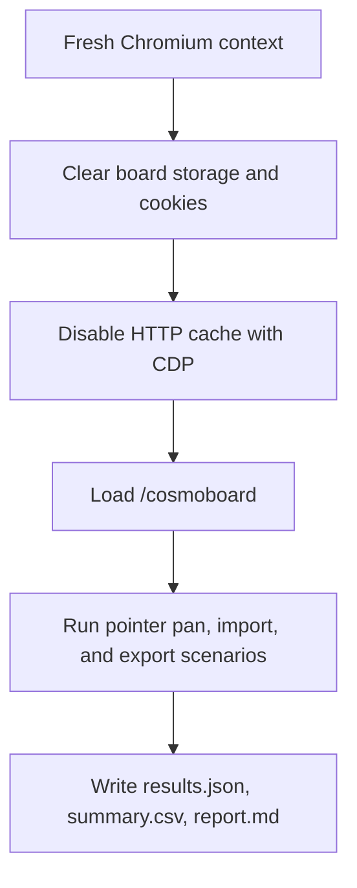
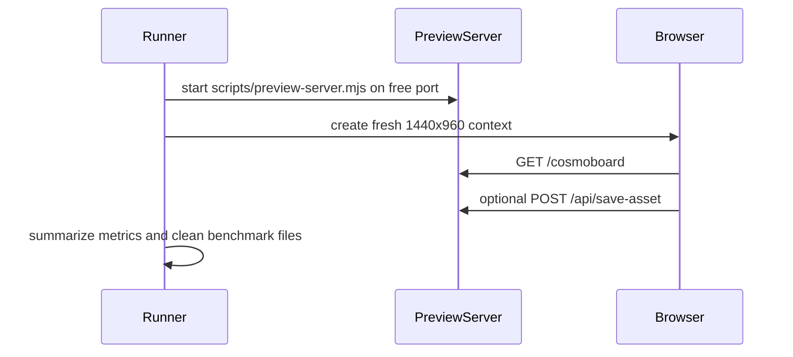
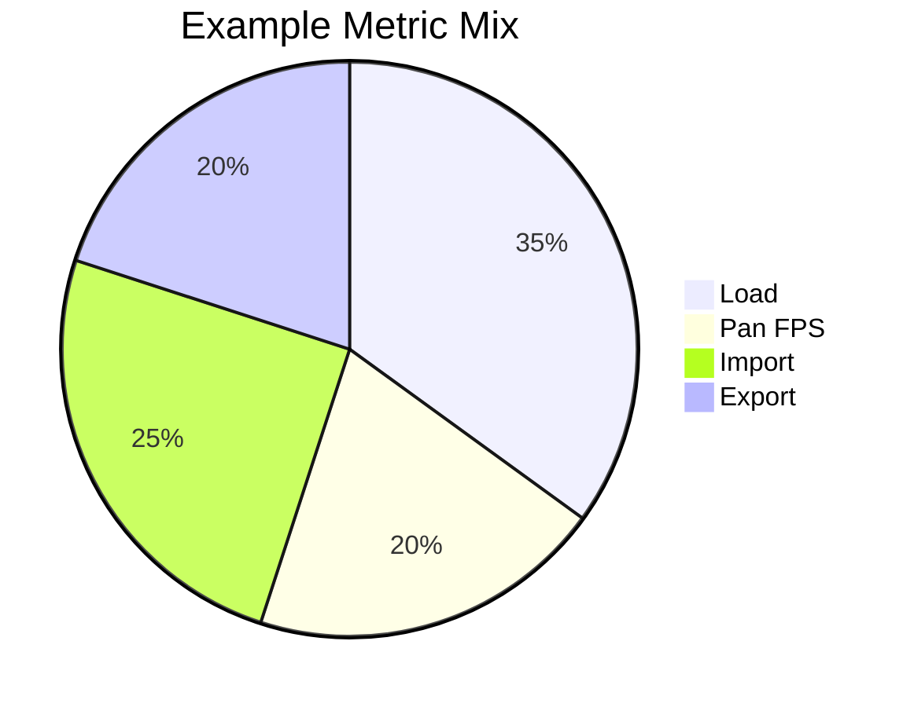
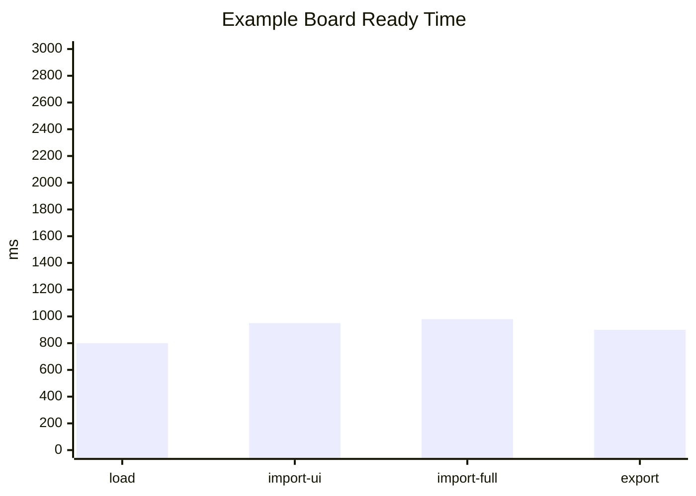

# Cosmoboard Performance Testing

This folder is the canonical performance testing hub for Cosmoboard. The current benchmark is opt-in, report-only, and targets the current `/cosmoboard` board.

## Runner

Use the Playwright benchmark runner from the repo root:

```powershell
npm run perf:audit -- --iterations=3 --cpu-throttle=4 --trace=false
```

The `--` separator is required so that npm forwards the flags through to the runner instead of consuming them. The runner starts `scripts/preview-server.mjs` on a free port, opens a fresh Chromium context at `1440x960`, clears `board:cosmoboard`, `board:cosmoboard:meta`, `board:cosmoboard:settings`, related board localStorage keys, cookies, disables HTTP cache through CDP, and applies `Emulation.setCPUThrottlingRate` so cross-machine numbers are interpretable. This is an empty browser cache benchmark, not a cold OS disk cache benchmark.

Each run aggregates p50/p95/min/max across iterations and diffs against the most recent prior run. The first run shows no diff — that is expected. Pass `--regression-threshold=N` to change the ±N% p50 flag (default 10).

### Flags

| Flag | Default | Purpose |
| --- | --- | --- |
| `--iterations=N` | 3 | Iterations per scenario; aggregates p50/p95 across them |
| `--cpu-throttle=N` | 4 | CDP `setCPUThrottlingRate` factor (`0` to disable) |
| `--regression-threshold=N` | 10 | Δ% on p50 that flags a regression in the diff table |
| `--trace[=true\|false]` | false | Emit a Playwright `trace.zip` |
| `--skip-heavy` | off | Skip the heavy-board scenario |
| `--skip-lighthouse` | off | Skip the Lighthouse pass (it is also auto-skipped if the `lighthouse` package is unavailable) |

## Scope Decisions

| Decision | Value |
| --- | --- |
| Scope | Docs plus a runnable benchmark |
| Standard board | current `/cosmoboard` |
| Budget mode | report-only |
| Large files | both UI-only and full upload/write modes |
| Result home | `.agents/performance_testing/test_results/<timestamp>/` |

## Measured Scenarios

| Scenario | What It Measures | Notes |
| --- | --- | --- |
| Board load and pan | Navigation timing, board-ready time, resource counts/sizes, panning FPS, janky-frame count, Long Animation Frames | Panning uses real pointer input through the pan tool |
| Large import, UI-only | PDF/image import timing with `/api/save-asset` mocked by Playwright route fulfillment | Measures UI cost without disk writes |
| Large import, full upload/write | PDF/image import timing through the real `/api/save-asset` endpoint | Uses benchmark-prefixed files and deletes only those generated paths |
| Export bundle | Export time and download artifact size | Uses the existing export modal and download fallback |
| Heavy board load and pan | Same family as board-load-pan but against a generated ~750-node fixture | Fixture is swapped into `current.canvas` for the iteration only and restored in `finally` |
| Lighthouse | Performance / accessibility / best-practices / SEO category scores | Runs once per benchmark; stored as `lighthouse.json`. Skipped cleanly when the `lighthouse` package is not installed |

## Required Reporting Style

Every report should be graph-heavy and comparison-ready. Include Mermaid flowcharts, `sequenceDiagram` sections, `pie` charts, `xychart-beta` bar charts where supported, and dense metric tables. The Markdown report should be readable in plain text, but the diagrams are part of the required audit output.









## Result Files

| File | Purpose |
| --- | --- |
| `results.json` | Full run metadata, environment, scenarios, iterations, raw metrics, plus `aggregates.byScenario` (used by the next run for the diff) and `diff.rows` against the most recent prior run |
| `summary.csv` | Spreadsheet-friendly per-iteration rows plus aggregate rows (`min`/`p50`/`p95`/`max`/`mean`) per scenario |
| `report.md` | Dense metric tables plus Mermaid flowcharts, sequence diagrams, pie charts, and per-family xychart/bar charts. Aggregate and Δ-vs-previous tables appear at the top |
| `lighthouse.json` | Full Lighthouse audit JSON when the pass succeeds |
| `trace.zip` | Optional Playwright trace when `--trace` is passed |

## References

- Chrome DevTools Performance/FPS: https://developer.chrome.com/docs/devtools/performance/reference/
- web.dev audit cache guidance: https://web.dev/articles/performance-audit-tools
- MDN Navigation/resource timing: https://developer.mozilla.org/en-US/docs/Web/Performance/Guides/Navigation_and_resource_timings
- MDN User Timing: https://developer.mozilla.org/en-US/docs/Web/API/Performance_API/User_timing
- MDN `requestAnimationFrame`: https://developer.mozilla.org/en-US/docs/Web/API/Window/requestAnimationFrame
- Chrome Long Animation Frames API: https://developer.chrome.com/docs/web-platform/long-animation-frames
- Playwright `page.evaluate`: https://playwright.dev/docs/evaluating
- Playwright route mocking: https://playwright.dev/docs/api/class-route
- Playwright CDP sessions: https://playwright.dev/docs/next/api/class-cdpsession
