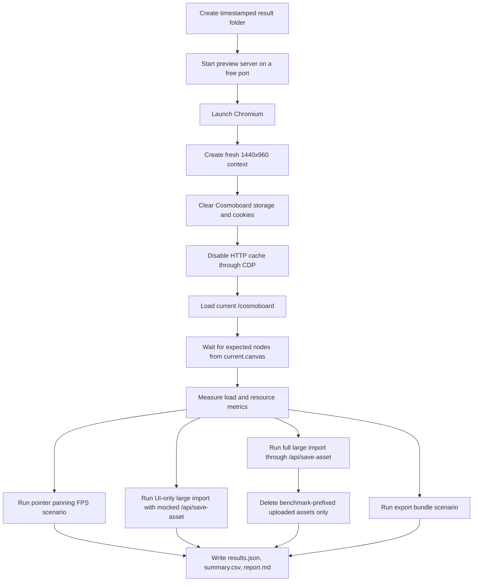
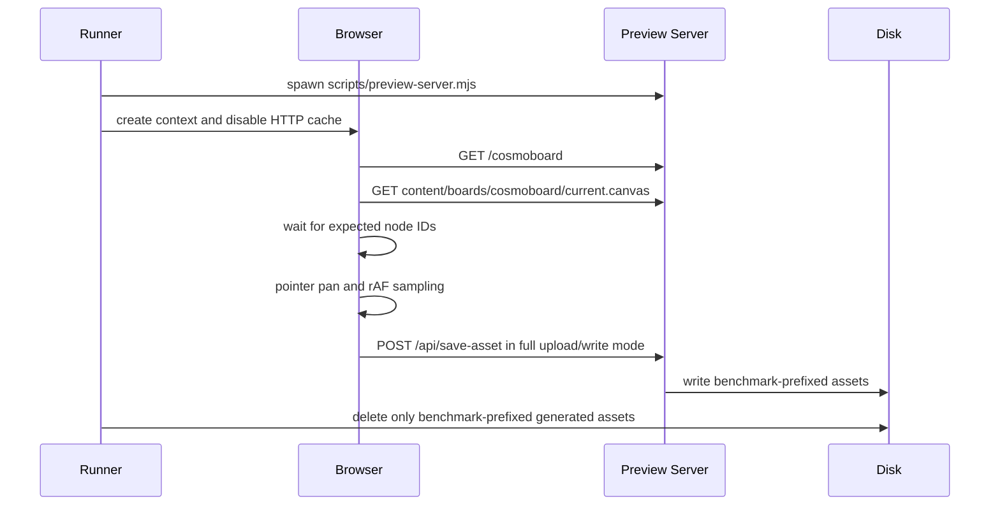
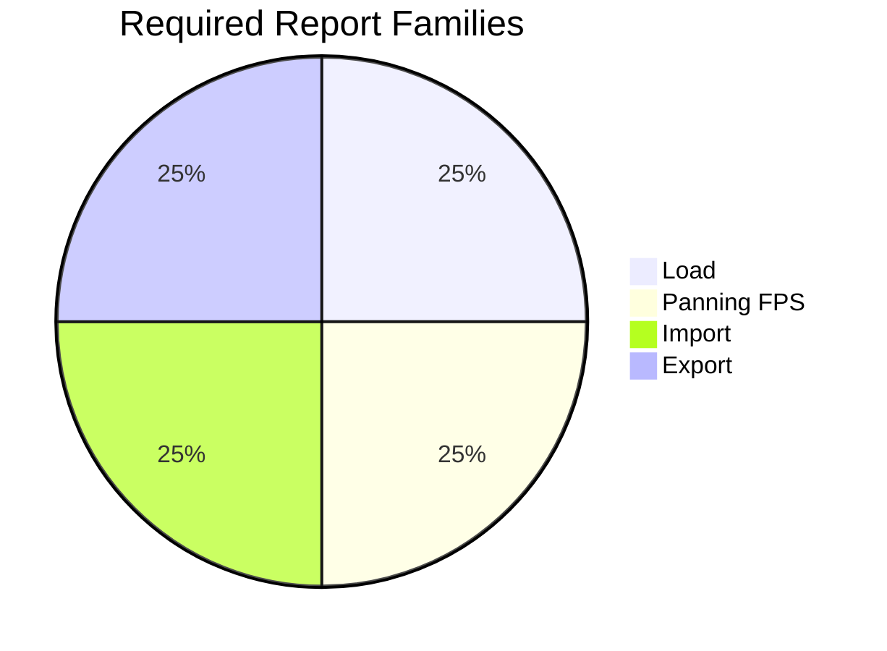
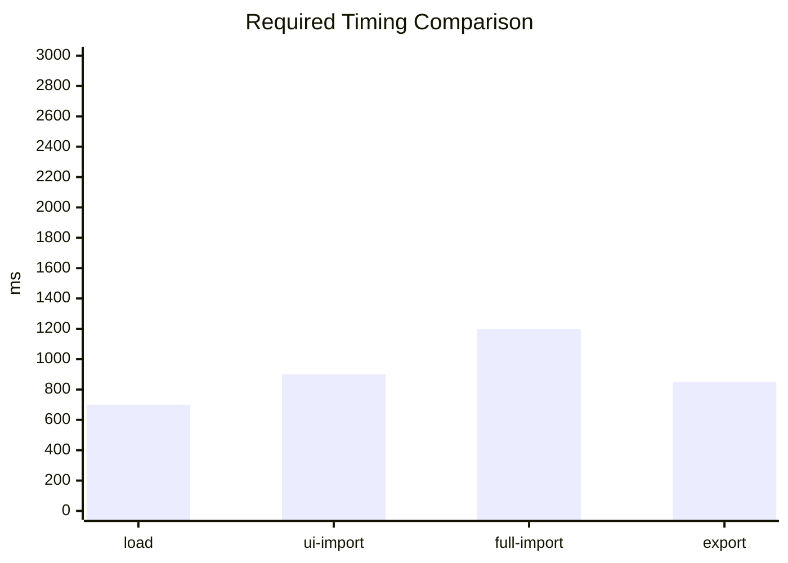

# Cosmoboard Performance Audit Benchmark Plan

## Goal

Measure current Cosmoboard performance without failing the build. The first benchmark pass is report-only and produces repeatable artifacts that can be compared across future changes.

## Confirmed Decisions

| Question | Decision |
| --- | --- |
| Scope | Documentation plus a runnable benchmark |
| Standard board | current `/cosmoboard`, plus a generated ~750-node heavy fixture for stress |
| Budget mode | report-only with auto-flagged regressions vs the most recent prior run |
| Large files | both UI-only and full upload/write modes |
| Cache model | Fresh browser context, cleared localStorage/cookies, disabled HTTP cache; not cold OS disk cache |
| CPU model | CDP `Emulation.setCPUThrottlingRate` so cross-machine numbers are interpretable (`--cpu-throttle`, default 4) |
| Benchmark execution | Opt-in through `npm run perf:audit` |
| Cross-run comparison | Each run reads the most recent prior `results.json` from the result root and renders a Δ-vs-previous table; first run shows none |
| Audit pass | A Lighthouse run is performed once per benchmark and stored as `lighthouse.json`; auto-skipped when the `lighthouse` package is not installed |

## Metrics

| Metric Group | Captured Values |
| --- | --- |
| `metrics.load` | navigation duration, DOMContentLoaded, load event, board-ready time |
| `metrics.panFps` | average FPS, p95 frame time, min FPS, frame count, sample duration, janky-frame count (>50ms) and ratio |
| `metrics.import` | mode, imported file count, duration, upload/write timing, generated asset bytes |
| `metrics.export` | duration, suggested filename, artifact size |
| `metrics.resources` | resource count, transfer size, encoded body size, decoded body size, counts by initiator type |
| `metrics.longAnimationFrames` | LoAF count, total duration, total blocking duration, max duration |
| `metrics.runtime` | CDP `Performance.metrics` — script/task/layout/recalc-style durations, JS heap used/total, document/node counts, layout/recalc-style counts |
| `metrics.vitals` | LCP, CLS, INP estimate via `PerformanceObserver` |
| `aggregates.byScenario` | min / p50 / p95 / max / mean per metric across iterations; serialized into `results.json` so the next run can diff against it |
| `diff.rows` | Δ% on p50 vs the most recent prior run, with regression flag when above the configured threshold |
| `lighthouse` | Category scores (performance, accessibility, best-practices, SEO); full report at `lighthouse.json` when the pass runs |

## Flow





## Scenarios

| Scenario | Iteration Behavior | Success Signal |
| --- | --- | --- |
| `board-load-pan` | Fresh page load, wait for all expected board nodes, pan through the pan tool with real pointer input | Load, resources, LoAF, and `panFps` are present |
| `large-import-ui-only` | Mock `/api/save-asset`, import existing participant PDF plus generated large SVG/image through the hidden file input | Import duration present and node count increases |
| `large-import-full-upload` | Let `/api/save-asset` write benchmark-prefixed PDF/SVG files, then delete only those paths | Import duration and upload/write timing present; generated content-board assets cleaned |
| `export-bundle` | Open export modal through the toolbar and save the generated zip through browser download fallback | Export duration and artifact size present |

## Output Contract

Every run writes to `.agents/performance_testing/test_results/<timestamp>/`.

| Artifact | Required |
| --- | --- |
| `results.json` | Yes |
| `summary.csv` | Yes |
| `report.md` | Yes |
| `trace.zip` | Only when `--trace` is enabled |

`results.json` contains:

```json
{
  "runId": "perf-audit-...",
  "timestamp": "...",
  "gitSha": "...",
  "environment": {},
  "scenarios": [
    {
      "name": "board-load-pan",
      "iterations": [
        {
          "metrics": {
            "load": {},
            "panFps": {},
            "import": {},
            "export": {},
            "resources": {},
            "longAnimationFrames": {}
          }
        }
      ]
    }
  ]
}
```

## Reporting Requirements

Reports must be graph-heavy and dense enough for comparison across runs. Include:

| Required Report Element | Purpose |
| --- | --- |
| Mermaid `flowchart` | Shows benchmark phases |
| Mermaid `sequenceDiagram` | Shows runner/browser/server/disk interactions |
| Mermaid `pie` chart | Shows resource or time distribution |
| Mermaid `xychart-beta` or bar chart where supported | Compares board-ready/import/export timings |
| Dense metric tables | Gives exact per-scenario values for spreadsheet-free review |





## Verification Plan

1. Run `npm run build`.
2. Run `node --test tests/build/performance-audit-build.test.mjs`.
3. Run `npm run perf:audit -- --iterations=1 --trace=false`.
4. Confirm the generated report contains load, panning FPS, import, export, resource, and LoAF metrics.
5. Confirm generated content-board assets from full upload/write mode are cleaned up.
6. Confirm `node --test tests/**/*.test.mjs` does not automatically run the benchmark.
