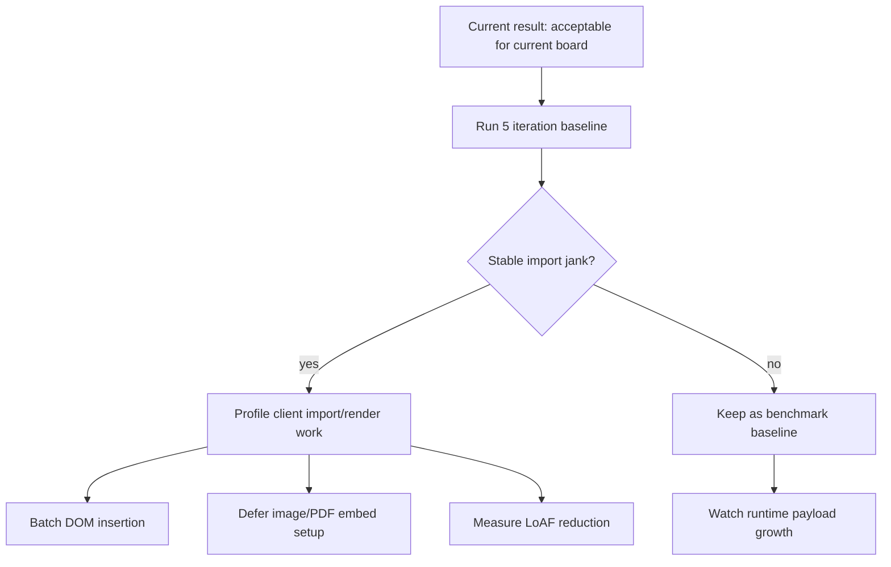
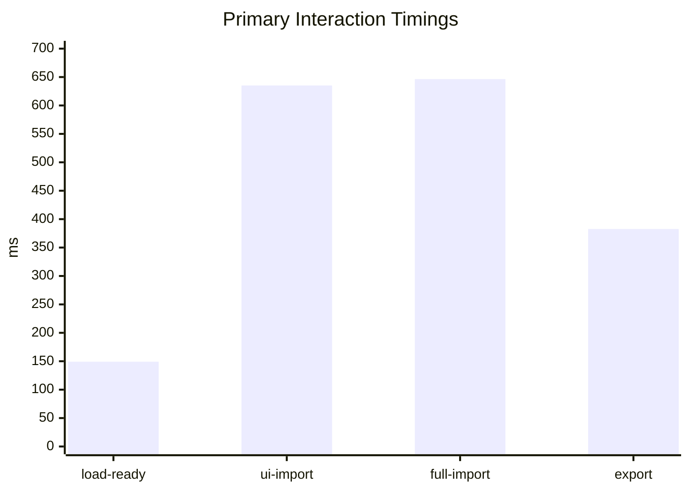
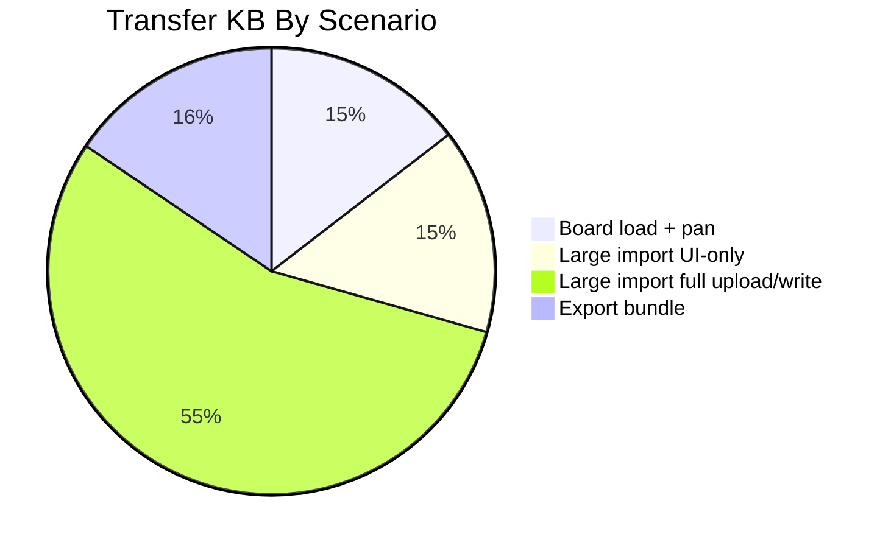

# GPT Performance Testing Feedback - 2026-04-29

Source run: `.agents/performance_testing/test_results/2026-04-29T11-09-10-119Z/`

## Main Recommendations And Issues

| Priority | Finding | Recommendation |
| --- | --- | --- |
| P0 | Large import/render path is the main current jank risk. | Profile import UI work first: file handling, node creation, DOM insertion, image/PDF embed setup. |
| P1 | Server upload/write is not the bottleneck. | Do not spend early optimization time on `/api/save-asset`; full upload/write added only ~19 ms. |
| P1 | Numbers are from a one-iteration smoke baseline. | Run `npm run perf:audit -- --iterations=5 --trace=false` before treating averages as stable. |
| P2 | `JavaScript/braindump.js` is the dominant payload. | Keep it on the watchlist as the board grows; split only when payload/parse cost becomes visible. |

## Consensus

Cosmoboard is performant enough for the current board size. Load and export are healthy, and panning was acceptable in the latest run. The first real performance issue to investigate is main-thread jank during large imports, not network, server writes, or export.

## Metric Snapshot

| Scenario | Board Ready ms | Navigation ms | Pan FPS | Import ms | Upload/Write ms | Export ms | Transfer KB | LoAF Count | LoAF Blocking ms |
| --- | ---: | ---: | ---: | ---: | ---: | ---: | ---: | ---: | ---: |
| Board load + pan | 149.2 | 52.5 | 58.4 | - | - | - | 495.1 | 4 | 27.0 |
| Large import, UI-only | 141.1 | 44.5 | - | 635.2 | 14.0 | - | 505.6 | 4 | 35.4 |
| Large import, full upload/write | 145.6 | 44.6 | - | 646.5 | 19.0 | - | 1874.6 | 5 | 95.8 |
| Export bundle | 138.9 | 51.6 | - | - | - | 382.7 | 528.8 | 7 | 49.0 |

## Interpretation

| Area | Read |
| --- | --- |
| Load | Good. The current board is ready in ~150 ms with empty browser cache semantics. |
| Pan | Good enough in this run: ~58 FPS average and ~16.8 ms p95 frame time. |
| Import | Needs attention. Mocked and full-write import timings are nearly the same, so the cost is mostly client-side. |
| Export | Fine for the current board: ~383 ms and ~9.2 KB artifact. |
| Cleanup | Passed. Full upload/write benchmark files were deleted and no `perf-audit-*` board assets remained. |

## Next Check

Run a 5-iteration benchmark, then compare import duration and LoAF blocking time. If full import still stays around ~650 ms with LoAF blocking near ~100 ms, optimize import rendering before touching server upload or export.
