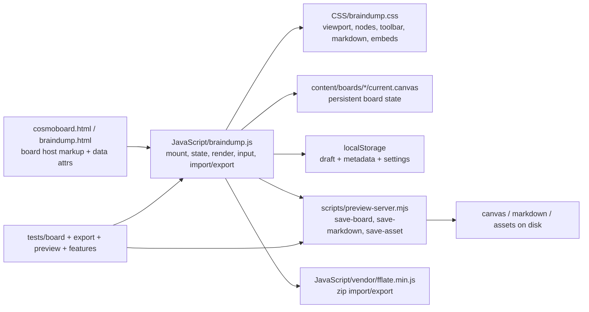
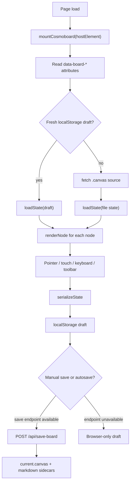
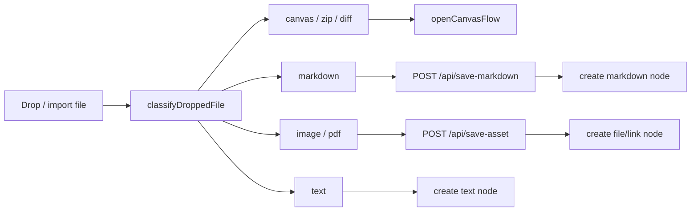
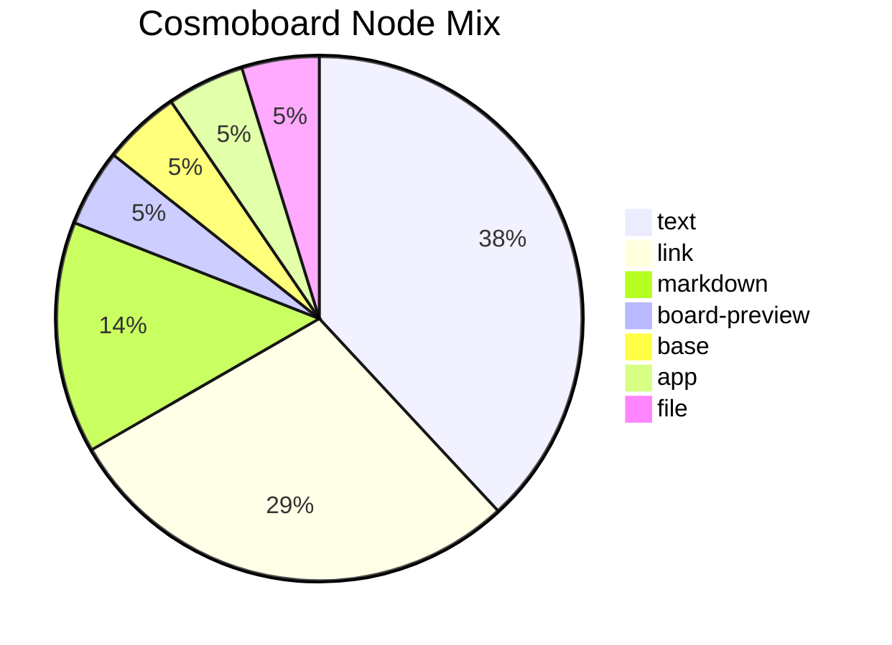
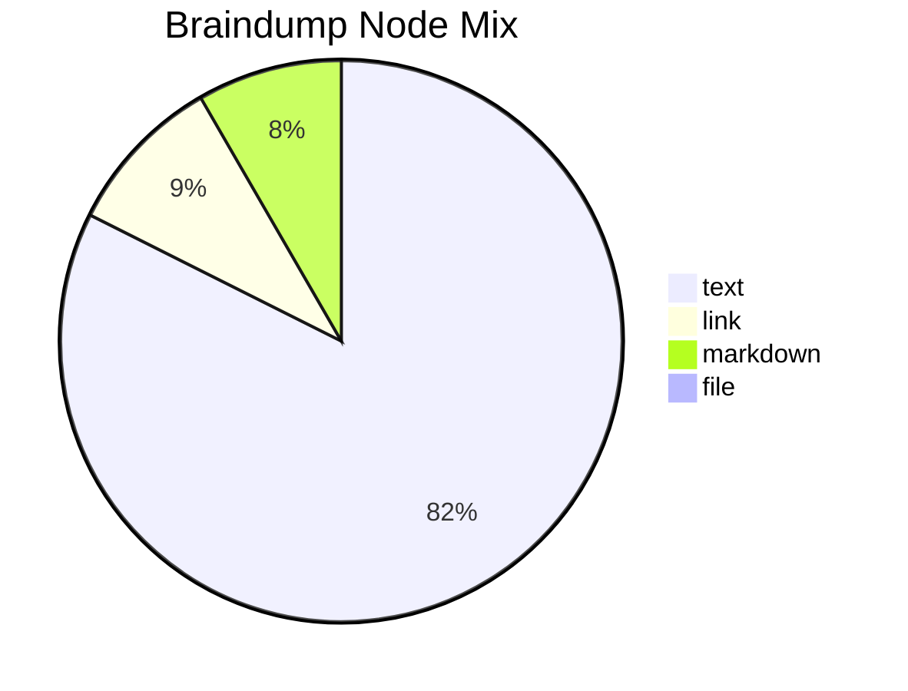
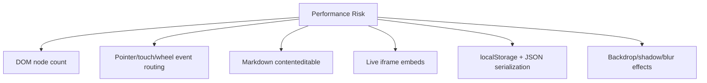
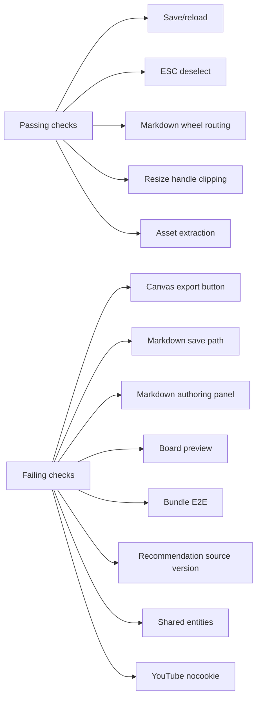
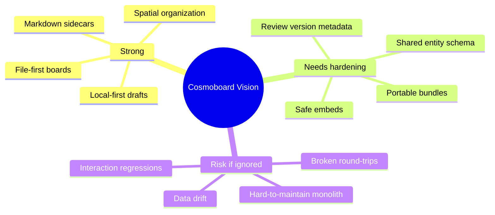
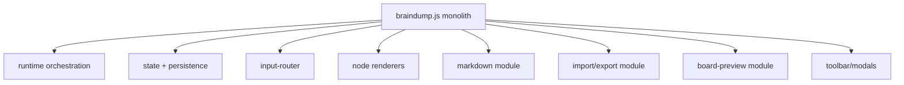
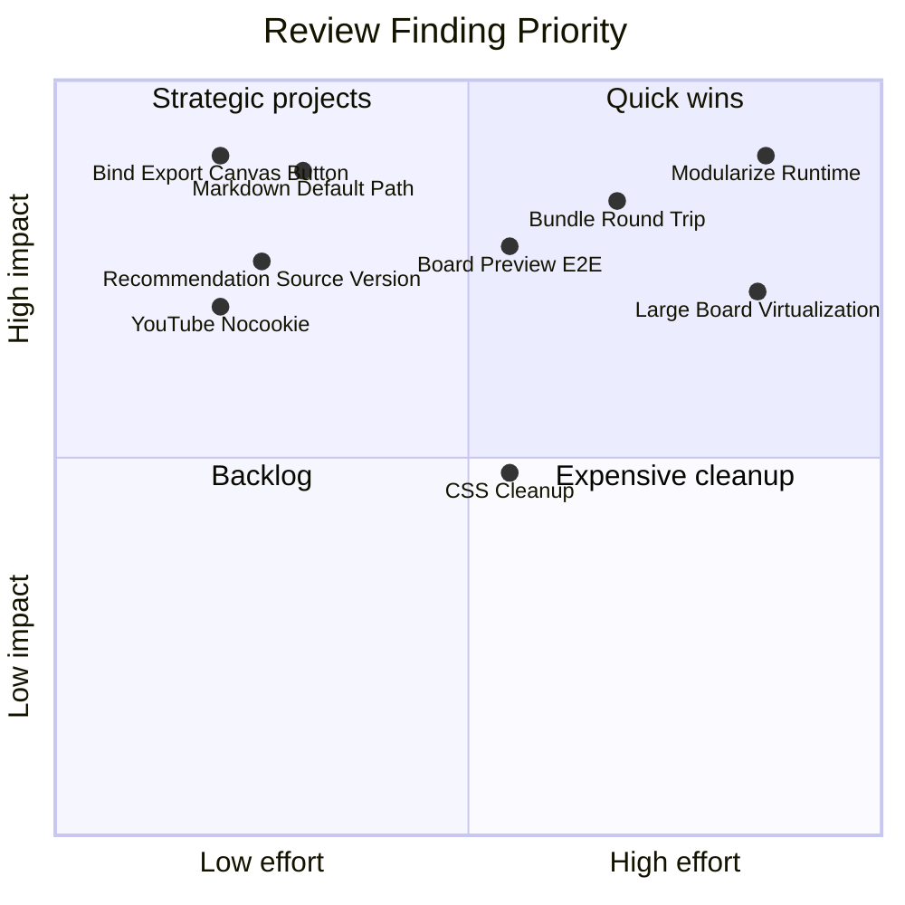

# GPT Review 20260429_032501: Current Board Core

Review focus: performance, functionality, vision, and code cleanliness for the current board runtime.

Out of scope: brainstorming docs, archive docs, backlog docs, handoff docs, and planning-management docs. Evidence is from the live core files, board data, README-level vision context, and test runs.

## Executive Summary

| Category | Rating | Main Takeaway |
| --- | --- | --- |
| Performance | Amber | The current board works at current sizes, but the runtime renders and binds everything directly. Large boards, live embeds, markdown editing, and bundle flows are the likely pressure points. |
| Functionality | Red/Amber | Core interactions have coverage and several paths pass, but current verification shows real regressions in export, markdown sidecars, board previews, shared entities, recommendation metadata, and YouTube embed policy. |
| Vision | Amber | The product direction is strong and visible: file-first, local-first, spatial, portable. Current implementation gaps mostly affect portability, safety, and reviewability. |
| Code Cleanliness | Red/Amber | `JavaScript/braindump.js` is a 6,624-line monolith with 223 functions and 127 event listener registrations. It needs visit-driven module extraction before more feature work compounds the coupling. |

| Top Priority | Finding | Why It Matters |
| --- | --- | --- |
| P0 | Verification suite is currently red | The board cannot be treated as stable until the failing paths are either fixed or intentionally rebaselined. |
| P0 | Export modal renders a `.canvas` action but JS does not bind it | User-visible export functionality is likely dead or inconsistent. |
| P0 | Markdown save endpoint returns the wrong default folder | Markdown sidecars can land outside the `markdown/` folder, breaking organization and tests. |
| P1 | Recommendation flow omits source version in issue body | GitHub review cannot reliably compare a suggested change against the board version it was based on. |
| P1 | YouTube live embeds use `youtube.com` instead of `youtube-nocookie.com` | This conflicts with the safe-by-default vision. |
| P1 | Board preview, shared entity, and markdown authoring E2Es fail | Several "Cosmoboard as connected knowledge surface" capabilities are not reliably proving themselves. |

## System Map

## Static Evidence Snapshot

| File | Role | Current Size / Shape | Risk Signal |
| --- | --- | --- | --- |
| `JavaScript/braindump.js` | Full board runtime | 6,624 lines, 223 functions, 127 `addEventListener` calls, 21 `fetch` calls | High coupling; hard to reason about interaction regressions. |
| `CSS/braindump.css` | Full board styling | 2,428 lines | Component boundaries are implicit; style regressions are likely as features grow. |
| `scripts/preview-server.mjs` | Local save/asset endpoint | 578 lines, 15 functions | Reasonable size, but path policy is critical and currently failing a markdown endpoint test. |
| `cosmoboard.html` | Main generalized board page | 402 lines | Host markup is mostly duplicated with Braindump and generated by build. |
| `braindump.html` | Original board page | 402 lines | Same runtime with different board config. |
| `content/boards/cosmoboard/current.canvas` | Primary current board | 21 nodes, 9.3 KB, 2 live embeds | Small enough now; good review target. |
| `content/boards/braindump/current.canvas` | Older rough board | 109 nodes, 133 KB, 1 data URI | Better stress case for runtime performance and portability. |

## Verification Results

| Command | Result | Notes |
| --- | --- | --- |
| `node --test --test-concurrency=1 tests/board/*.test.mjs` | Failed: 6 pass, 3 fail | Passed save/reload, legacy render fields, ESC deselect, markdown drag/title, markdown wheel routing, resize handle clipping. Failed export runtime, URL paste board preview, initial layout. |
| `node --test --test-concurrency=1 tests/export/*.test.mjs` | Failed: 2 pass, 1 fail | Runtime and size estimate pass. Full bundle E2E times out. |
| `node --test --test-concurrency=1 tests/preview/preview-server-routes.test.mjs tests/preview/preview-markdown-endpoint.test.mjs tests/preview/preview-save-endpoint.test.mjs` | Failed: 2 pass, 1 fail | Extensionless route and save endpoint pass. Markdown endpoint returns wrong path. |
| `node --test --test-concurrency=1 tests/features/*.test.mjs` | Failed: 0 pass, 5 fail | Markdown authoring, recommendation flow, shared entity build/runtime, and YouTube live embed all fail. |
| `node --test tests/build/extract-assets.test.mjs` | Passed | Isolated asset extraction check passed. |
| `npm run build` | Not run | Build rewrites tracked generated files and content; skipped to avoid mixing review output with generated changes in a dirty worktree. |
| `tests/build/cosmoboard-build.test.mjs` and `tests/build/export-bundling-build.test.mjs` | Not run | These call `build()` and rewrite tracked output; skipped for the same reason. |
| `tests/preview/preview-mode-smoke.mjs` | Not run | It expects an already-running preview server and writes smoke logs outside the review output folder. |

Environment note: the first non-escalated `node --test` attempt failed with `spawn EPERM`; rerunning with permission to spawn child processes provided the results above.

## Finding Matrix

| ID | Area | Severity | Evidence | User Impact | Recommended Action |
| --- | --- | --- | --- | --- | --- |
| F-001 | Export | P0 | `tests/board/board-save-export-runtime.test.mjs` expects `exportModalCanvasBtn` wired to `exportCanvas()`, but `JavaScript/braindump.js:2824` only binds `#braindump-export-confirm` to `exportProjectBundle(...)`. | The modal shows "Export .canvas" but the runtime likely never handles that button. | Add a dedicated `exportModalCanvasBtn` query and click handler that calls `exportCanvas()` and closes the modal. Add/repair the runtime test. |
| F-002 | Markdown persistence | P0 | `tests/preview/preview-markdown-endpoint.test.mjs` expected `content/boards/cosmoboard/markdown/preview-endpoint-test.md`; actual was `content/boards/cosmoboard/preview-endpoint-test.md`. | New notes can be saved outside the expected sidecar folder, weakening file organization and import/export assumptions. | Change default `/api/save-markdown` path resolution so filename-only saves target `content/boards/<slug>/markdown/<filename>`. Preserve explicit path behavior. |
| F-003 | Board previews | P1 | `tests/board/board-url-paste-preview-e2e.test.mjs` timed out waiting for `#cosmo-braindump .bd-board-preview-stage svg`. | Embedded board previews are a core Cosmoboard differentiator; failed previews make linked boards feel broken. | Reproduce manually, then inspect `fetchBoardPreviewState`, preview cache, and current board source/version assumptions. |
| F-004 | Initial layout | P1 | `tests/board/cosmoboard-initial-layout.test.mjs` saw title start at `176.31` where expected minimum was `256`. | First impression of the onboarding board may be off-center or test expectations may be stale. | Decide whether current layout is intended. Either adjust board content/viewport or update the test baseline. |
| F-005 | Bundle import/export | P1 | `tests/export/export-bundling-e2e.test.mjs` timed out after opening/importing a test bundle. | Portable bundle round-trip is part of the product promise and currently not proven. | Debug import completion criteria, sidecar persistence, and UI state after `#braindump-import` receives a zip. |
| F-006 | Markdown authoring | P1 | `tests/features/markdown-authoring-e2e.test.mjs` timed out waiting for `#braindump-markdown-title` after clicking `[data-tool="new-markdown"]`. | The user may not be able to reliably create/edit markdown via toolbar. | Verify toolbar-more state, hidden duplicate buttons, and whether `openMarkdownPanel()` is still the intended UX now that quick-create behavior exists. |
| F-007 | Recommendation flow | P1 | `tests/features/recommendation-flow-e2e.test.mjs` expected `## Board source version` and comparison guidance in the issue body; body omitted it. | GitHub recommendations lose important versioning context, increasing merge risk. | Add `boardConfig.sourceVersion` to recommendation issue body and keep the test assertion. |
| F-008 | Shared entities | P1 | `shared-entity-build` expected `source: content/entities/index.json` but received `undefined`; runtime E2E timed out waiting for `#cosmo-entity-eurocrate .bd-entity-title`. | Bases/entities are part of the next product layer but currently drift from tests. | Reconcile current entity node schema with tests. If entity nodes were removed from the board, rebaseline tests or restore the sample. |
| F-009 | Embed safety | P1 | `getYouTubeEmbedUrl` builds `https://www.youtube.com/embed/...`; test expects `https://www.youtube-nocookie.com/embed/...`. | Conflicts with safe-by-default and privacy expectations. | Switch YouTube embed host to `youtube-nocookie.com` unless there is a deliberate reason not to. |
| F-010 | Runtime architecture | P1 | `JavaScript/braindump.js` has 6,624 lines, 223 functions, 127 listener registrations. | Every feature increases regression risk across unrelated interactions. | Extract visited subsystems into `src/apps/braindump/*.mjs`, starting with export/import, markdown, board-preview, and input routing. |
| F-011 | CSS architecture | P2 | `CSS/braindump.css` has 2,428 lines and owns every board visual subsystem. | Styling changes are hard to localize; mobile/desktop toolbar regressions become easier. | Group by component, remove duplicates, and consider component-specific partials when the build pipeline supports it. |
| F-012 | Asset portability | P2 | Current scratch context notes dropped image/PDF assets are persisted but not yet portable sidecars in bundle export. | A board can look correct locally but fail to round-trip as a portable bundle. | Make asset sidecars part of export/import acceptance criteria after the current failing bundle E2E is fixed. |

## Performance Review

| Hotspot | Current Evidence | Why It May Cost | How To Measure | Likely Fix |
| --- | --- | --- | --- | --- |
| Full DOM render | `renderNode` handles all node types in one path; current Braindump has 109 nodes. | DOM size, image loads, live embeds, and markdown editors scale linearly with board size. | Add a test board with 250, 500, and 1,000 nodes; record load time, interaction FPS, and memory. | Introduce viewport-aware render culling for heavy node bodies, especially iframes, images, markdown, and previews. |
| Event listener volume | Runtime has 127 `addEventListener` registrations. | Listener logic becomes hard to reason about and may duplicate work for each mounted board. | Instrument listener registration per board mount and verify cleanup/remount behavior. | Centralize input routing and use delegated listeners where possible. |
| Markdown editing | `attachMarkdownEditor` uses contenteditable, selectionchange, per-line render/raw swaps, save timers. | Selection and DOM mutations can be expensive and fragile under long documents. | Add markdown documents with 100, 500, and 1,000 lines; profile typing latency and selection behavior. | Extract markdown editor into its own module with explicit editor state and targeted rerenders. |
| Board preview rendering | `fetchBoardPreviewState` fetches/caches source and `renderBoardPreviewSnapshotSvg` creates minimap SVG. | Good direction, but the E2E currently fails, so performance cannot be trusted. | Fix the board-preview test first, then measure multiple embedded previews on home/board pages. | Keep preview snapshots lightweight and lazy-load offscreen previews. |
| Live embeds | Cosmoboard currently has 2 live embeds; PDF iframe and external iframe are heavy. | Iframes can steal wheel/pointer events and consume memory/network. | Count live iframes, load time, and wheel routing behavior with 5, 10, 20 live embeds. | Keep preview-first default; gate live iframes behind explicit activation or viewport proximity. |
| Autosave and localStorage | State serializes to localStorage and save endpoint. | Large canvases and embedded data URIs can make frequent serialization costly. | Measure serialized byte size and save duration during drag, resize, markdown typing, and asset import. | Debounce/coalesce writes, avoid data URIs for large assets, and persist asset paths. |
| CSS effects | Many nodes use blur/backdrop/filter-like visual treatment. | Backdrop filters and shadows can cost on low-powered/mobile GPUs. | Use Chrome Performance with 100+ nodes and toolbar/modal overlays. | Reduce expensive effects on dense board states and mobile. |

## Functionality Review

| Capability | Current Status | Verification Signal | Risk |
| --- | --- | --- | --- |
| Load board from `.canvas` | Mostly working | Save/reload E2E passed; legacy render fields passed. | Need build tests once generated-output churn is controlled. |
| Local draft save | Mostly working | Save/reload E2E passed. | Known scratch bug around empty markdown/editor state needs regression coverage. |
| Repository save endpoint | Working for board saves | Preview save endpoint passed. | Concurrent autosave/manual save behavior should stay serialized. |
| Markdown creation/editing | Regressed or test stale | Markdown authoring E2E timed out. | User-facing note creation/editing may be unreliable. |
| Markdown sidecar path | Broken default | Preview markdown endpoint failed. | Sidecars can be saved in wrong folder. |
| Markdown in-canvas wheel/edit behavior | Working | Markdown wheel routing test passed. | Preserve while refactoring editor. |
| Drag/title behavior | Working | Markdown drag/title test passed. | Good regression coverage. |
| Resize handles | Working | Resize handle clipping test passed. | Good CSS/runtime coverage. |
| ESC deselect | Working | ESC deselect test passed. | Good input coverage. |
| Export `.canvas` from modal | Broken | Export runtime test failed. | High visibility toolbar regression. |
| Export bundle runtime | Partially working | Runtime and size estimate passed; full E2E failed. | Portable bundle promise not proven end-to-end. |
| Board preview embeds | Broken or stale test | URL paste board-preview E2E failed. | Weakens multiple-board navigation. |
| Shared entities/base layer | Broken or stale test | Entity build/runtime tests failed. | Product direction layer needs schema/test reconciliation. |
| Recommendation flow | Missing source version | Recommendation E2E failed. | Async review/versioning less safe. |
| YouTube live embed | Functionally embeds, policy mismatch | YouTube E2E failed on `youtube-nocookie` expectation. | Safety/privacy gap. |

## Vision Review

| Principle | Evidence That Supports It | Gap | Recommendation |
| --- | --- | --- | --- |
| File-first | Boards are plain `.canvas` JSON under `content/boards/*/current.canvas`; README and `CANVAS_FORMAT.md` align. | Sidecar path inconsistency weakens the file layout. | Make path policy explicit and test it: board files in board root, markdown in `markdown/`, assets in an asset folder. |
| Local-first | Runtime saves localStorage before repository sync and has endpoint fallback. | Local draft bugs can be destructive if stale/empty state wins over file state. | Add regression tests for empty markdown/editor state and draft-source-version mismatch. |
| Spatial by nature | Current Cosmoboard content uses text, markdown, board-preview, base, app, file, and live links spatially. | Initial layout test now fails, suggesting either content drift or stale baseline. | Decide the canonical first-view layout and lock it with a visual/geometry test. |
| Portable | `.canvas`, `.canvas.json`, `.zip`, markdown sidecars, and asset extraction exist. | Full bundle E2E fails and dropped assets are not fully portable sidecars. | Fix bundle E2E before adding more file types. Treat round-trip as a release gate. |
| Embeddable | Board-preview, markdown, app, file, link/live embed nodes exist. | Board preview and shared entity runtime tests fail. | Stabilize embedded-preview and entity schemas before expanding app embeds. |
| Safe by default | Preview-first embed language exists; live mode is explicit. | YouTube uses normal embed host, and live iframes are eager/heavy. | Use privacy-preserving hosts and consider click-to-activate live embeds. |
| Reviewable | Recommendation/bug/feature flows exist and GitHub issue URLs are generated. | Recommendation body lost source version. | Include source version and changed-elements context in every review issue. |

## Code Cleanliness Review

| Module / Area | Smell | Risk | Refactor Seam | Priority |
| --- | --- | --- | --- | --- |
| Runtime root | `mountCosmoboard` owns config, state, toolbar, input, render, import/export, markdown, and save. | One change can affect unrelated behaviors. | Create `src/apps/braindump/runtime.mjs` as orchestrator and extract subsystems incrementally. | P1 |
| Export/import | Bundle parsing, modal UI, file picker, canvas import, diff import, asset upload all live together. | Current export/import tests are red and hard to isolate. | Extract `export-import.mjs` with pure helpers plus DOM adapter. | P0/P1 |
| Markdown | Parser, renderer, editor, fullscreen, sidecar save, markdown-db, creation panel, drag/drop all in one file. | Markdown is central and currently has failing authoring/path tests. | Extract `markdown-render.mjs`, `markdown-editor.mjs`, `markdown-files.mjs`. | P1 |
| Input routing | Pointer, touch, wheel, keyboard, pan, select, draw, resize, iframes are interleaved. | Interaction regressions are hard to diagnose. | Extract `input-router.mjs` and keep DOM event registration centralized. | P1 |
| Board preview | Preview fetch/cache, snapshot, SVG rendering, node render are mixed into runtime. | Current preview E2E fails. | Extract `board-preview.mjs` with pure snapshot tests. | P1 |
| Toolbar/modals | HTML generated in page build and behavior in runtime; hidden/mobile variants complicate tests. | Tests can click hidden/duplicate controls or stale selectors. | Centralize toolbar action map and test visible action behavior. | P1 |
| CSS | One 2,428-line stylesheet owns all board UI. | Small changes can ripple across nodes/modals/mobile. | Add section headers and remove duplicate component blocks first; split later if build supports it. | P2 |
| Preview server path policy | `resolveMarkdownSavePath` is compact but policy is under-specified. | Wrong sidecar folder and possible future import/export drift. | Add path-policy unit tests before changing behavior. | P0 |

## Test Gap Matrix

| User Journey | Existing Coverage | Current Result | Missing Assertion / Scenario |
| --- | --- | --- | --- |
| Open Cosmoboard and see intended onboarding layout | `cosmoboard-initial-layout.test.mjs` | Fails | Add screenshot or geometry baseline after deciding intended layout. |
| Save board and reload from repository file | `board-save-reload-e2e.test.mjs` | Passes | Add conflict case: stale local draft with mismatched source version. |
| Create markdown note from toolbar | `markdown-authoring-e2e.test.mjs` | Fails | Clarify whether toolbar action opens panel or quick-creates. Test only visible button/action path. |
| Edit markdown sidecar and persist | `markdown-authoring-e2e.test.mjs` | Fails before edit | After path fix, assert sidecar path is inside `markdown/`. |
| Drop/import markdown | Existing drag/drop coverage is partial | Not directly verified in this run | Add `.md` drop with path and reload assertion. |
| Drop/import image/PDF/text | Scratch says recently implemented | Not verified by named test here | Add E2E that drops image, PDF, text and validates node types plus saved paths. |
| Export one `.canvas` file | `board-save-export-runtime.test.mjs` | Fails | Add modal button click E2E, not only runtime source regex. |
| Export/import portable bundle | `export-bundling-e2e.test.mjs` | Fails | After fix, assert markdown, nested board, and asset URLs survive reload. |
| Create recommendation issue | `recommendation-flow-e2e.test.mjs` | Fails | Assert source version, repo path, diff/full mode, and attachment filename type. |
| Use YouTube live embed | `youtube-live-embed.test.mjs` | Fails | Assert `youtube-nocookie`, start time, sandbox, and wheel routing. |
| Shared entity card renders | `shared-entity-runtime-e2e.test.mjs` | Fails | Reconcile test fixture with current board schema. |
| Preview server markdown save | `preview-markdown-endpoint.test.mjs` | Fails | Add explicit path case and filename-only default case. |

## Priority Map

## Suggested Roadmap

| Order | Work | Acceptance Gate |
| --- | --- | --- |
| 1 | Fix export modal `.canvas` button wiring. | `tests/board/board-save-export-runtime.test.mjs` passes, plus manual modal check. |
| 2 | Fix `/api/save-markdown` filename-only default path. | `tests/preview/preview-markdown-endpoint.test.mjs` passes. |
| 3 | Restore markdown authoring path through the visible toolbar. | `tests/features/markdown-authoring-e2e.test.mjs` passes and creates notes under `markdown/`. |
| 4 | Add source version back to recommendation body. | `tests/features/recommendation-flow-e2e.test.mjs` passes. |
| 5 | Switch YouTube embeds to `youtube-nocookie.com`. | `tests/features/youtube-live-embed.test.mjs` passes. |
| 6 | Decide whether current initial layout is intended. | Either content/viewport is adjusted or `cosmoboard-initial-layout.test.mjs` is rebaselined. |
| 7 | Debug board-preview rendering and bundle import E2E. | `board-url-paste-preview-e2e` and `export-bundling-e2e` pass. |
| 8 | Reconcile shared entity schema/tests. | `shared-entity-build` and `shared-entity-runtime-e2e` pass. |
| 9 | Start visit-driven modularization. | First extraction should target the next touched failing area, likely markdown or export/import. |
| 10 | Add performance benchmark board. | Baseline load/drag/zoom/typing metrics are recorded for 100, 250, and 500 nodes. |

## What To Look At First In Code

| File / Line Area | Why |
| --- | --- |
| `JavaScript/braindump.js:2824` | Export modal only binds the zip confirm button. |
| `JavaScript/braindump.js:3265` | `exportCanvas()` exists but is not reached by the modal's `.canvas` button. |
| `scripts/preview-server.mjs:191` | Markdown save path resolution returns the wrong default location for filename-only saves. |
| `JavaScript/braindump.js:993` | Recommendation issue body construction should include `boardConfig.sourceVersion`. |
| `JavaScript/braindump.js:884` | YouTube embed URL host should be privacy-preserving if safe-by-default remains a principle. |
| `JavaScript/braindump.js:4073` | Markdown editor is complex and should be extracted only while fixing a concrete markdown bug. |
| `JavaScript/braindump.js:5215` | Drop/import handling is broad and should get file-type E2E coverage. |
| `JavaScript/braindump.js:5987` | `renderNode` is the central renderer and the key future split point. |
| `JavaScript/braindump.js:6486` and `JavaScript/braindump.js:6512` | Load/save flows are core local-first protection points. |

## Final Assessment

The board is a strong prototype with a clear product spine: files, markdown, local drafts, spatial layout, previews, and portable bundles. The main problem is not lack of direction. The main problem is that the runtime is now large enough that basic product promises are starting to drift from tests.

The next work should be boring and strict: get the red tests green, lock path/version/export behavior, then extract the touched subsystems while fixing those bugs. Do not add another major board capability until export, markdown authoring, preview, recommendation metadata, and YouTube safety are stable again.
