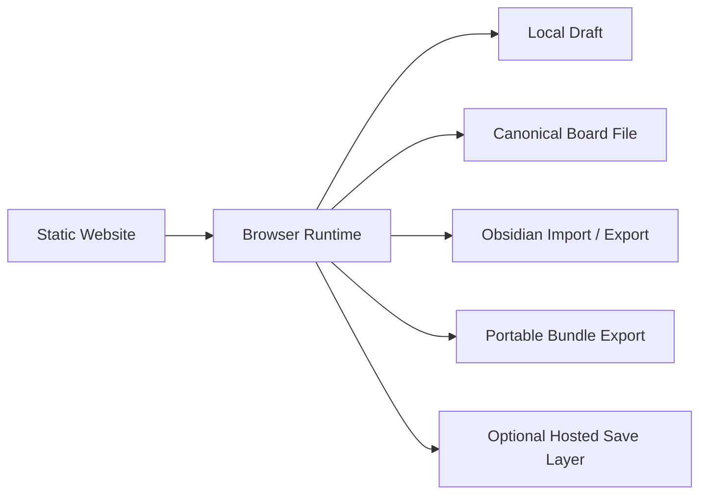
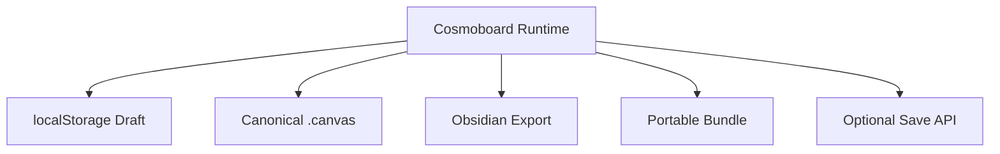
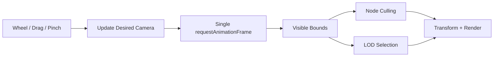
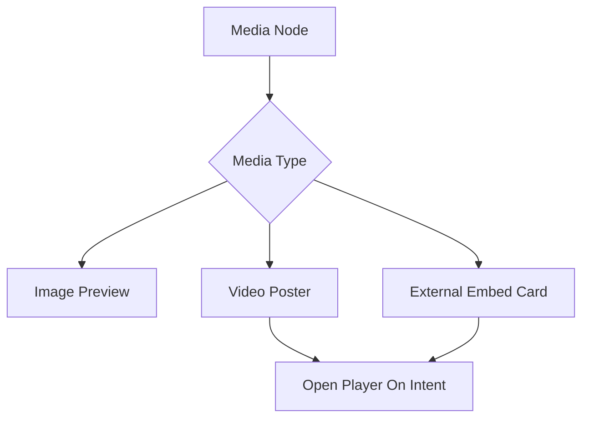
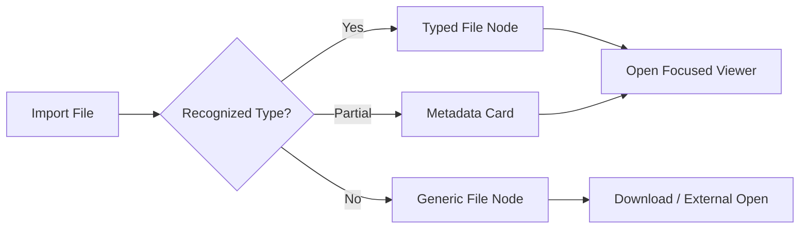
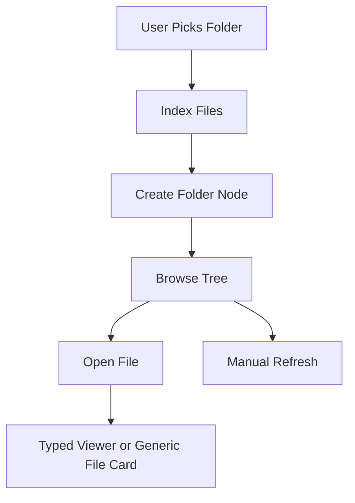
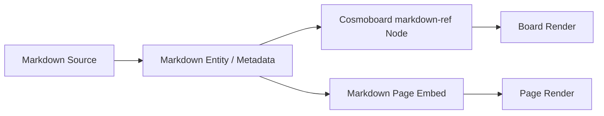
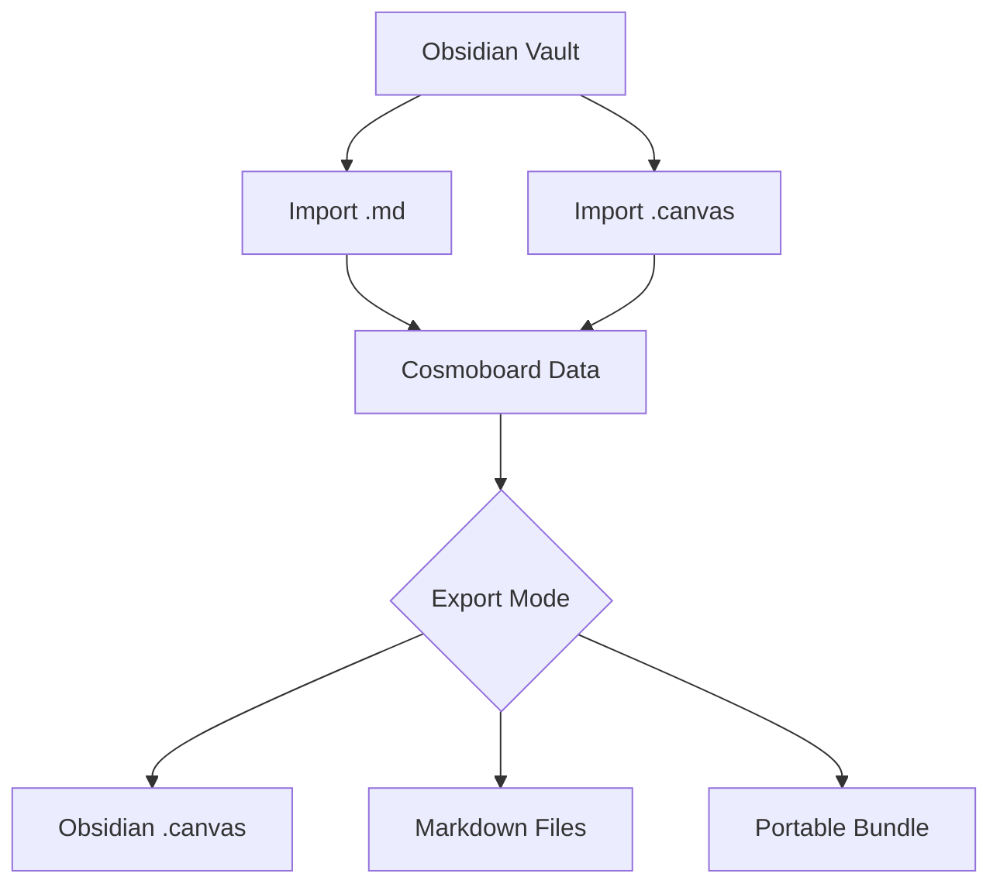
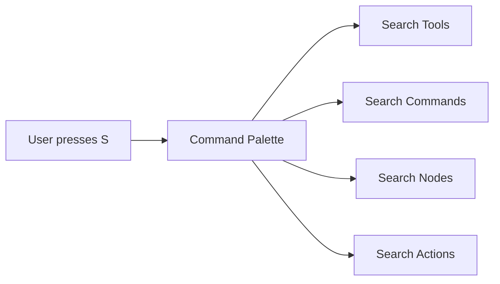
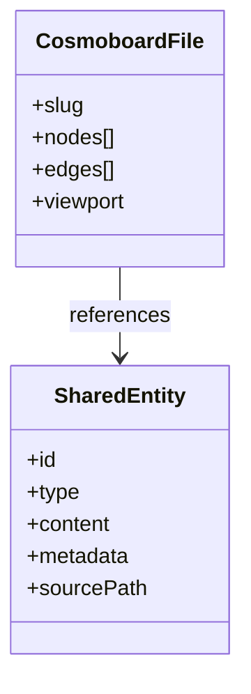

# Cosmoboard Implementation Plan

## Outcome

- Generalize the current Braindump board into a reusable `cosmoboard` engine.
- Keep Braindump as the first full-page cosmoboard.
- Allow project and topic pages to host embedded preview/read-only cosmoboards.
- Preserve the current local-first `.canvas` model and existing slug-based dev-server save flow.
- Build performance into the foundation so pan, zoom, and navigation stay fluid on any device.

## Roadmap At A Glance

| Track | Near-term | Later |
| --- | --- | --- |
| Core engine | Generalize Braindump into cosmoboard runtime | Multiple hosts and richer node types |
| Performance | Frame scheduler, culling, LOD, cheap embeds | Heavier media and drawing scaling |
| Page integration | Project embeds + full editor routes | Wider rollout across sections |
| Markdown | Read-only references first | Editable linked markdown entities |
| Video | Posters + metadata cards | On-demand players and timestamped clips |
| Tools | Stable toolbar first | `s` command palette and richer actions |
| Rich editing | Basic text + image handling | Crop, formatting, background removal, advanced actions |
| Delivery model | Local-first static workflow | Optional hosted save/sync layers |
| Obsidian | Compatible import/export path | Richer round-trip with fallbacks |
| Packaging | Canonical board files | Portable single-file bundle mode |
| File support | Viewer-first import of many file types | Richer viewers, folder nodes, partial in-place editing |

## Performance Is Part Of Scope

- <u>Performance work starts in phase 1, not after the feature is already built.</u>
- The board should stay visually fluid during pan and zoom even when many drawings are present.
- Images should not stall interaction while decoding.
- Future video support should use posters and deferred playback, never heavy live embeds in the hot path.
- Embedded cosmoboards should prefer cheap preview rendering over full editing costs.

## Product Constraints

- <u>The core product should be local first.</u>
- <u>The core product should remain usable on a static website.</u>
- Obsidian import/export should be designed in from the start.
- Portable single-file packaging should be supported when users do not want loose folders and sidecar assets.

| Constraint | Required behavior |
| --- | --- |
| Local first | Edit, save draft, import, and export without backend |
| Static website | Core runtime works on static hosting |
| Obsidian-friendly | Import/export markdown and `.canvas` with compatible mappings |
| Portable bundles | Can package data/media/markdown together when needed |
| Local folder access | Only after explicit user-granted file/folder access |



## Current Repo Touchpoints

- `src/site-data.mjs`
  - currently owns `braindumpPage.board`
- `scripts/build-site.mjs`
  - currently renders the Braindump host with `data-board-*`
- `JavaScript/braindump.js`
  - currently contains the full board runtime
- `CSS/braindump.css`
  - currently contains the board styling
- `scripts/dev-server.mjs`
  - already supports `POST /api/save-board?slug=<slug>`
- `content/boards/braindump/current.canvas`
  - current canonical board file
- `src/page-database.mjs`
  - likely touchpoint for opt-in project/page-level cosmoboards
- `.tmp/smoke-board.json`
  - useful stress fixture for performance and regression checks

| File | Role in migration |
| --- | --- |
| `src/site-data.mjs` | Current Braindump board metadata source |
| `scripts/build-site.mjs` | Current board host HTML generation |
| `JavaScript/braindump.js` | Current monolithic board runtime |
| `CSS/braindump.css` | Current board styling and interaction shell |
| `scripts/dev-server.mjs` | Existing slug-based save endpoint |
| `src/page-database.mjs` | Likely source for project-page board opt-in |

## Recommended File Additions

- `src/cosmoboards.mjs`
  - central registry for cosmoboard configs
- `JavaScript/cosmoboard.js`
  - generic runtime entry point
- `CSS/cosmoboard.css`
  - shared cosmoboard styles
- `content/boards/index.json`
  - optional generated or committed registry export for runtime lookup and tooling

## Recommended File Transition Strategy

- Keep `JavaScript/braindump.js` temporarily as a thin shim that mounts the generic cosmoboard runtime for the Braindump page.
- Keep `CSS/braindump.css` temporarily for Braindump-specific overrides after shared rules move into `CSS/cosmoboard.css`.
- Keep `braindump.html` as the first full-page host while the generic system is introduced.
- Do not rename the live Braindump page immediately unless there is a content/navigation reason. The system is `cosmoboard`; Braindump is one board.

## Architecture Target

- One engine, many boards.
- One canonical `.canvas` file per board slug.
- One registry describing which page hosts which board.
- One embedded preview mode and one full editing mode.
- Later, a linked-entity layer for shared notes, markdown references, and reusable content.

```mermaid
flowchart TD
    A[src/cosmoboards.mjs] --> B[scripts/build-site.mjs]
    B --> C[braindump.html full-page host]
    B --> D[project detail page embedded host]
    C --> E[JavaScript/cosmoboard.js]
    D --> E
    E --> F[content/boards/<slug>/current.canvas]
    E --> G[localStorage board:<slug>]
    E --> H[/api/save-board?slug=<slug>]
```

| Layer | V1 responsibility | Later expansion |
| --- | --- | --- |
| Registry | Slugs, page paths, modes, save config | Performance profiles, feature flags |
| Runtime | Interaction, rendering, save/load | Rich media, command palette, advanced tools |
| Board files | Layout and placements | View presets, filtered views |
| Shared entities | Not required for first rollout | Synced notes, markdown refs, reusable media |

## Storage And Portability Model

| Mode | Role | Must work without backend? |
| --- | --- | --- |
| Browser draft | Fast reopen and local-first editing | Yes |
| Canonical site board | Main website source of truth per slug | Yes |
| Obsidian export/import | Cross-tool interoperability | Yes |
| Portable single-file bundle | Backup, handoff, single-file portability | Yes |
| Hosted save/sync | Optional convenience | No |

## File Support Principles

- Broad file support should start with import and reliable fallback rendering, not immediate full editing.
- Every attached file should remain recoverable even when rich preview is unavailable.
- Rich viewers should be mounted on demand, not during normal board navigation.
- Local folder access should be progressive enhancement, not a baseline dependency.

| Principle | Why it matters |
| --- | --- |
| Viewer-first rollout | Prevents huge scope while still making files useful |
| Preserve original file | Avoids lossy imports |
| Fallback file cards | Unsupported types still remain usable |
| Permission-based folder access | Fits browser/static-site limitations |



## Phase 0: Baseline And Budgets

- Record the current behavior of `braindump.html` on desktop and mobile.
- Use `.tmp/smoke-board.json` or a derived heavy board fixture as a stress case.
- Define practical budgets:
  - pan and zoom should remain fluid under normal use
  - embedded previews should load fast and not disturb page scrolling/layout
  - saving must stay off the interaction hot path
- Capture known slow paths before refactoring so improvements can be verified instead of assumed.

| Baseline area | What to capture |
| --- | --- |
| Pan/zoom feel | Subjective smoothness on desktop and mobile |
| Heavy drawings | Whether motion degrades with dense strokes |
| Image-heavy board | Whether decoding causes hitching |
| Save behavior | Whether persistence interrupts interaction |
| Embed behavior | Cost of loading a cheap preview host |

## Phase 0A: Compatibility Baseline

- Test today's board against the minimum portability goals:
  - local reopen from browser state
  - import/export round trip
  - static-host behavior without save API
- Define compatibility goals up front for:
  - Obsidian markdown import
  - Obsidian canvas export
  - single-file portable bundle export

## Phase 1: Introduce Cosmoboard Registry

- Add `src/cosmoboards.mjs`.
- Move Braindump board metadata out of `src/site-data.mjs` or have `site-data.mjs` import from the new registry.
- Registry entry shape should include:
  - `slug`
  - `title`
  - `pagePath`
  - `sourcePath`
  - `legacySourcePath`
  - `storageKey`
  - `saveEndpoint`
  - `allowRecommendations`
  - `recommendation`
  - `mode`
  - `embed`
  - `performanceProfile`
  - `interchangeProfile`
- Keep the first entry equivalent to the current Braindump config so behavior does not regress.

## Phase 2: Generalize Build Output

- Refactor `renderBraindumpPage` in `scripts/build-site.mjs` into a generic cosmoboard host renderer.
- Keep a Braindump-specific wrapper if that reduces migration risk.
- Standardize data attributes around `data-cosmoboard-*` or continue current `data-board-*` temporarily with a documented migration path.
- Support both host modes:
  - full-page host
  - embedded preview host
- Emit only the minimum markup needed for the selected mode.
- Keep all essential board behavior working without assuming server-generated APIs beyond static asset delivery.

## Phase 3: Extract Generic Runtime

- Create `JavaScript/cosmoboard.js`.
- Move generic logic from `JavaScript/braindump.js` into container-scoped initialization.
- Replace assumptions like one global `#braindump-viewport` with `mountCosmoboard(container, config)`.
- Keep `JavaScript/braindump.js` as a bootstrap shim during migration.
- Ensure multiple cosmoboards can exist on the same page without shared global state collisions.

```mermaid
flowchart LR
    A[Page Host] --> B[mountCosmoboard(container, config)]
    B --> C[Camera State]
    B --> D[Node State]
    B --> E[Persistence]
    B --> F[Mode Controller]
```

## Phase 4: Extract Shared Styling

- Create `CSS/cosmoboard.css`.
- Move reusable board shell, item, canvas, overlay, toolbar, and interaction styles there.
- Leave only Braindump-specific page shell/layout overrides inside `CSS/braindump.css`.
- Add mode-aware styling:
  - full-page
  - embedded preview
  - expanded interactive

## Phase 5: Performance Foundation

- Move camera rendering to a frame scheduler:
  - event handlers update desired camera state
  - `requestAnimationFrame` performs the actual transform write
- Avoid repeated sync reads/writes during raw pointer and wheel handlers.
- Compute visible bounds and cull clearly offscreen nodes.
- Introduce level-of-detail rules by zoom level:
  - full detail nearby
  - reduced detail far away
  - preview-only media when zoomed far out
- Keep persistence debounced and not tied to every camera event.
- Ensure compatibility/import/export logic stays outside this hot path.



## Phase 6: Media Optimization

- Image nodes:
  - add preview/thumbnail support
  - preserve intrinsic dimensions in node data
  - decode asynchronously before visible swap
  - lazy-load offscreen images
- Future video nodes:
  - use poster image and metadata card by default
  - only mount heavy players on explicit user action
  - keep live playback outside the core navigation path
- Consider a simple media cache keyed by source url/path if repeated assets appear across boards.

| Media case | V1 | Later |
| --- | --- | --- |
| Local image | Preview + async decode | Build-time thumbnail pipeline |
| Remote image | Lazy preview | Smarter caching and transforms |
| Local mp4 | Poster only | On-demand inline or modal player |
| Server mp4 | Poster only | On-demand player with buffering controls |
| YouTube / Vimeo / embed platform | Metadata card + poster | Deferred iframe/player mount |
| Timestamped clip | Metadata field only if needed | Start playback from stored timestamp |



## Phase 6A: General File Support

- Add a generic file node family separate from image/video-specific nodes.
- First goal is broad ingest and safe display, not perfect preview for every type.
- Support import through:
  - drag and drop
  - file picker
  - multi-file import
- Preserve original name, type, size, timestamps where possible, and source handle/reference if available.

| File type | Early support | Later support |
| --- | --- | --- |
| PDF | File card + focused reader | In-board preview snippets |
| ZIP | Archive card + metadata | File tree viewer |
| JSON | File card + text/structure preview | Search and inspect tools |
| Markdown/text | File card or markdown-ref | Rich linkage and edit flows |
| AI | File card | Thumbnail/preview if derivable |
| STL | File card + metadata | 3D preview viewer |
| STEP / STP | File card + metadata | 3D preview / assembly inspection later |
| Unknown file | Generic file card | Optional plugin/viewer later |



## Phase 6B: Folder Support

- Add folder import only where user-granted browser APIs permit it.
- Folder support should start as:
  - folder node
  - indexed file list
  - open contained files into viewers
- In-place editing from folder handles should be limited to supported file types and browsers.
- Cosmoboard should never assume it can silently browse local directories.

| Folder capability | Early support | Later support |
| --- | --- | --- |
| Import folder | Permission-based if browser supports it | Better persistence of handles |
| Show file tree | Yes, if folder indexed | Rich navigation/filtering |
| Open file from folder | Yes | Typed viewers |
| Edit file in place | Limited and optional | Broader support for safe types |
| Sync folder changes | Manual refresh first | Smarter change detection later |



## Phase 6C: Document And Archive Viewers

- PDF support should be a priority after generic file nodes because it is broadly useful.
- ZIP support should focus on archive inspection before any extraction/edit features.
- JSON/text support should allow readable inspection without leaving the board.

| Viewer | Priority | Notes |
| --- | --- | --- |
| PDF viewer | High | Focused document reader first |
| Archive viewer | Medium | File list/tree and metadata first |
| Text/JSON viewer | High | Cheap and useful on static site |
| CAD/3D viewer | Medium-later | Heavier rendering path |

## Phase 7: Drawing Optimization

- Simplify stroke point data during or after drawing.
- Store finished strokes as one simplified path per stroke.
- Cache stroke bounds for fast viewport checks.
- Keep the active stroke interactive, but freeze completed strokes into cheaper render paths.
- If necessary later, split rendering into:
  - HTML layer for cards
  - vector/canvas layer for many completed drawings
- Validate performance using a drawing-heavy stress board, not only light demo content.

## Phase 8: Embedded Preview Mode

- Add an embedded preview host that can be inserted into project and topic pages.
- Preview mode should default to:
  - read-only
  - reduced toolbar
  - lower-detail media
  - explicit `Open cosmoboard` affordance
- Recommended default expansion model:
  - open the same board in a dedicated full-page editor route, not inline full editing inside a dense content page
- This keeps the content page light and gives the board full viewport space when editing.

| State | Behavior |
| --- | --- |
| Embedded idle | Read-only preview, cheap render |
| Embedded focus | Optional richer preview |
| Open full cosmoboard | Full editor route or full overlay |
| Full editor | Complete tool surface |

## Phase 9: Per-Project Cosmoboards

- Add cosmoboard metadata to project/topic content configuration.
- Best likely schema location:
  - `src/page-database.mjs` for generated content pages
  - or a board registry reference keyed by page slug
- Start with one pilot project, for example `eurocrate-storage`.
- Create canonical board files such as:
  - `content/boards/projects/eurocrate-storage/current.canvas`
- Add the embedded preview host to the project page and a dedicated full board route for the same slug.

## Phase 9A: Local-First Hardening

- Confirm every per-project cosmoboard still supports:
  - local draft reopen
  - file import
  - file export
  - static-site-only usage
- Do not let per-project rollout accidentally rely on hosted save behavior.

## Phase 10: Linked Entities And Markdown

- Add a shared entity model for notes/content that should sync across boards.
- Keep board files responsible for placement and composition only.
- Add entity types for:
  - shared note
  - link/reference
  - markdown reference
- Add markdown integration in two directions:
  - board node referencing markdown
  - markdown embedding cosmoboard preview or entity cards
- Keep this phase after the board engine and per-project rollout are stable.

## Markdown Plan

| Step | Scope | Notes |
| --- | --- | --- |
| 10A | Add `markdown-ref` node type | Read-only render first |
| 10B | Add source metadata | Store source path, title, excerpt, entity id |
| 10C | Add markdown embeds on pages | Board preview or entity card blocks |
| 10D | Add explicit edit authority | Board-only, markdown-only, or shared entity edit path |
| 10E | Add sync invalidation | Refresh referenced content when source changes |
| 10F | Add markdown import flow | Bring Obsidian/native `.md` notes into cosmoboard references |
| 10G | Add markdown export flow | Send linked/shared notes back out cleanly |



## Phase 10B: Obsidian Compatibility

- Keep cosmoboard data model as close as practical to Obsidian Canvas for shared concepts.
- Add import support for:
  - `.md`
  - `.canvas`
- Add export support for:
  - Obsidian-compatible `.canvas`
  - markdown files
  - compatible asset references
- For unsupported cosmoboard-only features, export fallback representations rather than dropping them silently.

| Cosmoboard feature | Obsidian export target | Fallback if unsupported |
| --- | --- | --- |
| Text note | Text node | Straight mapping |
| Image | File node | Straight mapping |
| Markdown ref | File/text node + source path | Preserve metadata |
| Video | Poster/link card | Store extra media metadata |
| Timestamped video | Link with timestamp metadata | Preserve timestamp separately |
| Interactive button | Text/link note | Preserve action metadata separately |
| Rich custom tool output | Flattened or simplified node | Keep richer metadata in bundle |



## Phase 10C: Portable Single-File Bundles

- Add a portable export mode that keeps board JSON, markdown, and media together when desired.
- Good candidate shapes:
  - `.cosmoboard.json`
  - `.canvas.json` plus packaged metadata
  - zip-like archive later if needed
- The portable bundle should support:
  - backup
  - transport
  - easy re-import
  - optional unpacking into Obsidian-friendly files later

| Bundle section | What it holds |
| --- | --- |
| `board` | Nodes, edges, viewport |
| `entities` | Shared note/media metadata |
| `markdown` | Embedded markdown content or references |
| `assets` | Inline or attached media payloads |
| `compatibility` | Fallback mappings for Obsidian/export targets |

## Phase 11: Video, Interactive Media, And Rich Nodes

- Introduce a formal `media` or `video` node family.
- Keep local mp4, server mp4, and external embeds under one consistent metadata model.
- Add timestamp support for clips that should start at a chosen moment.
- Add interactive button/action nodes, but keep actions limited to safe built-in behaviors.
- Avoid arbitrary code execution or page-breaking custom scripts.

| Node / feature | First implementation | Constraint |
| --- | --- | --- |
| Local mp4 node | Poster + open player | No autoplay in board |
| Server mp4 node | Poster + open player | Buffer on intent only |
| YouTube / platform node | Metadata card + poster | Deferred iframe mount |
| Timestamped video | Start time metadata | Player opens at stored time |
| Interactive button | Built-in safe action node | No arbitrary script execution |
| Other platform embed | Metadata + poster fallback | Must degrade cleanly on export |

## Phase 11A: CAD And Technical Viewers

- Add a technical file viewer track for formats like STL and STEP.
- Keep this separate from core board interaction so heavy rendering does not punish all boards.
- Prioritize:
  - metadata
  - reliable open behavior
  - focused preview
- Do not commit to full CAD editing inside cosmoboard.

| Technical format | Early shape | Later shape |
| --- | --- | --- |
| STL | File node + metadata | Interactive 3D preview |
| STEP / STP | File node + metadata | Preview/inspection later |
| AI | File node + derived preview if possible | Richer preview tools later |
| Engineering document bundle | Archive/folder node | Rich project package view |
| Interactive button | Safe built-in action set | No arbitrary scripts |
| Media gallery stack | Optional grouped media nodes | Must stay lightweight |

## Phase 12: Command Palette And Advanced Tooling

- Add a command palette triggered by pressing `s`.
- Palette should search:
  - tools
  - actions
  - node types
  - board commands
- This should complement visible toolbar controls, not replace them.
- Keep the palette fast and keyboard-first.

| Command palette capability | Purpose |
| --- | --- |
| Search tools | Quickly switch tools |
| Search commands | Save, export, recommend, open full board |
| Search insertions | Add note, image, media, markdown ref |
| Search nodes | Jump to content by label/title |
| Search actions | Crop image, remove background, format text, open file viewer |



## Phase 13: Rich Editing Tools

- Add richer text editing gradually.
- Keep expensive tools async and explicit.
- Do not let image editing or AI-like utilities block basic board interaction.

| Tool | Early shape | Important constraint |
| --- | --- | --- |
| Text formatting | Bold, headings, lists, emphasis | Keep markup model simple |
| Text scaling | Font size presets + drag handles | Separate from node scale if needed |
| Image crop | Non-destructive crop metadata | No pixel rewrite in hot path |
| Background removal | Async action on selected image | Run outside camera loop |
| Resize / scale | Node bounds controls | Cheap preview while dragging |
| Tool shortcuts | Visible plus searchable | Must work with palette |

## Phase 13A: File-Aware Editing

- Support in-board editing only for file types with a safe and clear browser workflow.
- Good early candidates:
  - markdown/text
  - JSON
  - image crop metadata
- Heavy binary formats should stay viewer-first much longer.

| File type | Editing direction |
| --- | --- |
| Markdown/text | Editable later with explicit source authority |
| JSON | Structured/text edit for supported cases |
| PDF | View-only |
| ZIP | View-only |
| STL / STEP | View-only initially |
| AI | View-only initially |

## Data Model Guidance

- Local-only board content:
  - stored only in the board `.canvas`
- Shared content:
  - stored as stable entity records
- Board file:
  - layout, viewport, edges, placements
- Shared entity:
  - canonical content and metadata



| Content type | Storage home |
| --- | --- |
| Local note | Board file |
| Shared note | Shared entity |
| Markdown note | Markdown file plus metadata/entity layer |
| Local drawing | Board file |
| Shared reusable media ref | Shared entity or media entity |
| Timestamped video | Media node/entity metadata |
| Generic attached file | File node or file entity |
| Folder import | Folder node plus indexed child references |

## Interchange Profiles

| Profile | Goal |
| --- | --- |
| `native` | Full cosmoboard fidelity |
| `obsidian-compatible` | Prioritize `.canvas` and markdown compatibility |
| `portable-bundle` | Keep everything together in one file |
| `file-heavy` | Favor embedded metadata and portable file packaging |

## Testing And Verification

- Keep desktop and mobile interaction testing in scope from the start.
- Reuse the existing whiteboard testing workflow as a baseline, but update terminology and scenarios for cosmoboard.
- Add at least these checks:
  - Braindump still loads and saves
  - embedded preview renders without full board chrome
  - opening the full cosmoboard works
  - heavy drawing board still pans and zooms fluidly
  - image-heavy board does not hitch badly during navigation
- Maintain one or more stress fixtures, including:
  - drawing-heavy board
  - image-heavy board
  - mixed board with bookmarks and large content spread

## Risks

- Refactoring globals in `JavaScript/braindump.js` into container-scoped state is easy to underestimate.
- Embeds can accidentally inherit too much of the full-page editor cost if the runtime is not mode-aware.
- Media nodes can dominate performance if full assets are loaded too early.
- Drawing-heavy boards can overwhelm SVG/DOM if stroke simplification and culling are skipped.

## Recommended Delivery Order

1. Registry extraction.
2. Generic host renderer in `build-site`.
3. Generic runtime extraction.
4. Shared CSS extraction.
5. Performance scheduler, culling, and LOD foundation.
6. Embedded preview mode.
7. One pilot project cosmoboard.
8. Broader rollout to more pages.
9. Linked entities.
10. Markdown reference support.
11. Video/media nodes.
12. Command palette.
13. Rich editing tools.

## Acceptance Criteria For V1

- Braindump still works through the new generic cosmoboard engine.
- A project page can show an embedded preview/read-only cosmoboard.
- The embedded board can open the same slug in a full editing view.
- The dev server still saves by slug to `content/boards/<slug>/current.canvas`.
- Pan and zoom remain fluid on typical desktop and modern phone hardware.
- Heavy drawings and image-rich boards are handled with visible performance safeguards, not just hope.
- Core edit/import/export workflow still works on a static website without hosted save support.
- Local drafts remain first-class, not fallback behavior.

## Post-V1 Planned Features

| Feature | Planned stage |
| --- | --- |
| Shared markdown-backed entities | After linked entities are stable |
| Local/server/external video players | After base media layer is stable |
| Timestamped video nodes | Alongside video player support |
| Interactive button nodes | After safe action model exists |
| `s` command palette | After tool model is stable |
| Image crop / background removal | After media node model is stable |
| Portable single-file bundles | After interchange layer is stable |
| Deeper Obsidian round-trip fidelity | After base compatibility path is working |
| Broad file/folder viewers | After generic file node layer is stable |
