# Cosmoboard Portability Plan

## Goal

- Turn the current Braindump implementation into a reusable `cosmoboard` system.
- Make it possible to attach a cosmoboard to any page.
- Support two main presentation modes:
  - full-page cosmoboard
  - embedded preview/read-only cosmoboard that expands into a full board
- Default to separate cosmoboards per project, page, or topic.
- Still allow multiple views of the same underlying board or linked content later.

## Quick View

| Topic | Decision |
| --- | --- |
| System name | `cosmoboard` |
| Default board ownership | One board per project, page, or topic |
| Shared sync model | Later through linked entities, not one giant file |
| Embedded behavior | Preview/read-only until expanded |
| Full editor | Dedicated full cosmoboard view |
| Performance stance | First-class requirement from the start |
| Core deployment model | Local-first and static-site-compatible |
| Canonical interchange target | Obsidian-friendly `.canvas` where possible |
| Portable bundle mode | Single-file export when needed |
| File support direction | Broad ingest with viewer-first fallbacks |
| Markdown direction | Markdown and cosmoboards link both ways later |
| Video direction | Posters/previews first, heavy players only on demand |

## Non-Negotiables

- <u>Performance is a first-class product requirement, not a polish phase.</u>
- Pan, zoom, and panning must feel fluid on desktop, tablet, and mobile.
- Large boards with many drawings, images, and later videos must degrade gracefully instead of becoming sticky or janky.
- Embedded cosmoboards must stay cheap to load and cheap to render.
- The architecture should favor the snappy path even if it limits some v1 features.

## Delivery Constraints

- <u>The core system should be local first.</u>
- <u>The core system should work on a static website.</u>
- Editing, import, export, and local reopen must work without any backend.
- Server save endpoints, GitHub recommendation flows, or later sync services should be optional layers, not core requirements.
- Obsidian interoperability should be treated as a real product goal, not a side export script.
- When needed, media plus board JSON plus markdown should be portable as a single file bundle.

| Constraint | Meaning in practice |
| --- | --- |
| Local first | Browser keeps working drafts locally and can import/export without server help |
| Static-site compatible | Core board features work on GitHub Pages-style hosting |
| Obsidian-friendly | Export and import should target Obsidian markdown and canvas formats where possible |
| Single-file portability | A board can be packed with its media/markdown when folder sprawl is undesirable |
| Local folder access | Only through explicit user-granted file/folder access, not arbitrary filesystem crawling |

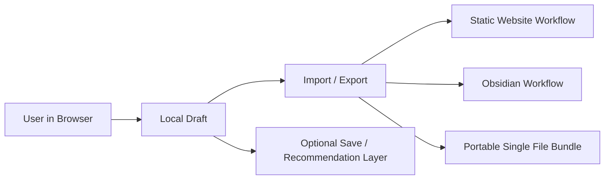

## Decisions Already Made

- The product name should be `cosmoboard`, not `whiteboard`.
- The main practical need is one cosmoboard per project or per content area.
- Embedded cosmoboards should start as preview/read-only until expanded.
- Long term, linked content should update everywhere it is reused.
- Long term, markdown files should be linkable inside cosmoboards, and cosmoboards should be embeddable or referenceable inside markdown-driven content.

## Current Repo Reality

- `braindump.html` is currently one special page hosting the existing board.
- `JavaScript/braindump.js` already has a config-driven core via `boardConfig`.
- `JavaScript/braindump.js` already uses transform-based camera movement with `translate3d(... ) scale(...)`, which is the correct base for smooth pan and zoom.
- `CSS/braindump.css` already sets `will-change: transform` on the canvas layer.
- `scripts/build-site.mjs` already injects board config into the page through `data-board-*` attributes.
- `scripts/dev-server.mjs` already supports saving by slug to `content/boards/<slug>/current.canvas`.
- `content/boards/braindump/current.canvas` is already the right canonical file pattern.
- The current implementation is close to reusable, but the naming, DOM hooks, and runtime bootstrapping are still Braindump-specific.

## Naming Direction

- Treat `Braindump` as one cosmoboard instance, not the name of the system.
- The system name in docs, config, and future UI should be `cosmoboard`.
- Recommended future runtime names:
  - `JavaScript/cosmoboard.js`
  - `CSS/cosmoboard.css`
  - `data-cosmoboard`
  - `data-cosmoboard-slug`
- Existing file names do not need to be renamed immediately if that slows down implementation. The important change is the architecture and public naming.

| Current term | Future term |
| --- | --- |
| whiteboard system | cosmoboard system |
| Braindump board code | cosmoboard engine |
| whiteboard node | cosmoboard node |
| whiteboard embed | cosmoboard preview/embed |

## Core Recommendation

- Do not use one giant global board file for the whole site as v1.
- Use separate canonical cosmoboard files per project, page, or topic.
- Build the runtime so multiple pages can host cosmoboards using the same engine.
- Add a linked-content layer on top later for notes, markdown references, and reusable cards that should stay in sync across multiple cosmoboards.

## Local-First And Static-Site Direction

- The core editing loop should work with:
  - local browser state
  - imported files
  - exported files
- Static hosting should support:
  - open board
  - edit board locally
  - reopen local draft
  - import/export
  - recommendation/export workflows
- The optional `save-board` server route should remain an enhancement for local development or future hosted sync, not a dependency.
- If all optional server behavior disappears, the cosmoboard should still remain useful and complete as a local-first tool.

| Capability | Must work on static host? | Notes |
| --- | --- | --- |
| Open canonical board | Yes | Fetch static file |
| Edit locally | Yes | In-browser only |
| Autosave draft | Yes | `localStorage` or local draft model |
| Import `.canvas` / markdown / bundle | Yes | No server needed |
| Export for backup/share | Yes | No server needed |
| Repo save | Optional | Convenience layer |
| Recommendation flow | Optional | Can remain static-friendly |

## Why This Is The Right Shape

- Per-project cosmoboards are easier to load, moderate, diff, and embed.
- A single huge board would become slow and messy quickly.
- A reusable engine solves the immediate portability problem.
- A linked-content layer solves the longer-term "same note updates everywhere" problem without forcing the whole site into one canvas file.
- Separate board files also make performance easier to keep under control because the runtime can avoid loading unrelated content.

## Performance Direction

- Keep camera movement transform-only on one composited layer.
- Batch wheel, pinch, and drag camera updates through `requestAnimationFrame` instead of doing every visual update directly inside raw event handlers.
- Keep local persistence debounced and off the hot path for interaction.
- Avoid layout reads inside the pan/zoom loop except when absolutely necessary.
- Do not make offscreen or zoomed-out content pay the same rendering cost as focused content.
- Prefer level-of-detail rendering, culling, and preview media over full-fidelity rendering everywhere at once.

| Hot path | Requirement | Optimization direction |
| --- | --- | --- |
| Pan / drag | Must stay fluid | One transform write per frame via `requestAnimationFrame` |
| Wheel / pinch zoom | Must feel immediate | Camera state first, render once per frame |
| Large drawing boards | Must not clog DOM | Path simplification, cached bounds, reduced detail at distance |
| Image-heavy boards | Must not stall motion | Preview image first, async decode, lazy media |
| Embedded previews | Must stay cheap | Read-only mode, reduced detail, deferred activation |
| Save/persistence | Must not affect motion | Debounce and keep off interaction hot path |

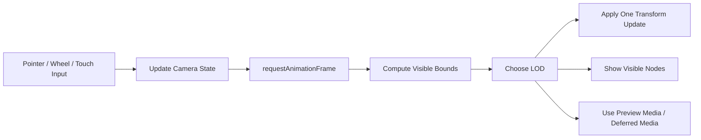

## Media Optimization Strategy

- Images should support two visual states:
  - lightweight preview or thumbnail
  - full-resolution source only when needed
- Image nodes should store width, height, and preview metadata so the layout can stabilize before the image finishes decoding.
- Use lazy loading for offscreen images and embedded board previews.
- Prefer `img.decode()` or equivalent async decode flow before swapping media into view.
- If useful later, generate smaller board thumbnails at build time for local assets instead of always loading original images.
- Do not let image decoding block panning or zooming.

- Videos should not render as live players in the board by default.
- Future video nodes should use:
  - poster image
  - metadata card
  - play-on-demand behavior
- Avoid mounting video iframes or active video elements during navigation around the board.
- Only activate playback after focused user intent, ideally in a modal or isolated detail state.

| Media type | Default board rendering | Activation model | Performance note |
| --- | --- | --- | --- |
| Local image | Preview or thumbnail | Expand on focus | Decode off hot path |
| Local mp4 | Poster frame | Click to open player | Do not autoplay in board |
| Server mp4 | Poster frame | Click to open player | Buffer only on intent |
| YouTube / Vimeo / platform embed | Metadata card + poster | Mount iframe on demand | Never keep iframe live while navigating |
| Timestamped video | Poster + time badge | Open player at given timestamp | Keep timestamp in node metadata |
| GIF-like motion | Prefer mp4/webm preview | Play only if focused | Avoid expensive looping assets |

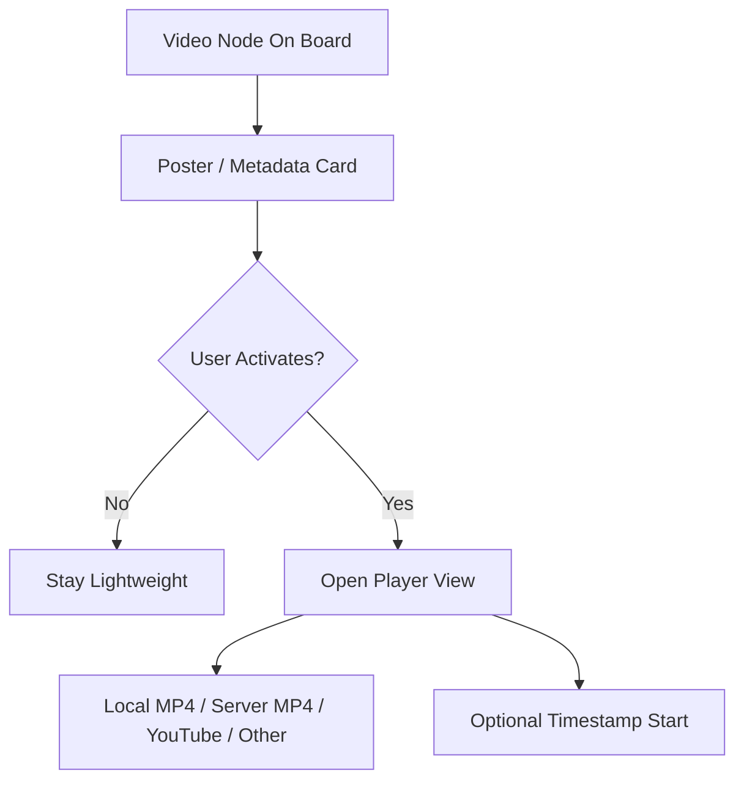

## File Support Direction

- Cosmoboard should aim to ingest a broad range of file types, even if editing support arrives much later than viewing support.
- The default model should be:
  - import first
  - preview if possible
  - extract metadata when useful
  - open in focused viewer when needed
  - preserve original file/link even when rich in-board rendering is not available
- Unsupported rich rendering should degrade to a useful file card, not a broken node.
- Browser and static-site limits mean local file and folder access must be permission-based.

| File type | First-class board behavior | Fallback if rich preview is limited |
| --- | --- | --- |
| `.md` / text | Readable note or reference node | Plain text/file card |
| `.json` | Inspectable structured node or file card | Download/open externally |
| `.pdf` | In-board preview or focused document reader | File card with metadata |
| `.zip` | Archive summary, file list if readable | File card + extract/download |
| `.ai` | Metadata/file card first | Thumbnail if available, otherwise file card |
| `.stl` | 3D model preview later | File card with dimensions/metadata |
| `.step` / `.stp` | Metadata/file card first | 3D preview later or external open |
| Image formats | Native board media node | File card if unsupported |
| Video formats | Poster-based media node | Link/file card |
| Unknown binary | File node with icon, name, size | Keep original file untouched |

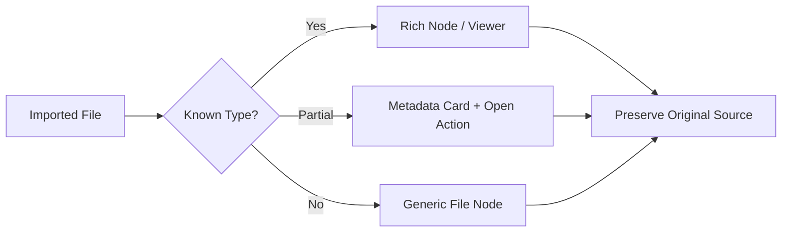

## File And Folder Support Constraints

- A static website cannot silently inspect a user's local filesystem.
- Local file access must come from:
  - drag-and-drop
  - file picker
  - folder picker where browser APIs support it
- Local folder navigation/editing is possible only if the user explicitly grants access and the browser allows persistent handles.
- Folder support should be treated as progressive enhancement, not a guaranteed baseline feature on every browser.

| Capability | Static-site feasible? | Notes |
| --- | --- | --- |
| Drag in one file | Yes | Baseline |
| Import many files | Yes | Via multi-select or drop |
| Import folder | Partially | Depends on folder picker/browser support |
| Navigate folder contents | Partially | Requires granted handles and in-browser index |
| Edit local file in place | Partially | Only where explicit file write APIs exist |
| Watch folder for changes | Later / partial | Browser support and permission model dependent |

## File Viewer Strategy

- Viewer-first support should expand by file family.
- Recommended viewer families:
  - document viewer
  - archive/file tree viewer
  - media viewer
  - 3D model viewer
  - generic metadata/file card
- A file node should be able to open a focused viewer without making the whole board heavier during navigation.

| Viewer family | Target files | Default board rendering |
| --- | --- | --- |
| Document viewer | PDF, markdown, text, JSON | File card or preview excerpt |
| Archive viewer | ZIP and similar packages | File card + file list summary |
| Media viewer | Image, video, audio | Thumbnail/poster |
| CAD / 3D viewer | STL, STEP, maybe AI-derived preview | Metadata/file card first |
| Generic file viewer | Anything else | Icon + metadata + open/download |

## CAD And Technical File Direction

- CAD and technical file support should be planned as a layered capability.
- First useful level:
  - attach file
  - show type, size, name, maybe thumbnail
  - link/open/download reliably
- Second level:
  - preview 3D geometry for STL and maybe STEP
  - inspect basic metadata
- Third level:
  - lightweight interaction such as rotate, zoom, explode, inspect layers/parts
- Full CAD editing inside cosmoboard should be treated as far-future and optional.

| Technical file | Recommended path |
| --- | --- |
| STL | Prioritize preview viewer later |
| STEP / STP | Metadata first, preview later |
| AI | File card first, derived preview if available |
| ZIP of project files | Archive card with contents tree |
| Mixed project folder | Folder node with index/tree view |

## Folder Nodes

- A local folder should be representable as a folder node when the user grants access.
- Folder nodes should ideally support:
  - showing child files
  - opening a contained file into the right viewer
  - refreshing/reindexing the folder
  - optionally pinning important files as child nodes or references
- Editing within the interface should be limited to safe supported types first, not every possible file.

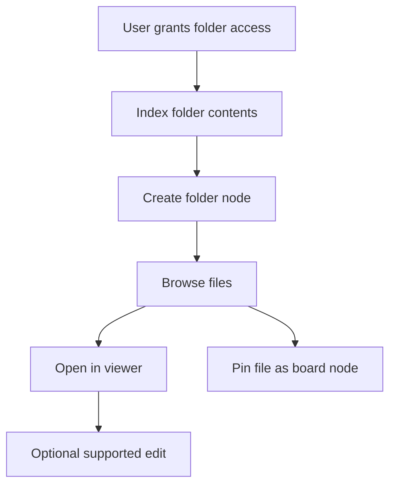

## File Packaging Direction

- The system should support both:
  - multi-file canonical website structure
  - portable single-file bundle exports
- Portable bundles are especially important for boards with many attached files.
- When exporting to a single-file bundle, cosmoboard should preserve:
  - board structure
  - linked markdown/text
  - file metadata
  - embedded or attached media payloads where reasonable
  - fallback compatibility metadata

| Packaging mode | Best use case |
| --- | --- |
| Canonical multi-file | Website source control and predictable fetches |
| Portable single-file bundle | Backup, handoff, archive, transport |
| Obsidian-friendly unpacked export | Interop with vault-based workflows |

## Drawing Optimization Strategy

- Store completed drawings as simplified paths, not raw point explosions.
- Simplify strokes during or immediately after drawing using distance thresholds or path simplification.
- Keep one finished path per stroke instead of many DOM elements per segment.
- Cache stroke bounds so visibility checks stay cheap.
- When zoomed far out, prefer lower-detail stroke rendering instead of full point fidelity.
- If boards become drawing-heavy, move completed drawings to a separate cached drawing layer while keeping only the active stroke interactive.
- Consider a hybrid render model later:
  - DOM/HTML for interactive cards
  - SVG or canvas-backed layer for many completed drawings

## Interaction Fluidity Strategy

- Pan and zoom should remain fluid even while media exists on the board.
- Selection, dragging, and editing should not force a full board rerender.
- The runtime should isolate expensive work from the camera loop.
- Save, import, recommendation prep, and metadata fetches must never block pointer interaction.
- Embedded preview mode should default to the cheapest possible render path.

## Future Capability Families

| Capability | Product direction | Default UX direction |
| --- | --- | --- |
| Command search | Press `s` to open tool search / command palette | Type to filter tools and actions |
| Rich text formatting | Allow headings, bold, lists, inline emphasis | Lightweight formatting controls |
| Text scaling | Resize text blocks and text size independently | Drag handles + size presets |
| Image crop | Crop image inside node bounds | Non-destructive crop metadata |
| Background removal | Automatic background removal for images | Async tool/action, not inline blocking |
| Interactive buttons | Nodes can trigger actions or state changes | Explicit action nodes, not arbitrary scripts |
| Timestamped media | Start playback at a specific moment | Stored in node metadata |
| Tool shortcuts | Searchable and keyboard-driven | Palette plus visible shortcut hints |

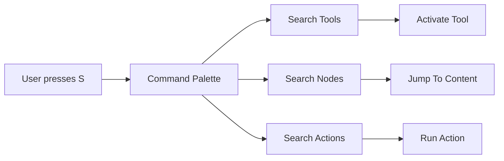

## Recommended Architecture

- Layer 1: cosmoboard engine
  - Handles pan, zoom, selection, drawing, cards, import/export, local persistence, and save flows.
- Layer 2: board registry
  - Declares which boards exist, where their canonical files live, and which page hosts them.
- Layer 3: board view files
  - Each cosmoboard has its own canonical `.canvas` file for layout and page-specific composition.
- Layer 4: linked entities
  - Shared notes, markdown-backed content, links, sketches, or references with stable ids.
- Layer 5: page host
  - Decides whether the board is full-page, embedded preview, or expanded interactive mode.

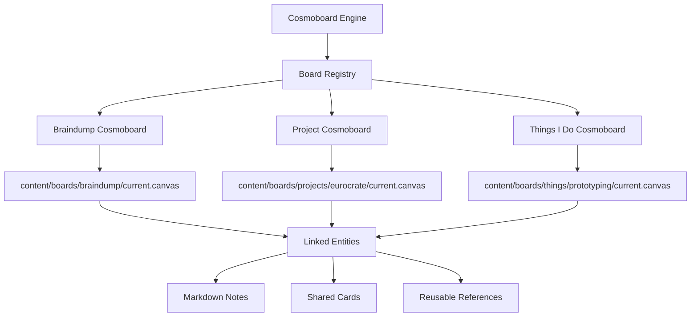

| Layer | Responsibility | Notes |
| --- | --- | --- |
| Engine | Camera, interaction, rendering, save flow | Shared across all boards |
| Registry | Board lookup and config | Maps slugs to pages and modes |
| Board file | Layout and composition | One canonical `.canvas` per board |
| Linked entities | Shared synced content | Later phase for cross-board reuse |
| Page host | Full page or embed shell | Controls preview vs full editor |

## Recommended Board Strategy

- Each project should be able to own its own cosmoboard.
- Each topic section should also be able to own its own cosmoboard if useful.
- Braindump should remain a broad exploratory cosmoboard.
- Project cosmoboards should stay focused and smaller.
- Later, Braindump and project cosmoboards can reference shared entities rather than copy-pasting content.

| Board type | Purpose | Default mode |
| --- | --- | --- |
| Braindump | Broad exploratory space | Full-page |
| Project board | Context-specific workboard | Embedded preview + full editor |
| Topic board | Section-level board | Embedded or full-page |
| Shared entity view | Cross-board content reuse | Later phase |

## Recommended V1 File Structure

```text
content/boards/index.json
content/boards/braindump/current.canvas
content/boards/projects/eurocrate-storage/current.canvas
content/boards/projects/another-project/current.canvas
content/boards/things/prototyping/current.canvas
```

## Recommended V2 Linked-Content Structure

```text
content/boards/index.json
content/boards/braindump/current.canvas
content/boards/projects/eurocrate-storage/current.canvas
content/entities/note-001.json
content/entities/link-014.json
content/entities/markdown-002.json
content/entities/sketch-003.json
content/notes/idea-a.md
content/notes/process-b.md
```

## Packaging Modes

| Mode | Purpose | Shape |
| --- | --- | --- |
| Browser draft | Fast local reopen | `localStorage` or browser draft record |
| Canonical site board | Predictable website source | `content/boards/<slug>/current.canvas` |
| Obsidian export | Direct Obsidian-friendly handoff | `.canvas` plus `.md`/media when needed |
| Portable bundle | Keep everything together in one file | `.cosmoboard.json` or similar single-file package |

- The website can keep a clean canonical board file per slug.
- The system should also support a portable single-file bundle mode when you want board JSON, media, and markdown to travel together.
- Single-file bundle mode is especially useful for:
  - backup
  - sharing
  - handoff
  - importing/exporting without a folder tree

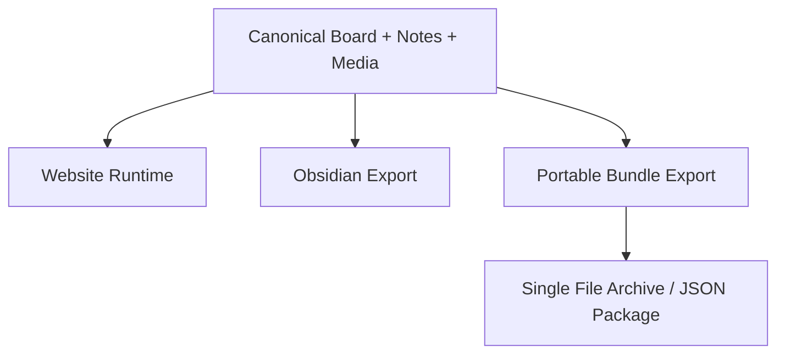

## What Lives In A Board File vs A Linked Entity

- A board file should store:
  - placement
  - size
  - viewport
  - z-order
  - connectors
  - which entity ids are present on that board
- A linked entity should store:
  - the actual note content
  - markdown source path if applicable
  - metadata
  - stable id
  - entity type
- This split is what makes "same note updates everywhere" possible.

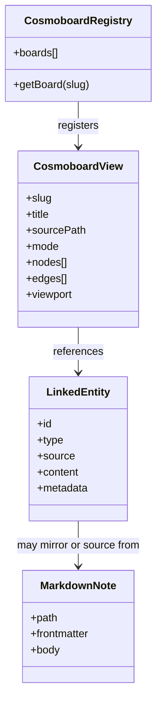

## Multiple Views Of The Same Board

- There are two different needs here:
  - one board having multiple visual views
  - multiple boards sharing the same underlying entities
- The practical first step is the second one.
- Full alternate views of the exact same board file can be added later, but they should not block the per-project rollout.
- If needed later, a board view can support:
  - filtered subsets
  - different default viewport presets
  - read-only embeds pointing at the same canonical board

| Need | Recommended first move |
| --- | --- |
| Same content in multiple places | Shared entity references |
| Same board seen differently | View presets and filtered views later |
| Tiny in-page board view | Read-only embed |
| Full editing | Dedicated full board route |

## Embed Behavior

- Embedded cosmoboards should load as preview/read-only by default.
- The embedded mode should minimize toolbar chrome.
- The embedded mode should prioritize:
  - quick render
  - lightweight interaction
  - clear `Open cosmoboard` action
- Once expanded, the same board can open in full interactive mode.
- Embedded mode should favor previews, reduced detail, and deferred media activation.

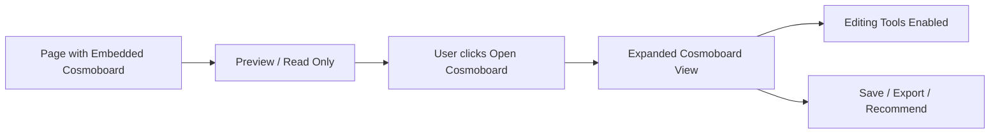

| Embed state | Expected behavior |
| --- | --- |
| Initial load | Cheap preview render only |
| Hover / touch focus | Slightly richer preview if needed |
| Open action | Navigate to or open full editor |
| Editing mode | Full toolbar and interaction enabled |

## Markdown Integration Direction

- A cosmoboard node should eventually be able to reference a markdown file.
- A markdown file should eventually be able to reference or embed a cosmoboard.
- Do not treat markdown integration as raw HTML dumping.
- Treat markdown as a first-class source type with stable ids and metadata.
- Recommended future cosmoboard node types:
  - `text`
  - `drawing`
  - `bookmark`
  - `page`
  - `entity-ref`
  - `markdown-ref`
- Recommended future markdown embed types:
  - live cosmoboard preview
  - linked card list from a board
  - specific entity embed

| Markdown use case | Recommended model | Sync direction |
| --- | --- | --- |
| Board shows markdown note | `markdown-ref` node | Markdown is source of truth |
| Markdown page shows board preview | Cosmoboard embed block | Board is source of truth |
| Same content reused in many boards | Shared entity referencing markdown or text entity | Shared entity is source of truth |
| Quick board-only note | Local text node | Board-only unless promoted later |

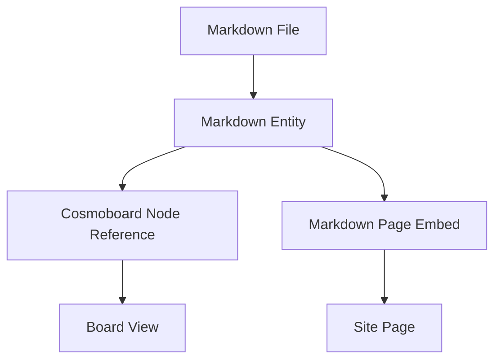

## Markdown Implementation Outline

- Start with read-only markdown reference nodes first.
- Keep markdown parsing/build integration separate from the camera/render loop.
- Give markdown-backed nodes stable ids and source paths.
- Support promotion paths:
  - board-local note -> shared entity
  - shared entity -> markdown-backed entity if needed later
- Keep edit authority explicit:
  - some nodes edited in board
  - some nodes edited in markdown source
  - some nodes edited through shared entity tooling

| Markdown direction | Priority | Reason |
| --- | --- | --- |
| Import existing `.md` notes | High | Important for Obsidian and existing note reuse |
| Render markdown refs in board | High | Core linkage between notes and boards |
| Export board-linked notes back out | High | Keeps system portable |
| Full in-board markdown editing | Later | More complexity and edit-authority questions |

## Obsidian Compatibility Direction

- Aim for Obsidian Canvas compatibility off the gate where realistic.
- Keep the canonical board schema as close as possible to Obsidian Canvas for shared node/edge concepts.
- Import Obsidian markdown notes directly.
- Import Obsidian `.canvas` files where supported node types map cleanly.
- Export unsupported cosmoboard features into Obsidian-friendly fallback representations instead of dropping them silently.
- Preserve richer cosmoboard-only metadata so the site can round-trip more faithfully than Obsidian itself can render.

| Cosmoboard feature | Obsidian target | Fallback strategy |
| --- | --- | --- |
| Text note | Text node or markdown file | Straight mapping |
| Image | File node | Straight mapping |
| Markdown ref | Markdown file + file/text node link | Preserve source path metadata |
| Video node | File/embed fallback or poster + link | Keep playback metadata in note/body/json |
| Timestamped video | Link plus stored timestamp | Add timestamp to URL/metadata |
| Interactive button | Text or link card | Preserve action metadata separately |
| Rich custom action | Text note + metadata | Do not silently discard semantics |

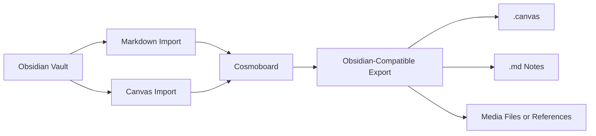

## Obsidian Export Strategy

- Preferred path:
  - export directly as Obsidian-compatible `.canvas` whenever feature usage stays within compatible bounds
- Compatible-first fallback path:
  - export supported nodes directly
  - transform unsupported nodes into simpler Obsidian-safe representations
  - attach richer metadata so re-import into cosmoboard can restore more meaning
- Portable bundle path:
  - pack board, markdown, media, and cosmoboard-specific metadata into one file
  - optionally unpack later into an Obsidian-friendly folder structure

## Sync Rules For Linked Content

- If a board node is only local to one board, editing it changes only that board.
- If a board node references a shared entity id, editing it should update the shared entity source.
- Any board or markdown file rendering that entity should then reflect the updated content.
- The board file should not duplicate the canonical content if the node is a shared entity reference.
- Local-only nodes and shared linked entities should coexist without forcing everything into one model.

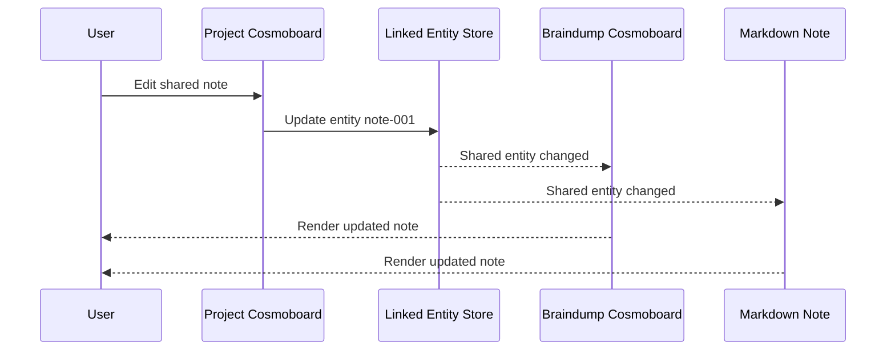

| Content type | Canonical source |
| --- | --- |
| Local sketch | Board file |
| Local note | Board file |
| Shared note | Shared entity |
| Markdown-backed note | Markdown file or markdown entity layer |
| Timestamped video ref | Media entity / node metadata |

## Save And Persistence Direction

- Keep localStorage per cosmoboard using keys like `board:<slug>`.
- Keep one canonical `.canvas` file per cosmoboard.
- Keep export/import available for every cosmoboard.
- Keep recommendation flows board-aware so submissions map to the correct board.
- If online save evolves later, sync by board slug and linked entity id, not by one giant global blob.
- Keep persistence debounced and out of the interaction hot path.

| Persistence layer | Required | Why |
| --- | --- | --- |
| Browser draft | Yes | Local-first usability |
| Canonical `.canvas` | Yes | Predictable website source |
| Obsidian export/import | Yes, planned | Interoperability goal |
| Portable single-file bundle | Yes, planned | Keeps content together when desired |
| Hosted sync | Optional | Enhancement, not dependency |

## Registry Direction

- Add a central board registry file such as `content/boards/index.json`.
- Each registry entry should describe:
  - `slug`
  - `title`
  - `sourcePath`
  - `pagePath`
  - `mode`
  - `embedded`
  - `allowRecommendations`
  - `entityPolicy`
  - `performanceProfile`
- This avoids scattering cosmoboard config across templates and ad hoc page markup.

| Registry field | Why it exists |
| --- | --- |
| `slug` | Stable identity for save/load |
| `pagePath` | Host routing |
| `mode` | Full-page vs embed behavior |
| `entityPolicy` | Local-only vs shared-enabled |
| `performanceProfile` | Lets heavy/light boards tune defaults |

## Concrete Refactor Path

- Step 1: reframe the system as `cosmoboard`, with Braindump as one instance.
- Step 2: extract `JavaScript/braindump.js` into a generic initializer driven by container config.
- Step 3: extract `CSS/braindump.css` into reusable cosmoboard styles plus page-specific overrides.
- Step 4: add a board registry file and update the page build layer to opt pages into cosmoboards.
- Step 5: add embedded preview/read-only mode with expand-to-edit behavior.
- Step 6: add performance guardrails before scaling to many project boards.
- Step 7: add per-project cosmoboard support.
- Step 8: add linked entity references for reused notes and markdown-backed content.
- Step 9: add markdown-to-cosmoboard and cosmoboard-to-markdown integration.

## Default Recommendation If You Want To Move Fast

- Implement separate cosmoboards per project or topic first.
- Share one cosmoboard engine across the whole site.
- Make embeds preview/read-only until expanded.
- Build the performance model into the engine immediately.
- Delay the linked-entity store until after the per-project rollout works cleanly.
- When linked entities arrive, use them only for content that genuinely needs cross-board sync.

## Open Questions Still Worth Deciding

- Should a project page open its cosmoboard inline, in a modal, or as a dedicated page?
- Should expanded embeds edit the same board file directly, or open a dedicated full-page editor route?
- Should markdown-backed entities be editable from inside the cosmoboard, or only from the markdown source?
- Should drawings ever become shared entities, or should shared entities be limited to notes, links, and markdown-backed content?
- Do you want one cosmoboard maximum per page, or is multiple-per-page a real requirement?
- Should the `s` command palette be global across the board, or scoped to the active board only?
- Should interactive button nodes be limited to safe built-in actions, or later expose richer action systems?

## My Current Recommendation

- The correct v1 is:
  - one cosmoboard engine
  - one canonical board file per project/page/topic
  - preview/read-only embeds
  - expand into full editing
  - performance-first rendering and media handling
  - local-first static-site operation
  - compatible-first Obsidian import/export direction
- The correct v2 is:
  - linked entities with stable ids
  - markdown-backed content references
  - shared updates across boards and markdown where content is intentionally linked
  - richer portable bundle workflows
