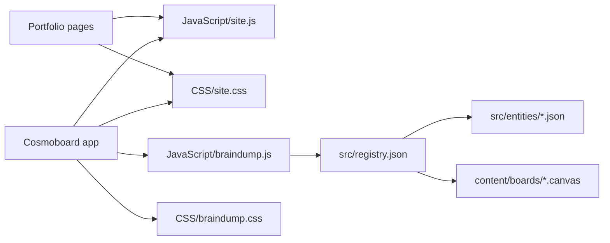
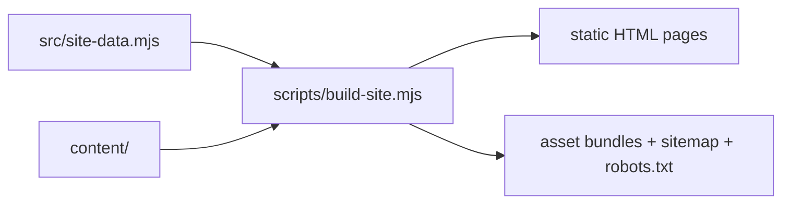

# evrenucar.com

Personal website for Evren Ucar — portfolio pages plus the Cosmoboard app.

Deep context lives in [`AGENTS.md`](AGENTS.md) and [`.agents/`](.agents/agents.md). This file is first-touch orientation.

---

## Repo structure

| Directory | Role | Docs |
| --- | --- | --- |
| `src/` | Cosmoboard app source (apps, entities, registry) | [src/AGENTS.md](src/AGENTS.md) |
| `JavaScript/` | Front-end behavior (`site.js`, `braindump.js`) | [JavaScript/AGENTS.md](JavaScript/AGENTS.md) |
| `CSS/` | Styling (`site.css`, `braindump.css`, page-database) | [CSS/AGENTS.md](CSS/AGENTS.md) |
| `content/` | Boards, entities, projects (data, not code) | [content/AGENTS.md](content/AGENTS.md) |
| `tests/` | Node-test suite, organized by domain | [tests/README.md](tests/README.md) |
| `scripts/` | Build, preview, sync, extraction utilities | [scripts/README.md](scripts/README.md) |
| `docs/` | Reference docs (Notion sync, etc.) | [docs/notion-sync.md](docs/notion-sync.md) |
| `.agents/` | Planning, routing, skill docs | [.agents/agents.md](.agents/agents.md) |

---

## Architecture

### Site composition

### Build flow

---

## Quickstart

| Task | Command |
| --- | --- |
| Install | `npm install` |
| Sync Notion content | `npm run sync:notion` |
| Build static site | `npm run build` |
| Run preview server | `npm run preview` |
| Run all tests | `node --test tests/` |
| Run one test | `node --test tests/<subdir>/<file>.test.mjs` |
| Check markdown links | `node scripts/check-md-links.mjs` |

Preview runs at `http://127.0.0.1:4173`.

---

## Notion flow

The site supports public shared Notion pages for **Projects**, **Things I do**, and **Open-Quests**. Each manifest entry in `src/notion-public-pages.json` controls:

- which section the item belongs to
- card summary and labels
- whether the card opens an internal page, an external URL, or only shows a status label
- sort order

The page title, long-form content, media, and last-updated time are pulled from the public Notion page itself. No Notion token required.

`scripts/sync-notion.mjs` does a lightweight metadata check first and reuses cached rendered content when `last_edited_time` is unchanged.

The GitHub Action runs `sync:notion` + `build` automatically on pushes to `main`, manual dispatch, and hourly on a schedule.

More detail: [docs/notion-sync.md](docs/notion-sync.md).
