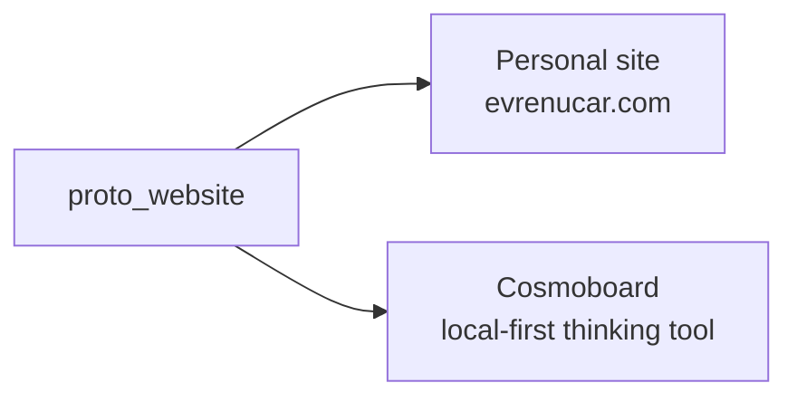
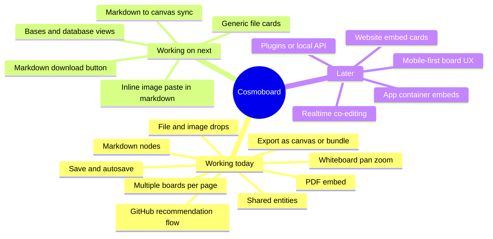
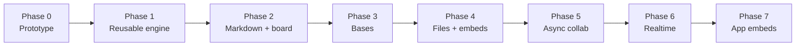
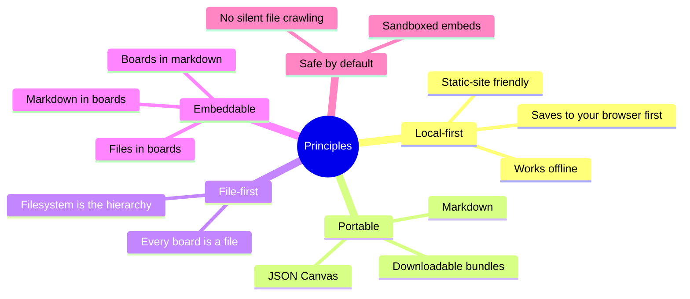

# evrenucar.com

Live site: [evrenucar.com](https://evrenucar.com)

My personal website. It started as a simple portfolio. Then I added a tiny whiteboard for jotting things down. Then I kept building. Now this repo is two things at once.

---

## The story so far

I wanted to update my old personal site. While I was at it I thought it would be nice to drop in a small whiteboard for ideas, the kind of thing I keep wanting in other tools. That small whiteboard turned into Braindump. Braindump turned into Cosmoboard. Cosmoboard kept growing. It now lives inside the personal site as a working prototype, even though the long-term home will probably be its own product later.

So this repo is one site doing two jobs.

---

## What it currently does

### As a personal site

- About me, projects, things I do, photography, open-quests, cool bookmarks
- Project and quest pages pulled in from public Notion pages
- Static HTML, no framework, fast to load
- Dark theme, left sidebar, teal highlights

### As a Cosmoboard prototype

- Whiteboard surface you can pan, zoom, and drop things on
- Boards are plain `.canvas` JSON files on disk
- Drag and drop markdown, images, PDFs, and text into a board
- Markdown notes render inline on the canvas
- Multiple boards on the same page, including embedded preview boards
- Local-first save with autosave, plus a GitHub recommendation flow
- Shared entities (one record, reused across boards and structured views)
- Import and export both as Git-friendly `.canvas` files and as portable bundles

The two live surfaces today are `braindump.html` (the original whiteboard) and `cosmoboard.html` (the generalized one).

---

## What I am slowly building

Cosmoboard is the slow long-term project. Inner rings are working today. Outer rings are next or later.

The same idea as a phase ladder:

We are roughly between Phase 1 and Phase 2 right now.

---

## Core ideas behind Cosmoboard

---

## Repo map

| Folder | What lives there |
| --- | --- |
| `src/` | Cosmoboard app source, registry, shared entities |
| `JavaScript/` | `site.js` for the portfolio, `braindump.js` for the board runtime |
| `CSS/` | `site.css` plus board styling |
| `content/` | Boards, markdown, project data, Notion-synced content |
| `tests/` | Node test suite |
| `scripts/` | Build, preview server, Notion sync, asset helpers |
| `docs/` | Notion sync notes and other reference docs |
| `.agents/` | Planning, routing, and skill docs for working on this repo |

Detailed agent docs:

- [`AGENTS.md`](AGENTS.md) — session workflow
- [`.agents/agents.md`](.agents/agents.md) — router, points to the right doc per task
- [`.agents/project.md`](.agents/project.md) — durable product facts
- [`.agents/holistic_planning/holistic_planning.md`](.agents/holistic_planning/holistic_planning.md) — north star and phased roadmap

---

## Quickstart

| Task | Command |
| --- | --- |
| Install | `npm install` |
| Sync Notion content | `npm run sync:notion` |
| Build static site | `npm run build` |
| Run preview server | `npm run preview` |
| Run all tests | `node --test tests/` |
| Run one test file | `node --test tests/<subdir>/<file>.test.mjs` |
| Check markdown links | `node scripts/check-md-links.mjs` |

Preview runs at `http://127.0.0.1:4173`.

---

## Cosmoboard landing page

There is a separate, plain landing page for the Cosmoboard idea on its own, in case I want to share it without the full personal site around it.

- Live: [evrenucar.com/cosmoboard-landing.html](https://evrenucar.com/cosmoboard-landing.html)
- File: [`cosmoboard-landing.html`](cosmoboard-landing.html)
- Not linked from the site navigation on purpose
- Open it directly, or visit `http://127.0.0.1:4173/cosmoboard-landing.html` while running `npm run preview`

---

## Notion flow

The site supports public shared Notion pages for **Projects**, **Things I do**, and **Open-Quests**. Each manifest entry in `src/notion-public-pages.json` controls:

- which section the item belongs to
- card summary and labels
- whether the card opens an internal page, an external URL, or only shows a status label
- sort order

Title, long-form content, media, and last-updated time come from the public Notion page itself. No Notion token required. `scripts/sync-notion.mjs` does a lightweight metadata check first and reuses cached rendered content when `last_edited_time` is unchanged.

A GitHub Action runs `sync:notion` and `build` on pushes to `main`, on manual dispatch, and hourly on a schedule.

More detail: [docs/notion-sync.md](docs/notion-sync.md).
